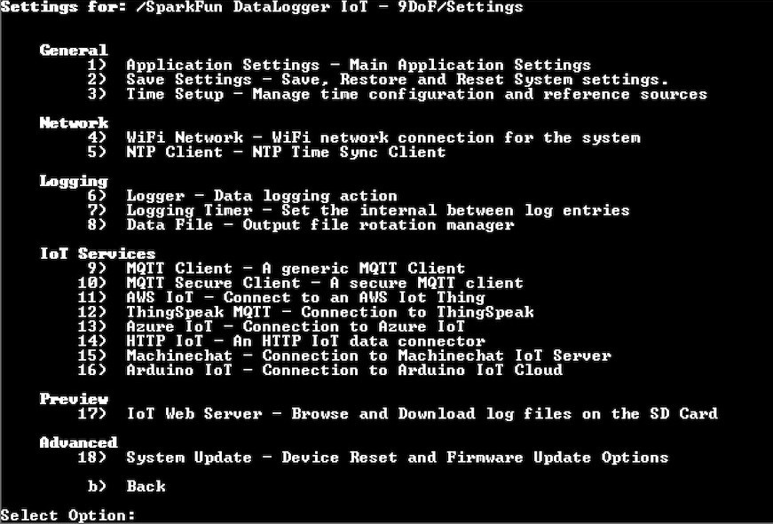
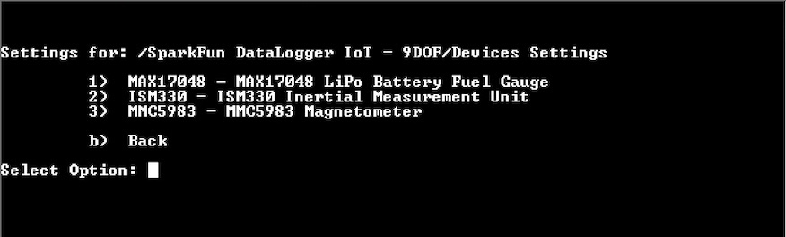

# Configuration

Configuring the settings is as easy as opening a serial menu. You can use any serial monitor or terminal emulator to quickly and easily change and store the DataLogger IoT settings via its USB-C interface.

## Serial Terminals

There are plenty of free alternatives out there to configure the DataLogger IoT. For the scope of this tutorial we will be using Tera Term.

* [Tera Term (Windows)](https://learn.sparkfun.com/tutorials/terminal-basics/all#tera-term-windows)
* [RealTerm (Windows)](https://learn.sparkfun.com/tutorials/terminal-basics/all#real-term-windows)
* Minicom (Linux, Unix, MacOS)
* [Screen (Linux, Unix, MacOS)](https://learn.sparkfun.com/tutorials/terminal-basics/all#command-line-windows-mac-linux)

> **NOTE** You will need a serial terminal client that supports edit characters. Most if not all modern serial terminal programs will have the ability to support interactive edits. Unfortunately, we have not had any success with CoolTerm. We have tested the DataLogger IoT with Tera Term, Minicom, and Screen.

If this is the your first time using a terminal window, We recommend checking out the [Serial Terminal Basics](https://learn.sparkfun.com/tutorials/terminal-basics) tutortial.

The above guides will show you how to open the correct port for the DataLogger IoT and how to set the baud rate to **115200** baud. You can change the DataLogger IoT's baud rate through the configuration menus too should you need to.

### Arduino IDE Serial Monitor - **Not Recommended**

The Arduino IDE Serial Monitor is not intented for interacive user and should not be used with the DataLogger IoT. For users with an Arduino IDE, you could also use the Arduino Serial Monitor by setting the line ending to **Newline**. Users will also need to ```CTRL``` + ```Enter``` when sending any character to the DataLogger IoT. However, we recommend using one of the terminals mentioned earlier.

## Initialization and Serial Output

Connect the DataLogger IoT to a USB cable and connect to your computer. The addressable RGB LED will light up green as it initializes. As of firmware **v1.0.2.00 - build 00013e**, a **Startup Menu** was added to the system. This allows you to change the behavior of the DataLogger at start-up. This change only affects the current system session.


* 'n' &mdash; Normal startup
* 'a' &mdash; Disable I2C device auto load on startup
* 'l' &mdash; List the I2C devices supported. This device table is discarded after auto-load
* 'w' &mdash; Disable WiFi
* 's' &mdash; Disable preference restore during startup

The amount of time the start-up menu is displayed is adjustable. This settings can be configured in the **Settings/Application Settings** page, under the Advanced section.

You should see the following output when the board initializes:


The messages in the serial terminal provide us with the DataLogger's configuration and will vary depending on the firmware version that is loaded on the board.

* The DataLogger IoT software version (in this case is **v01.02.00 - build 00013e**).
* As the DataLogger IoT is initializing, the system settings are being restored from the last saved preference.
* There no WiFi credentials and the board has failed to connect. This output will change once you provide the WiFi credentials and are able to connect to the network.
* There are 3x devices currently detected and they are connected through I<sup>2</sup>C through the Qwiic port and SPI. These are the on-board sensors for the DataLogger IoT. There may be more devices that are detected depending on the firmware and what is connected to the ports. Since these were recognized, they were loaded onto the DataLogger IoT.
* The current date and time is shown (by default), the date and time is set to **1-1-1970** and **00:00:00**). This value will change depending on the clock source through NTP, RTC, or a u-blox GNSS module.
* The time the board has been running will be shown in the uptime.
* The primary external time source that the board syncs is currently through the **NTP client**. This can be configured depending on your clock source.
* The board name (in this case, it was **SparkFun DataLogger IoT - 9DoF**)
* The board ID (in this case, it was **SFD16C8F0D1AD6B8**)
* The microSD card has been found, the type of memory card it is, the size of the memory card, how much memory is used, and how much is available.
* If there is a WiFi network name saved, the SSID will be shown along with information indicating whether the board was able to connect to the WiFi network. By default there is no SSID saved in memory.
* If there is a battery connected, the LiPo Battery Fuel Guage will indicate if there is one attached to the board.
* Parameters for low power mode will be provided indicating if deep sleep is enabled, sleep interval, and wake interval.
* Parameters for logging are also provided for the logging interval, the format for the serial output, format for the microSD card, current saved filename, and file rotation period.
* The board will also show the available IoT services that are enabled for the DataLogger IoT.
* Current settings to download log files via a web interface (included in firmware v01.02.00)
* Supported devices through Qwiic or SPI will be listed if they are connected.
* The output will finish by telling you what devices are connected to the DataLogger IoT again.

As of firmware v01.02.00, there is also a compact mode! By adjusting the setting, the ESP32 will output less at startup. This settings can be configured in the **Settings/Application Settings** page, under the Advanced section.


Once the DataLogger IoT has initialized, the DataLogger IoT will begin outputting comma separated values (CSV). This is the default output that is set for the DataLogger IoT - 9DoF. Of course, you will not have as many readings on the DataLogger IoT since the 6DoF IMU and magnetometer are not populated on that version of the board.


Depending on your DataLogger IoT preferences, your device may output as a JSON format like the image shown below.


The data scrolling up the screen show what each device's output is along with their associated unit if it is available. Your mileage will vary depending on the board version that you have and what device is connected:

* `MAX17048.Voltage (V)`
* `MAX17048.State of Charge (%)`
* `MAX17048.Charge Rate (%/hr)`
* `ISM330.Accel X (milli-g)`
* `ISM330.Accel Y (milli-g)`
* `ISM330.Accel Z (milli-g)`
* `ISM330.Gyro X (milli-dps)`
* `ISM330.Gyro Y (milli-dps)`
* `ISM330.Gyro Z (milli-dps)`
* `ISM330.Temperature (C)`
* `MMC5983.X Field (Gauss)`
* `MMC5983.Y Field (Gauss)`
* `MMC5983.Z Field (Gauss)`
* `MMC5983.Temperature (C)`

The output will vary depending on what is connected so you may get additional readings in the output and it may not be in the following order listed above. The logging rate defaults to about 0.067Hz (or 15000ms), so as the data scrolls past, you will see the last value settle at about 0.067Hz.

## Main Menu

Right! Let's open the main menu by pressing on any key in the serial terminal program.


You will be prompted with a few options. Once in the configuration menu, all three colors of the addressable RGB LED will turn on to produce the color white indicating that you are navigating through the menu. Before we dive into the settings, lets check out a few commands and saving settings.

### Bang (!) Command Reference

As of firmware v01.02.00, commands can be executed directly from the serial console thus bypassing the serial menu system! The following commands are supported.

|Command|Description|
|--|--|
|!about|Display the system about page|
|!clear-settings|Clear the on board system preferences with a yes/no prompt|
|!clear-settings-forced|Clear the on board system preferences with no prompt|
|!devices|List the currently connected devices|
|!factory-reset|Perform a factory reset - presents a Y/N prompt|
|!heap|Display the current system heap memory usage|
|!json-settings|For setting the device settings via a serial connection. When this command is sent, the system expects to receive a JSON settings file|
|!log-now|Perform a log observation event|
|!log-rate|If log rate measurement is enabled, the current log rate is printed|
|!reset-device|Reset the device - erasing any saved settings and restarting the device|
|!reset-device-forced|Reset the device, but without a Y/N prompt|
|!restart|Restart the device|
|!restart-forced|Restart the device without a Y/N prompt|
|!save-settings|Save the current settings to on-board flash|
|!sdcard|Output the current SD card usage statistics|
|!systime|Output current system time|
|!uptime|The uptime of the device|
|!device-id|The ID for the device|
|!version|The version of the firmware|
|!wifi|Output current system WiFi state|

Typing a quick command and hitting the ```Enter``` button will result in the DataLogger IoT executing the command without the need to go through the menu system. Below is an example showing the `!about` quick command being sent and then executing the command as the DataLogger IoT is outputting CSV values to the serial terminal.


### Exiting and Saving

When exiting the menus, you will be prompted with either an ```x``` or ```b```. You can use either character when exiting the menus as well as ```X``` or ```B```. Note that you will need to use either of these keys when making a change in order for the DataLogger IoT to save any changes in memory. Make sure that you receive the following message indicating that the settings were saved: ```[I] Saving System Settings```. The DataLogger IoT will the continue reading the devices and outputting the readings through the serial terminal.


### Cancelling Changes

You can also use any of your ```Esc``` or arrow keys (i.e. ```&#8593;```, ```&#8595;```, ```&#8592;```, ```&#8594;```) to exit. However, using the escape or arrow keys will not save any changes in memory once the reset button is hit or whenever power is cycled.


### Timeout from Inactivity

The menus will slowly exit out after 2 minutes of inactivity, so if you do not press a key the DataLogger IoT will return to its previous menu. It will continue to move back until it reaches the main menu. After another additional 2 minutes of inactivity, the board will exit begin logging data again. When the menu exits from inactivity, any changes will not be saved in memory as well.


## Settings

Let's start by configuring the DataLogger's system settings. Send a ```1``` through the serial terminal. You will have the option to adjust various settings ranging from the your preferences, time source to synchronize the date and time, WiFi network, how the device logs data, which IoT service to use, and firmware updates.



!!! note
    You may notice after entering a ```1``` that there is a slight delay before the DataLogger IoT responds. The delay was added to allow some time for the DataLogger IoT to receive an additional digit for any option greater than 9. If you want to head to option 1 immediately without the slight delay, you can hit the ```Enter``` key to enter the Application Settings.

We'll go over each of these options below.

### General: Application Settings

In the Settings Menu, send a ```1``` to adjust the Application Settings. As of firmware v01.00.02, users can now adjust the baud rate of the serial console output and the menu system's timeout value.


In the Application Settings Menu, users will be able to configure the addressable RGB's LED through software, menu timeout, microSD card's output format, serial console's output format, terminal's baud rate, deep sleep parameters, and view the current settings of the DataLogger IoT similar to when the board was initialized. Depending on your preference and how you are logging data, you can adjust the data as CSV or JSON.

* ```1``` **LED Enabled** &mdash; Enable/Disable the on-board RGB LED activity
  * Accepts a boolean value:
    * ```1``` to enable _(default)_
    * ```0``` to disable
* ```2``` **Menu Timeout** &mdash; Inactivity timeout period for the menu system
  * Accepts the following values:
    * ```1``` 30 Seconds = 30
    * ```2``` 60 Seconds = 60 _(default)_
    * ```3``` 2 Minutes = 120
    * ```4``` 5 Minutes = 300
    * ```5``` 10 Minutes = 600
    * ```b``` Back
* ```3``` **Color Output** &mdash; Use color output with the Serial console. _(added as of firmware v01.02.00)_
  * Accepts a boolean value:
    * ```1``` to enable _(default)_
    * ```0``` to disable
* ```4``` **Board Name** &mdash; A specific name for this DataLogger
  * Accepts a string
* ```5``` **SD Card Format** &mdash; Enable and set the output format
  * Accepts the following values:
    * ```1``` to disable = 0
    * ```2``` CSV format _(default)_ = 1
    * ```3``` JSON format = 2
* ```6``` **Serial Console Format** &mdash; Enable and set the output format
  * Accepts the following values:
    * ```1``` to disable = 0
    * ```2``` CSV format _(default)_ = 1
    * ```3``` JSON format = 2
* ```7``` **JSON Buffer Size** &mdash; Output buffer size in bytes
  * Accepts an integer between ```100``` to ```5000``` :
    * 1600 bytes _(default)_
* ```8``` **Terminal Baud Rate** &mdash; Update terminal baud rate. Changes take effect on restart.
  * Accepts an unsigned integer between **1200** to **50000**:
    * **115200** _(default)_
* ```9``` **Enable System Sleep** &mdash; If enabled, sleep the system
  * Accepts a boolean value:
    * ```1``` to enable
    * ```0``` to disable _(default)_
* ```10``` **Sleep Interval (sec)** &mdash; The interval the system will sleep for
  * Accepts an integer between ```5``` to ```86400``` :
    * ```30``` seconds _(default)_
* ```11``` **Wake Interval (sec)** &mdash; The interval the system will operate between sleep period
  * Accepts an unsigned integer between ```60``` to ```86400``` :
    * ```120``` seconds _(default)_
* ```12``` **Startup Messages** Level of message output at startup
  * Accepts a value between ```1``` to ```3``` :
    * ```1``` Normal = 0 _(default)_
    * ```2``` Compact = 1
    * ```3``` Disabled = 2
* ```13``` **Startup Delay** Startup Menu Delay in Seconds
  * Accepts a value between ```0``` to ```60``` :
    * ```2``` seconds _(default)_
* ```14``` **Device Names** Name always includes the device address
  * Accepts a boolean value:
    * ```1``` to enable _(default)_
    * ```0``` to disable
* ```15``` **About...** &mdash; Details about the system
* ```b``` **Back**

!!! note
    Once the baud rate is changed and saved, make sure to adjust the baud rate of your serial terminal when the board is reset. If you forgot the baud rate, you can hold the BOOT button down for 20 seconds to erase the on-board preferences (besides the baud rate, this also includes any other settings that were saved) and restart the board.

When finished, you will need to exit the menus so that the DataLogger IoT saves the changes. Send a ```b``` to exit out this menu, ```b``` to exit out of the DataLogger IoT settings, and ```x``` to exit out of the main menu.


### General: Save Settings

In the Settings menu, send a ```2``` to adjust the Save Settings. As of firmware v01.01.01, the JSON output buffer size is now user configurable. This will be under option "**JSON File Buffer Size**" when in the Save Settings Menu.


In the Save Settings Menu, users will be able to save, restore, or clear any preferences in memory (i.e. persistent storage) or a saved file to a fallback device (i.e. microSD card). Note that any passwords and secret keys are not saved in the save settings file. You will need to manually enter those values in the file saved on the microSD card.

* ```1``` **Fallback Restore** &mdash; If unable to restore settings, use the fallback source (JSON File)
  * Accepts a boolean value:
    * ```1``` to enable _(default)_
    * ```0``` to disable
* ```2``` **Fallback Save** &mdash; Save settings also saves on the fallback storage (JSON File)
  * Accepts a boolean value:
    * ```1``` to enable
    * ```0``` to disable _(default)_
* ```3``` **JSON File Buffer Size** &mdash; The size in bytes used for the internal I/O buffer
  * Accepts an unsigned integer:
  * ```6400``` _(default, as of firmware v01.01.01)_
* ```4``` **Save Settings** &mdash; Save current settings to persistent storage
  * Accepts a yes/no:
    * ```Y``` or ```y``` for yes
    * ```N``` or ```n``` for no
* ```5``` **Restore Settings** &mdash; Restore saved settings
  * Accepts a yes/no:
    * ```Y``` or ```y``` for yes
    * ```N``` or ```n``` for no
* ```6``` **Clear Settings** &mdash; Erase the saved settings on the device
  * Accepts a yes/no:
    * ```Y``` or ```y``` for yes
    * ```N``` or ```n``` for no
* ```7``` **Save to Fallback** &mdash; Save System Settings to the fallback storage (JSON File)
  * Accepts a yes/no:
    * ```Y``` or ```y``` for yes
    * ```N``` or ```n``` for no
* ```8``` **Restore from Fallback** &mdash; Restore system settings from the fallback storage (JSON File)
  * Accepts a yes/no:
    * ```Y``` or ```y``` for yes
    * ```N``` or ```n``` for no
* ```b``` **Back**

If you have the Fallback Save enabled or selected the option **Save to Fallback**, you will notice an additional file called **datalogger.json** saved in the microSD card. This is the fallback file that is saved. Using a text editor, you can edit this file to adjust the settings or provide WiFi credentials, certificates, and keys. You can use option ```7``` to restore the settings on your DataLogger IoT.


When finished, you will need to exit the menus so that the DataLogger IoT saves the changes. Send a ```b``` to exit out this menu, ```b``` to exit out of the DataLogger IoT settings, and ```x``` to exit out of the main menu.


### General: Time Sources

!!! note
    Make sure to connect the ESP32-WROOM to a 2.4GHz WiFi network and ensure that is not a guest network that requires you to sign in. Unfortunately, 5GHz WiFi is not supported on the ESP32-WROOM module.

In the Settings Menu, send ```3``` to manage the time reference sources. As of firmware v01.01.01, time zone support is at the clock level, not tied to NTP. The option to adjust the Time Zone is moved to the Time Sources menu.


In this menu, you will have options to update the primary reference clock, update interval, add a secondary reference clock, and update it's interval. By default, the primary reference clock is set to use the Network Time Protocol (NTP). To synchronization the time, you will need to connect to a 2.4GHz WiFi network in order to update the time. To add a secondary clock, make sure to connect a compatible Qwiic-enabled devices that can keep track of time (i.e. Qwiic Real Time Clock Module - RV-8803 or a Qwiic-enabled u-blox GNSS module).

To adjust the time zone, you will need to enter a POSIX timezone string variable. Try [checking out this CSV in this GitHub repo](https://github.com/nayarsystems/posix_tz_db/blob/master/zones.csv) and searching for the timezone string variable in your area. For more information about [POSIX format specification check out this article from IBM](https://developer.ibm.com/articles/au-aix-posix/).

* ```1``` **The Time Zone** &mdash; Time zone setting string for the device
  * Accepts a string:
    * ```MST7MDT,M3.2.0,M11.1.0``` _(default, as of firmware v01.01.01)_
* ```2``` **Reference Clock** &mdash; The current reference clock source
  * Accepts the following values:
    * ```1``` for no clock
    * ```2``` for NTP Client _(default)_
* ```3``` **Update Interval** &mdash; Main clock update interval in minutes. 0 = No update
  * Accepts an unsigned integer:
    * ```0``` = No update
    * ```60``` seconds _(default)_
* ```4``` **Enable Clock Fallback** &mdash; Use a valid reference clock if the primary is not available
  * Accepts a boolean value:
    * ```1``` to enable _(default)_
    * ```0``` to disable
* ```5``` **Dependant Interval** &mdash; Connected depedant clock update interval in minutes. 0 = No update
  * Accepts an unsigned integer:
    * ```0``` = No update
    * ```60``` seconds _(default)_
* ```6``` **Update Connected** &mdash; Update connected clocks on main clock update
  * Accepts a boolean value:
    * ```1``` to enable _(default)_
    * ```0``` to disable
* ```b``` **Back**

### Alternative Time Sources

As an alternative to using the NTP, users can also add a compatible Qwiic-enabled device that can keep track of time (i.e. Qwiic Real Time Clock Module - RV-8803 or a Qwiic-enabled u-blox GNSS module). These can be set as the primary or secondary clock.


Once attached, you will be prompted with additional options to select a primary reference clock.


    If you are using a u-blox GNSS module, make sure that you have enough satellites in view. The option to add or configure the GNSS will not be available if there are not enough satellites in view. If you are using the Qwiic Real Time Clock Module - RV-8803, you may need to go into the device settings to manually adjust the date and time.

When finished, you will need to exit the menus so that the DataLogger IoT saves the changes. Send a ```b``` to exit out this menu, ```b``` to exit out of the DataLogger IoT settings, and ```x``` to exit out of the main menu.


### Network: WiFi Network

!!! note
    The ESP32-WROOM can only connect to a 2.4GHz WiFi network. Unfortunately, 5GHz is not supported on the ESP32-WROOM module.

In the Settings Menu, send a ```4``` to configure the WiFi settings. As of firmware v01.00.02, up to 4 sets of WiFi credentials can be saved.


Once you are in the WiFi Network menu, you can enable/disable WiFi and save the WiFi network credentials. Once connected to a 2.4GHz WiFi network, you can synchronize the date and time, connect to an IoT service to log data, and update the latest firmware over-the-air. Since the WiFi is turned on by default, you will simply need to save the WiFi network's name and password.

* ```1``` **Enabled** &mdash; Enable or Disable the WiFi Network connection
  * Accepts a boolean value:
    * ```1``` to enable _(default)_
    * ```0``` to disable
* ```2``` **Network Name** &mdash; The SSID of the WiFi network
  * Accepts a string:
    * For example, if my network name is "`MY_NETWORK_NAME`", you would manually type ```MY_NETWORK_NAME```. When finished hit the ```ENTER``` key
* ```3``` **Password** &mdash; The Password to connect to the WiFi network
  * Accepts a string:
    * For example, if my network name is "`MY_SUPER_SECRET_PASSWORD`", you would manually type ```MY_SUPER_SECRET_PASSWORD```. Note that as you type the password, each character will be replaced with an asterisk (`*`). When finished hit the ```ENTER``` key.
* ```4``` **Network 2 Name** &mdash; Alternative network 2 SSID
  * Accepts a string:
    * For example, if my network name is "`MY_NETWORK_NAME_2`", you would manually type ```MY_NETWORK_NAME_2```. When finished hit the ```ENTER``` key
* ```5``` **Network 2 Password** &mdash; Alternative network 2 Password
  * Accepts a string:
    * For example, if my network name is "`MY_SUPER_SECRET_PASSWORD_2`", you would manually type ```MY_SUPER_SECRET_PASSWORD_2```. Note that as you type the password, each character will be replaced with an asterisk (`*`). When finished hit the ```ENTER``` key.
* ```6``` **Network 3 Name** &mdash; Alternative network 2 SSID
  * Accepts a string:
    * For example, if my network name is "`MY_NETWORK_NAME_3`", you would manually type ```MY_NETWORK_NAME_3```. When finished hit the ```ENTER``` key
* ```7``` **Network 3 Password** &mdash; Alternative network 3 Password
  * Accepts a string:
    * For example, if my network name is "`MY_SUPER_SECRET_PASSWORD_3`", you would manually type ```MY_SUPER_SECRET_PASSWORD_3```. Note that as you type the password, each character will be replaced with an asterisk (`*`). When finished hit the ```ENTER``` key.
* ```8``` **Network 4 Name** &mdash; Alternative network 2 SSID
  * Accepts a string:
    * For example, if my network name is "`MY_NETWORK_NAME_4`", you would manually type ```MY_NETWORK_NAME_4```. When finished hit the ```ENTER``` key
* ```9``` **Network 4 Password** &mdash; Alternative network 4 Password
  * Accepts a string:
    * For example, if my network name is "`MY_SUPER_SECRET_PASSWORD_4`", you would manually type ```MY_SUPER_SECRET_PASSWORD_4```. Note that as you type the password, each character will be replaced with an asterisk (`*`). When finished hit the ```ENTER``` key.
* ```b``` **Back**

When finished, you will need to exit the menus so that the DataLogger IoT saves the changes. Send a ```b``` to exit out this menu, ```b``` to exit out of the DataLogger IoT settings, and ```x``` to exit out of the main menu.


Press the reset button or cycle power to restart the DataLogger IoT. You can also go through the menu and reset the device through software as well. Once the board is reset, the DataLogger will attempt to connect to a WiFi network. If you are successful, the output will indicate that the board connected to a WiFi network and will update the current time through a NTP Client.


If you have a [Qwiic Dynamic NFC/RFID Tag](https://www.sparkfun.com/products/21274) connected to the board's Qwiic connector, you can easily update your WiFi credentials! Just make sure to save the WiFi credentials to the tag.

If you saved your preferences to a JSON file on your microSD card's root directory, you can also save your WiFi credentials and load the system settings from the menu as well!

### Network: NTP Client

In the Settings menu, send a ```5``` to adjust the NTP Client settings. As of firmware v01.01.01, time zone support is at the clock level, not tied to the NTP. The option to adjust the Time Zone is moved to the Time Sources menu.


In this menu, users will have the option to enable/disable the NTP client, select the primary/secondary server, or adjust the time zone for your area.

* ```1``` **Enabled** &mdash; Enable or Disable the NTP Client
  * Accepts a boolean value:
    * ```1``` to enable _(default)_
    * ```0``` to disable
* ```2``` **NTP Server One** &mdash; The primary NTP Server to use
  * Accepts a string:
    * ```time.nist.gov``` _(default)_
* ```3``` **NTP Server Two** &mdash;  The secondary NTP Server to use
  * Accepts a string:
    * ```pool.ntp.org``` _(default)_
* ```b``` **Back**

When finished, you will need to exit the menus so that the DataLogger IoT saves the changes. Send a ```b``` to exit out this menu, ```b``` to exit out of the DataLogger IoT settings, and ```x``` to exit out of the main menu.


### Logging: Logger

In the Settings menu, send a ```6``` to adjust how data is logged.


In the Logger menu, users will have the option to add a timestamp, increment sample numbering, data format, or reset the sample counter. Note that the timestamp is the system clock and syncs with the reference clock that was chosen. Data from the Qwiic-enabled devices that keep track of time can also be included for each data entry by default.

* ```1``` **Timestamp Mode** &mdash; Enable timestamp output and set the format of a log entry timestamp
  * ```1``` for no timestamp _(default)_ = 0
  * ```2``` for milliseconds since program start = 1
  * ```3``` for seconds since Epoch = 2
  * ```4``` for Date Time - USA Date format = 3
  * ```5``` for Date Time = 4
  * ```6``` for ISO08601 Timestamp = 5
  * ```7``` for ISO08601 Timestamp with Time Zone = 6
* ```2``` **Sample Numbering** &mdash; An incremental count of the current log entry
  * Accepts a boolean value:
    * ```1``` to enable
    * ```0``` to disable _(default)_
* ```3``` **Numbering Increment** &mdash; Increment amount for Sample Numbering
  * Accepts an unsigned integer between ```1``` to ```10000```:
    * ```1``` _(default)_
* ```4``` **Output ID** &mdash; Include the Board ID in the log output _(added as of firmware v01.02.00)_
  * Accepts a boolean value:
    * ```1``` to enable
    * ```0``` to disable _(default)_
* ```5``` **Output Name** &mdash; Include the Board Name in the log output _(added as of firmware v01.02.00)_
  * Accepts a boolean value:
    * ```1``` to enable
    * ```0``` to disable _(default)_
* ```6``` **Rate Metric** &mdash; Enable to record the logging rate data _(added as of firmware v01.02.00)_
  * Accepts a boolean value:
    * ```1``` to enable
    * ```0``` to disable _(default)_
* ```7``` **SD Card Format** &mdash; Enable and set the output format
  * Accepts an integer:
    * ```1``` to disable  = 0
    * ```2``` CSV format  = 1 _(default)_
    * ```3``` JSON format = 2
* ```8``` **Serial Console Format** &mdash; Enable and set the output format
  * Accepts an integer:
    * ```1``` to disable  = 0
    * ```2``` CSV format  = 1 _(default)_
    * ```3``` JSON format = 2
* ```9``` **System Info** &mdash; Log system information _(added as of firmware v01.02.00)_
  * Accepts a boolean value:
    * ```1``` to enable
    * ```0``` to disable _(default)_
* ```10``` **Reset Sample Counter** &mdash; Reset the sample number counter to the provided value
  * Accepts an unsigned integer between ```0``` to ```10000```:
    * ```0``` _(default)_
* ```b``` **Back**

When finished, you will need to exit the menus so that the DataLogger IoT saves the changes. Send a ```b``` to exit out this menu, ```b``` to exit out of the DataLogger IoT settings, and ```x``` to exit out of the main menu.


Press the reset button or cycle power to restart the DataLogger IoT. You can also go through the menu and reset the device through software as well. Below is an example with the ISO08601 time that was added to the output.


### Logging: Logging Timer

In the Settings menu, send an ```7``` to adjust the Logging Timer.


Adjusting the interval for the Logging Timer will change the amount of time between log entries.

* ```1``` **Interval** &mdash; The timer interval in milliseconds
  * Accepts an integer:
    * ```15000``` milliseconds _(default)_
* ```b``` **Back**

When finished, you will need to exit the menus so that the DataLogger IoT saves the changes. Send a ```b``` to exit out this menu, ```b``` to exit out of the DataLogger IoT settings, and ```x``` to exit out of the main menu.


### Logging: Data File

In the Settings menu, send an ```8``` to adjust the Logging Data File.


Adjusting these parameters allows you to change the filename prefix, the number the files starts at, and how often the DataLogger will create a new file on the microSD card. For example, the default file will be saved as **sfe0001.txt**. After 1 day, the DataLogger will rotate files by creating a new file named **sfe0002.txt**. The DataLogger will begin logging data in this new file. The purpose of this log rotation is to limit the size of each file prevent issues when opening large files.

* ```1``` **Rotate Period** &mdash; Time between file rotation
  * Accepts the following values:
    * ```1``` for 6 hours = 6
    * ```2``` for 12 hours  = 12
    * ```3``` for 1 day (24 hours)  = 24 _(default)_
    * ```4``` for 2 days (48 hours)  = 48
    * ```5``` for 1 week (168 hours)  = 168
* ```2``` **File Start Number** &mdash; The number the filename rotation starts with
  * Accepts an unsigned integer:
    * ```1``` _(default)_
* ```3``` **Filename Prefix** &mdash; The prefix string for the generated filenames
  * Accepts a string:
    * ```sfe``` _(default)_
* ```b``` **Back**

When finished, you will need to exit the menus so that the DataLogger IoT saves the changes. Send a ```b``` to exit out this menu, ```b``` to exit out of the DataLogger IoT settings, and ```x``` to exit out of the main menu.


The contents of the file will depend on how the data was saved (either CSV or JSON). Make sure that the SD Card format is enabled to either CSV or JSON with your desired device outputs turned on so that the DataLogger can save the readings.

When removing the microSD card, make sure to remove your power source. Then insert into it into microSD card adapter or USB reader. When connecting the memory card to your computer, you can use a text editor to view the saved readings. In this case, a Windows operating system was viewing the file **sfe0000.txt** and it was only file available in the microSD card.


### IoT Services: MQTT Client

In the Settings menu, send an ```9``` to adjust settings for the MQTT Client.


* ```1``` **Enabled** &mdash; Enable or Disable MQTT Client
  * Accepts a boolean value:
    * ```1``` to enable
    * ```0``` to disable _(default)_
* ```2``` **Port** &mdash; The MQTT broker port to connect to
  * Accepts an unsigned integer:
    * ```1883``` _(default)_
* ```3``` **Server** &mdash; The MQTT server to connect to
  * Accepts a string
* ```4``` **MQTT Topic** &mdash; The MQTT  topic to publish to
  * Accepts a string
* ```5``` **Client Name** &mdash; Name of this device used for MQTT Communications
  * Accepts a string
* ```6``` **Username** &mdash; Username to connect to an MQTT broker, if required.
  * Accepts a string
* ```7``` **Password** &mdash; Password to connect to an MQTT broker, if required.
  * Accepts a string
* ```8``` **Buffer Size** &mdash; MQTT payload buffer size. If 0, the buffer size is dynamic
  * Accepts an unsigned int16:
    * ```0``` for dynamic buffer size _(default)_
* ```b``` **Back**

### IoT Services: MQTT Secure Client

In the Settings menu, send an ```10``` to adjust settings for the MQTT Secure Client.


* ```1``` **Enabled** &mdash; Enable or Disable MQTT Secure Client
  * Accepts a boolean value:
    * ```1``` to enable
    * ```0``` to disable _(default)_
* ```2``` **Port** &mdash; The MQTT broker port to connect to
  * Accepts an unsigned integer:
    * ```8883``` _(default, as of firmware v01.00.04)_
* ```3``` **Server** &mdash; The MQTT server to connect to
  * Accepts a string
* ```4``` **MQTT Topic** &mdash; The MQTT  topic to publish to
  * Accepts a string
* ```5``` **Client Name** &mdash; Name of this device used for MQTT Communications
  * Accepts a string
* ```6``` **Username** &mdash; Username to connect to an MQTT broker, if required.
  * Accepts a string
* ```7``` **Password** &mdash; Password to connect to an MQTT broker, if required.
  * Accepts a string
* ```8``` **Buffer Size** &mdash; MQTT payload buffer size. If 0, the buffer size is dynamic
  * Accepts an unsigned int16:
    * ```0``` for dynamic buffer size _(default)_
* ```9``` **CA Cert Filename** &mdash; The File to load the certificate from
  * Accepts a string
* ```10``` **Client Cert Filename** &mdash; The File to load the client certificate from
  * Accepts a string
* ```11``` **Client Key Filename** &mdash; The File to load the client key from
  * Accepts a string
* ```b``` **Back**

### IoT Services: AWS IoT

In the Settings menu, send an ```11``` to adjust settings for the AWS IoT.


* ```1``` **Enabled** &mdash; Enable or Disable AWS IoT
  * Accepts a boolean value:
    * ```1``` to enable
    * ```0``` to disable _(default)_
* ```2``` **Port** &mdash; The MQTT broker port to connect to
  * Accepts an unsigned integer:
    * ```8883``` _(default, as of firmware v01.00.04)_
* ```3``` **Server** &mdash; The MQTT server to connect to
  * Accepts a string
* ```4``` **MQTT Topic** &mdash; The MQTT  topic to publish to
  * Accepts a string
    * **$aws/things//shadow/update** _(default)_
* ```5``` **Client Name** &mdash; Name of this device used for MQTT Communications
  * Accepts a string
* ```6``` **Username** &mdash; Username to connect to an MQTT broker, if required.
  * Accepts a string
* ```7``` **Password** &mdash; Password to connect to an MQTT broker, if required.
  * Accepts a string
* ```8``` **Buffer Size** &mdash; MQTT payload buffer size. If 0, the buffer size is dynamic
  * Accepts an unsigned int16:
    * ```0``` for dynamic buffer size _(default)_
* ```9``` **CA Cert Filename** &mdash; The File to load the certificate from
  * Accepts a string
* ```10``` **Client Cert Filename** &mdash; The File to load the client certificate from
  * Accepts a string
* ```11``` **Client Key Filename** &mdash; The File to load the client key from
  * Accepts a string
* ```b``` **Back**

### IoT Services: ThingSpeak MQTT

In the Settings menu, send an ```12``` to adjust settings for ThingSpeak MQTT


* ```1``` **Enabled** &mdash; Enable or Disable ThingSpeak MQTT
  * Accepts a boolean value:
    * ```1``` to enable
    * ```0``` to disable _(default)_
* ```2``` **Port** &mdash; The MQTT broker port to connect to
  * Accepts an unsigned integer:
    * ```8883``` _(default, as of firmware v01.00.04)_
* ```3``` **Server** &mdash; The MQTT server to connect to
  * Accepts a string
* ```4``` **MQTT Topic** &mdash; The MQTT  topic to publish to
  * Accepts a string
* ```5``` **Client Name** &mdash; Name of this device used for MQTT Communications
  * Accepts a string
* ```6``` **Username** &mdash; Username to connect to an MQTT broker, if required.
  * Accepts a string
* ```7``` **Password** &mdash; Password to connect to an MQTT broker, if required.
  * Accepts a string
* ```8``` **Buffer Size** &mdash; MQTT payload buffer size. If 0, the buffer size is dynamic
  * Accepts an unsigned int16:
    * ```0``` for dynamic buffer size _(default)_
* ```9``` **CA Cert Filename** &mdash; The File to load the certificate from
  * Accepts a string
* ```10``` **Client Cert Filename** &mdash; The File to load the client certificate from
  * Accepts a string
* ```11``` **Client Key Filename** &mdash; The File to load the client key from
  * Accepts a string
* ```12``` **Channels** &mdash; Comma separated list of ```<device name>=<thingspeak channel ID>```
  * Accepts a string
* ```b``` **Back**

### IoT Services: Azure IoT

In the Settings menu, send an ```13``` to adjust settings for the Azure IoT.


* ```1``` **Enabled** &mdash; Enable or Disable Azure IoT
  * Accepts a boolean value:
    * ```1``` to enable
    * ```0``` to disable _(default)_
* ```2``` **Port** &mdash; The MQTT broker port to connect to
  * Accepts an unsigned integer:
    * ```8883``` _(default, as of firmware v01.00.04)_
* ```3``` **Server** &mdash; The MQTT server to connect to
  * Accepts a string
* ```4``` **MQTT Topic** &mdash; The MQTT  topic to publish to
  * Accepts a string
* ```5``` **Client Name** &mdash; Name of this device used for MQTT Communications
  * Accepts a string
* ```6``` **Username** &mdash; Username to connect to an MQTT broker, if required.
  * Accepts a string
* ```7``` **Password** &mdash; Password to connect to an MQTT broker, if required.
  * Accepts a string
* ```8``` **Buffer Size** &mdash; MQTT payload buffer size. If 0, the buffer size is dynamic
  * Accepts an unsigned int16:
    * ```0``` for dynamic buffer size _(default)_
* ```9``` **CA Cert Filename** &mdash; The File to load the certificate from
  * Accepts a string
* ```10``` **Client Cert Filename** &mdash; The File to load the client certificate from
  * Accepts a string
* ```11``` **Client Key Filename** &mdash; The File to load the client key from
  * Accepts a string
* ```11``` **Device ID** &mdash; The device id for the Azure IoT device
  * Accepts a string
* ```12``` **Device Key** &mdash; The device key for the Azure IoT device
  * Accepts a string
* ```b``` **Back**

### IoT Services: HTTP IoT

In the Settings menu, send an ```14``` to adjust settings for the Azure IoT.


* ```1``` **Enabled** &mdash; Enable or Disable the HTTP Client
  * Accepts a boolean value:
    * ```1``` to enable
    * ```0``` to disable _(default)_
* ```2``` **URL** &mdash; The URL to call with log information
  * Accepts a string
* ```3``` **CA Cert Filename** &mdash; The File to load the certificate from
  * Accepts a string
* ```b``` **Back**

### IoT Services: MachineChat

In the Settings menu, send an ```15``` to adjust settings for MachineChat.


* ```1``` **Enabled** &mdash; Enable or Disable the HTTP Client
  * Accepts a boolean value:
    * ```1``` to enable
    * ```0``` to disable _(default)_
* ```2``` **URL** &mdash; The URL to call with log information
  * Accepts a string
* ```3``` **CA Cert Filename** &mdash; The File to load the certificate from
  * Accepts a string
* ```b``` **Back**

### IoT Services: Arduino Cloud

In the Settings menu, send an ```16``` to adjust settings for Arduino Cloud. This feature was added as of firmware v01.01.01.


* ```1``` **Enabled** &mdash; Enable or Disable the Arduino IoT Client
  * Accepts a boolean value:
    * ```1``` to enable
    * ```0``` to disable _(default)_
* ```2``` **Thing Name** &mdash; The Thing Name to use for the IoT Device connection
  * Accepts a string
* ```3``` **Thing ID** &mdash; The Thing ID to use for the IoT Device connection
  * Accepts a string
* ```4``` **API Client ID** &mdash; The Arduino Cloud API Client ID
  * Accepts a string
* ```5``` **API Secret** &mdash; The Arduino Cloud API Secret
  * Accepts a string
* ```6``` **Device Secret** &mdash; The Arduino IoT Device Secret
  * Accepts a string
* ```7``` **Device ID** &mdash; The Arduino IoT Cloud Device ID
  * Accepts a string
* ```b``` **Back**

### IoT Web Server

As of firmware v01.02.00, log files can be viewed and downloaded using the IoT Web Server feature if mDNS (multicast DNS) is supported on your network. This functionality is accessed via the Settings Menu, Type ```17``` to enter the System Update menu. Once this menu entry is selected, the following menu options are presented:


* ```1``` **Enabled** &mdash; Enabled or Disable the Web Server
  * Accepts a boolean value
    * ```1``` to enable
    * ```0``` to disable _(default)_
* ```2``` **Username** &mdash; Web access control. Leave empty to disable authentication
  * Accepts a string
* ```3``` **Password** &mdash; Web access control.
  * Accepts a string
* ```4``` **mDNS Support** &mdash; Enable a name for the web address this device
  * Accepts a boolean value
    * ```1``` to enable
    * ```0``` to disable _(default)_
* ```5``` **mDNS Name** &mdash; mDNS Name used for this device address
  * Accepts a string
    * dataloggerXXXXX, where XXXXX is the taken from the last 5x characters from your DataLogger IoT's board ID _(default)_
* ```b``` **Back**

You will need to make sure that the ESP32 is on the same network as your computer in order to access the log files.

When authentication is enabled, some browsers might require a second login depending on user settings.

The SparkFun Datalogger IoT requires restarting if the web interface is enabled.

For more information on how to use this feature, check out the [section on viewing and downloading log files using the IoT web server](../example_iot_web_server/).

[Examples: Viewing and Downloading Log Files using the IoT Web Server](../example_iot_web_server)

### Advanced: System Update

New sensors and features are being added all the time and we've made it really easy for you to keep your DataLogger IoT up to date. The System Update option provides the following functionality to the end user:

* Restart the device
* Performing a Factory Reset on the device
* Updated the device firmware from a file on an SD Card.

!!! note
    What's going on here?!? This tutorial was updated for firmware version **01.02.00**!!! You will notice this menu option has changed to ```18``` !!!

This functionality is accessed via the Settings Menu, which is required to use this capability. Type ```18``` to enter the System Update menu. Once this menu entry is selected, the following menu options are presented:


* ```1``` **Device Restart** &mdash; Restart/reboot the device
  * Accepts the following values:
    * ```Y``` or ```Y``` to restart or reboot the device using the current firmware and system preferences
    * ```N``` or ```n``` to cancel
* ```2``` **Factory Reset** &mdash; Erase all settings and revert to original firmware
  * Accepts the following values:
    * ```Y``` or ```Y``` to factory reset the device
    * ```N``` or ```n``` to cancel
* ```3``` **Update Firmware - SD Card** &mdash; Update the firmware from the SD card
  * Accepts firmware in the **/root** directory of the microSD card with the file naming pattern __SparkFunDataLoggerIoT_.bin_*, where the asterisk **&ast;** is the firmware version number (i.e. **SparkFunDataLoggerIoT_01.00.01.bin**).
* ```4``` **Update Firmware - OTA** &mdash; Update the firmware over-the-air
  * Connects to a server and searches for the latest firmware that is available. Note that you must be connected to a WiFi network to be able to update the board over-the-air.
  * Accepts the following values if there is new firmware available.
    * ```Y``` or ```Y``` to update over-the-air
    * ```N``` or ```n``` to cancel
* ```b``` **Back**

When finished, you will need to exit the menus so that the DataLogger IoT saves the changes. Send a ```b``` to exit out this menu, ```b``` to exit out of the DataLogger IoT settings, and ```x``` to exit out of the main menu.


For more information on how to update firmware manually or over-the-air, check out the section under [Examples: Updating Firmware](../updating_firmware/).

## Device Settings

In the Main Menu, send a ```2``` through the serial terminal to adjust the devices settings.



This will bring up the connected devices that are currently available. You can configure each device and enable/disable each output. Below is a sample of the on-board devices available for the DataLogger IoT - 9DoF when only the MAX17048, ISM330, and MMC5983 are connected. As the DataLogger IoT - 9DoF initializes, the board will populate additional devices in this window if they are detected. Your mileage will vary depending on what is connected. On the DataLogger IoT you will not see the ISM330 or MMC5983  as an option since the 6DoF IMU and magnetometer are not populated on that version of the board.

* ```1``` **MAX17048** &mdash; MAX17048 LiPo Battery Fuel Gauge
  * ```1``` **Voltage (V)** &mdash; Battery voltage (Volts)
    * ```1``` to enable Voltage (V) _(default)_
    * ```2``` to disable Voltage (V)
  * ```2``` **State of Charge (%)** &mdash; Battery state of charge (%)
    * ```1``` to enable state of charge (%) _(default)_
    * ```2``` to disable state of charge  (%)
  * ```3``` **Charge Rate (%/hr)** &mdash; Battery charge change rate (%/hr)
    * ```1``` to enable change rate (%/hr) _(default)_
    * ```2``` to disable change rate (%/hr)
* ```2``` **ISM330** &mdash; ISM330 Inertial Measurement Unit
  * ```1``` **Accel Data Rate (HZ)** &mdash; Accelerometer Data Rate (Hz)
    * ```1``` for Off
    * ```2``` for 12.5 Hz
    * ```3``` for 26 Hz
    * ```4``` for 52 Hz
    * ```5``` for 104 Hz _(default)_
    * ```6``` for 208 Hz
    * ```7``` for 416 Hz
    * ```8``` for 833 Hz
    * ```9``` for 1666 Hz
    * ```10``` for 3332 Hz
    * ```11``` for 6667 Hz
    * ```12``` for 1.6 Hz
  * ```2``` **Accel Full Scale (g)** &mdash; Accelerometer Full Scall (g)
    * ```1``` for 2 g
    * ```2``` for 16 g
    * ```3``` for 4 g _(default)_
    * ```4``` for 8 g
  * ```3``` **Gyro Data Rate (Hz)** &mdash; Gyro Data Rate (Hz)
    * ```1``` for Off
    * ```2``` for 12.5 Hz
    * ```3``` for 26 Hz
    * ```4``` for 52 Hz
    * ```5``` for 104 Hz _(default)_
    * ```6``` for 208 Hz
    * ```7``` for 416 Hz
    * ```8``` for 833 Hz
    * ```9``` for 1666 Hz
    * ```10``` for 3332 Hz
    * ```11``` for 6667 Hz
  * ```4``` **Gyro Full Scale (dps)** &mdash; Gyro Full Scale (dps)
    * ```1``` for 125 dps
    * ```2``` for 250 dps
    * ```3``` for 500 dps _(default)_
    * ```4``` for 1000 dps
    * ```5``` for 2000 dps
    * ```6``` for 4000 dps
  * ```5``` **Accel Filter LP2** &mdash; Accelerometer Filter LP2
    * ```1``` to enable _(default)_
    * ```2``` to disable
  * ```6``` **Gyro Filter LP1** &mdash; Gyro Filter LP1
    * ```1``` to enable _(default)_
    * ```2``` to disable
  * ```7``` **Accel Slope Filter** &mdash; Accelerometer Slope Filter
    * ```1``` for ODR/4
    * ```2``` for ODR/10
    * ```3``` for for ODR/20
    * ```4``` for ODR/45
    * ```5``` for ODR/100 _(default)_
    * ```6``` for ODR/200
    * ```7``` for ODR/400
    * ```8``` for ODR/800
  * ```8``` **Gyro LP1 Filter Bandwidth** &mdash;  Gyro LP1 Filter Bandwidth
    * ```1``` Ultra Light
    * ```2``` Very Light
    * ```3``` Light
    * ```4``` Medium _(default)_
    * ```5``` Strong
    * ```6``` Very Strong
    * ```7``` Aggressive
    * ```8``` Extreme
  * ```9``` **Accel X (milli-g)** &mdash; Accelerometer X (milli-g)
    * ```1``` to enable
    * ```2``` to disable
  * ```10``` **Accel Y (milli-g)** &mdash; Accelerometer Y (milli-g)
    * ```1``` to enable
    * ```2``` to disable
  * ```11``` **Accel Z (milli-g)** &mdash; Accelerometer Z (milli-g)
    * ```1``` to enable
    * ```2``` to disable
  * ```12``` **Gyro X (milli-dps)** &mdash; Gyro X (milli-g)
    * ```1``` to enable
    * ```2``` to disable
  * ```13``` **Gyro Y (milli-dps)** &mdash; Gyro Y (milli-g)
    * ```1``` to enable
    * ```2``` to disable
  * ```14``` **Gyro Z (milli-dps)** &mdash; Gyro Z (milli-g)
    * ```1``` to enable
    * ```2``` to disable
  * ```15``` **Temperature (C)** &mdash; The temperature in degrees C
    * ```1``` to enable
    * ```2``` to disable
* ```3``` **MMC5983** &mdash; MMC5983 Magnetometer
  * ```1``` **Filter Bandwidth (Hz)** &mdash; The filter bandwidth in Hz
    * ```1``` 100 Hz _(default)_
    * ```2``` 200 Hz
    * ```3``` 400 Hz
    * ```4``` 800 Hz
  * ```2``` **Auto-Reset** &mdash; Auto-Reset
    * ```1``` to enable
    * ```2``` to disable
  * ```3``` **X Field (Gauss)** &mdash; The X Field strength in Gauss
    * ```1``` to enable
    * ```2``` to disable
  * ```4``` **Y Field (Gauss)** &mdash; The Y Field strength in Gauss
    * ```1``` to enable
    * ```2``` to disable
  * ```5``` **Z Field (Gauss)** &mdash; The Z Field strength in Gauss
    * ```1``` to enable
    * ```2``` to disable
  * ```6``` **Temperature (C)** &mdash; The ambient temperature in degrees C
    * ```1``` to enable
    * ```2``` to disable
* ```b``` **Back**

When finished, you will need to exit the menus so that the DataLogger IoT saves the changes. Send a ```b``` to exit out this menu, ```b``` to exit out of the DataLogger IoT settings, and ```x``` to exit out of the main menu.


As you connect additional devices to the DataLogger IoT, the values associated with each device in this menu will change! Make sure to check your device settings menu after additional devices are attached should you decide to configure the additional devices and enable/disable their outputs.


