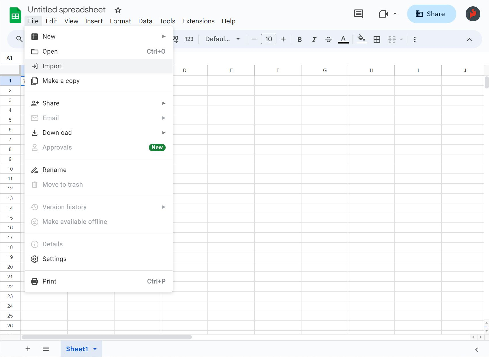
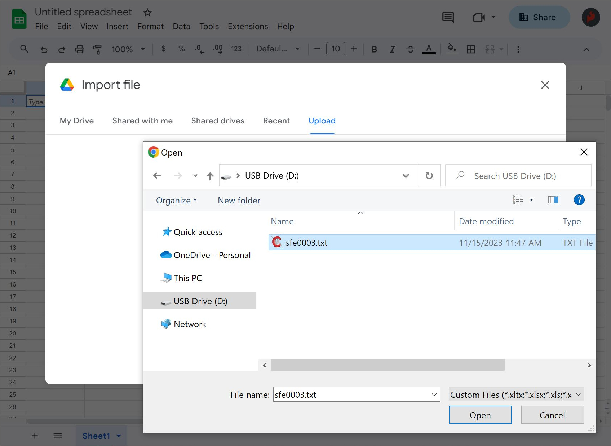
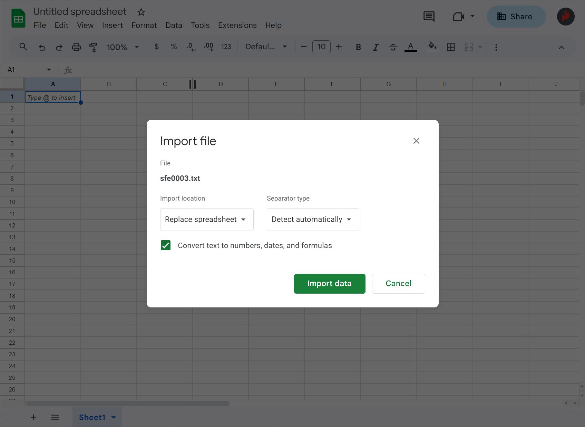
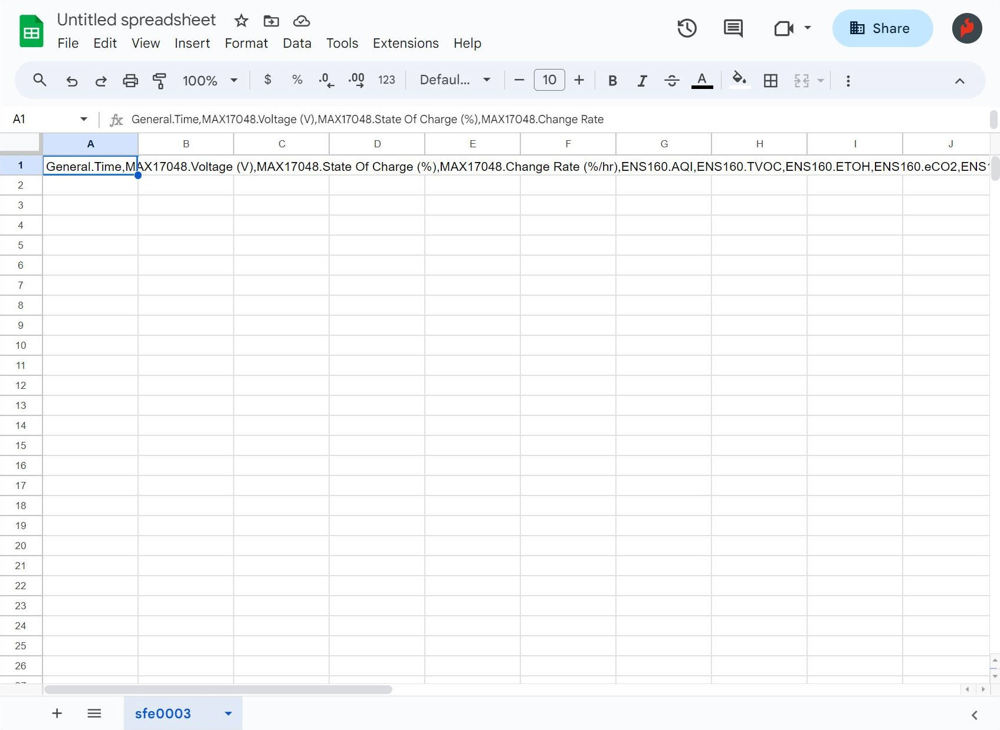
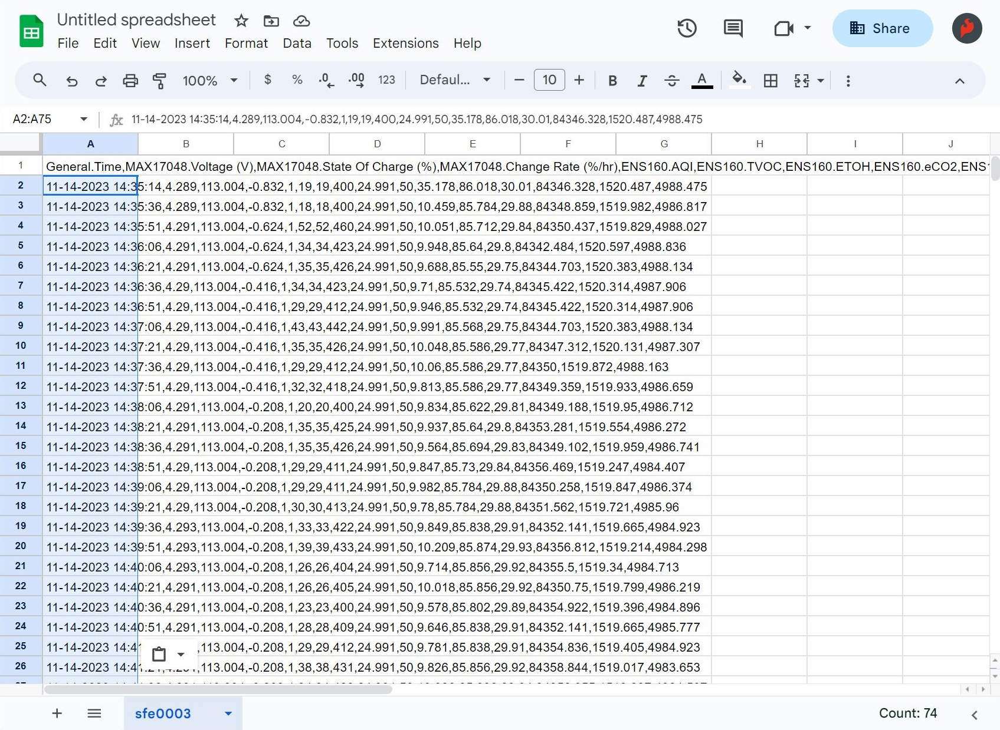
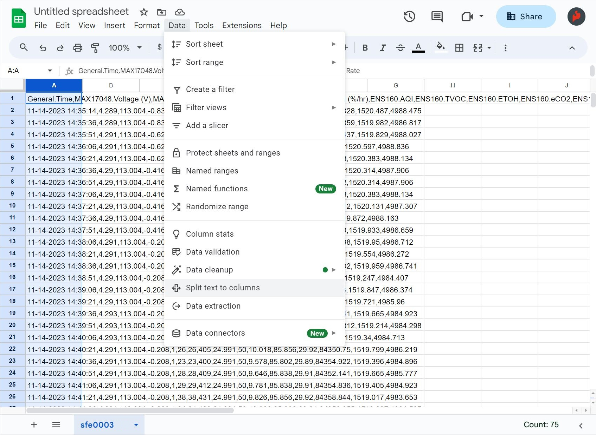
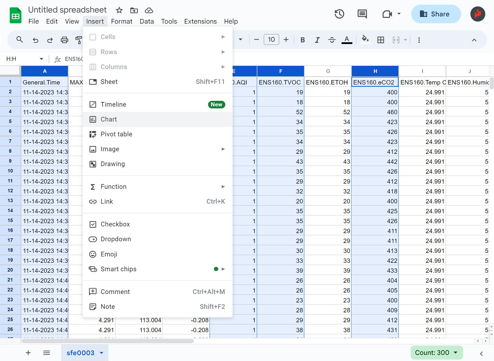
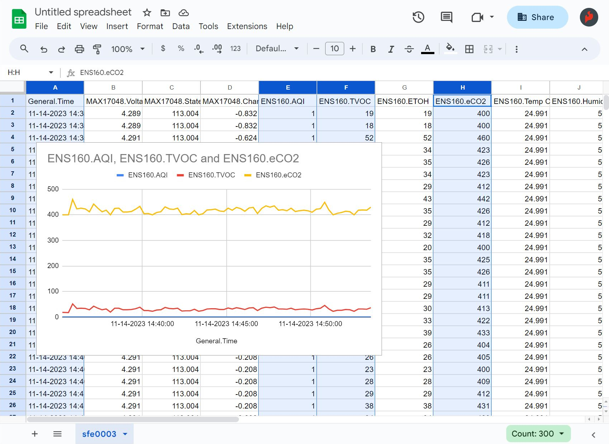
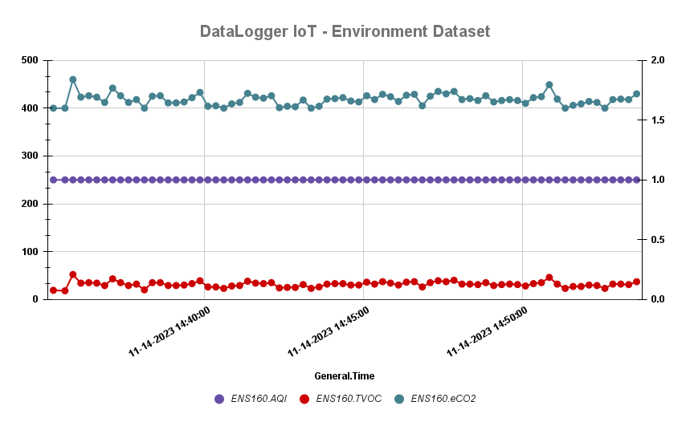
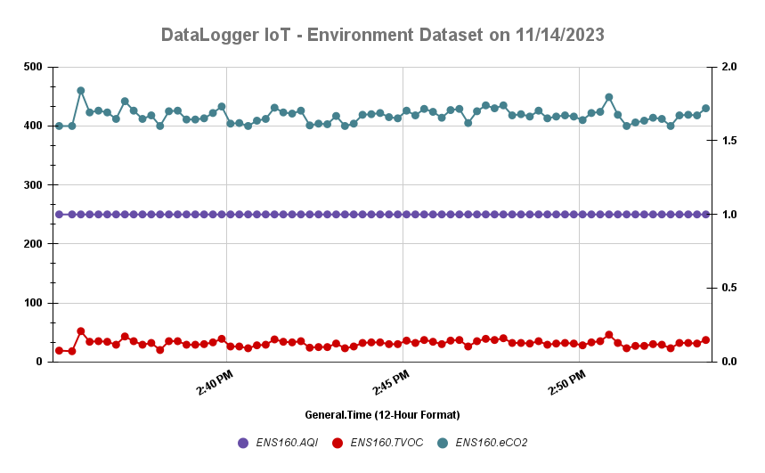

The DataLogger IoT is great at displaying real time data with an IoT service whenever there is an Internet connection available. For those that want to use the DataLogger IoT without a WiFi connection and/or you just want to save data to a microSD card, you can import the comma separated values (CSV) from the text file into a spreadsheet to graph the values.

There are a few spreadsheet programs available that can take text files with CSV but for the scope of this tutorial, we will be using Google Sheets&trade; to convert the CSV output to a graph.

    
     
    <i>Image Courtesy of <a href="https://www.google.com/sheets/about/">Google Sheets</a>. </i>

!!! note
    Google and Google Sheets are trademarks of Google LLC. This tutorial is not endorsed by or affiliated with Google in any way. We just thought it was a sweet tool to visualize all the data that was collected by your snazzy DataLogger IoT. 😉

### Log Some Data!

At this point, we will assume that you have configured connected your devices to the DataLogger IoT and configured its settings. Insert the microSD card into it's socket. Power the DataLogger IoT up and start logging some data! In this case, we were using the DataLogger IoT using the Qwiic Environmental Combo Breakout - ENS160/BME280. of course, you could have other compatible Qwiic-enabled devices connected depending on your setup. For simplicity, a WiFi connection was used to synchronize the clock to the NTP server and a computer's USB port was used to power everything.

!!! tip
    For users without an Internet connection to sync the clock to the NTP server, you may want to consider using a compatible Qwiic-enabled device like the Qwiic Real Time Clock (RTC) Module - RV-8803 or a Qwiic-enabled u-blox GNSS module. Note that you will need to configure the time to your area before logging any data. U-blox GNSS modules would also need to be able to view a few satellites before being able to synchronize to the UTC.

!!! note
    For users that require a timestamp with their datasets, make sure to [enable timestamp](https://docs.sparkfun.com/SparkFun_DataLogger/example_timestamp/).

### Download the Log Files

Users can download the log files to your computer with the IoT Web Server. You will need to update firmware to v01.02.00 and enable this feature. For more information, check out the [previous example to view and download log files using the IoT web server](../example_iot_web_server/).

<a href="../example_iot_web_server" class="md-button">Examples: Viewing and Downloading Log Files using the IoT Web Server</a>

Of course, users can follow the old school method and manually grab the files using a microSD card reader. When ready, remove power from the DataLogger IoT and eject the microSD card from the socket. Insert the microSD card into an adapter and connect to your computer.

  

### Importing CSV to a Spreadsheet

Log into your Google account and [open Google Sheets to create a new spreadsheet](https://www.google.com/sheets/about/).

<a href="https://docs.google.com/spreadsheets/create" target="google_sheets" class="md-button">Click Here to Create a New Google Spreadsheet</a>

Head to the menu and select: **File** > **Import**.

  

A window will pop up with some options to import a file. Click the **Upload** tab. Click on the **Browse** button to choose the file. Or drag and drop the file into the upload area. In this case, the DataLogger IoT saved the comma separated values to a text file called **sfe0003.txt**.

  

!!! note
    Not seeing any data in the file or even a text file saved in the root directory? Make sure that the microSD card is formatted correctly and the DataLogger is configured properly. In the menu, make sure to have the [**SD Card Format** enabled and set to the correct format](../configuration/#logging-logger). In this case, we are using the default CSV format.

Another window will pop up asking how to import the file. From the drop down menu, select: **Import location** > **Create new spreadsheet** and **Separator Type** > **Detect automatically**.  Since the file will include commas to separate each reading, Google Sheets should automatically separate text and values into each cell. Otherwise, you can select **comma** as the separator type.

  

!!! note
    If you have the file open, you can also manually paste the CSV data into the spreadsheet. Select all the contents of the text file and copy the contents onto your clipboard. Right click the cell closest to the top and farthest to the left of the spreadsheet (i.e. A1). Then paste the data. One caveat is that Google Sheets may have problems where it only pastes the title of each column.

    

      
    

    If you see this happen, you will need to select all but the header row from the text file. Then copy the contents onto your clipboard again. Right click on the next row the titles (i.e. A2) and paste the data.

    

      
    

!!! tip
    To separate the values to each column, highlight everything in the column. Then head to the menu and select:  **Data** > **Split text into columns**

    

      
    

### Graphing Your Datasets

Hold down the <kbd>Shift</kbd> button on your keyboard and select the columns that you would like to graph using your mouse. Once the data is highlighted, head to the menu and select: **Insert** > **Chart**.

  <a href="../assets/csv_to_spreadsheet_select_columns_to_graph.JPG"> Chart from menu"></a>

The values that were selected will be graphed. You will want to be careful about including too many datasets on the graph as it can be hard to read when they are not in the same range.

  

At this point, try formatting the data based on your preferences and export the graph. The graph below was formatted and exported to a PNG. Note that the values for the AQI were moved to the right of the graph for a better viewing since they were smaller than the datasets for TVOC and eCO2.

  

!!! note
    There are additional features to help format your data based on your personal preferences! Select the column that you would like to format. Then head to the menu: **Format** > **Number**. Select the format that you would like to apply to the dataset. In this case, we adjusted the General Time with **Custom Date and Time** to show a 12-hour format before creating a new graph.

    

      
    

