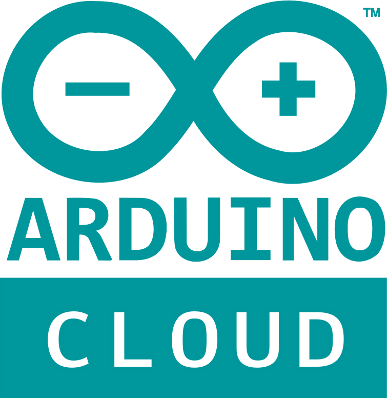
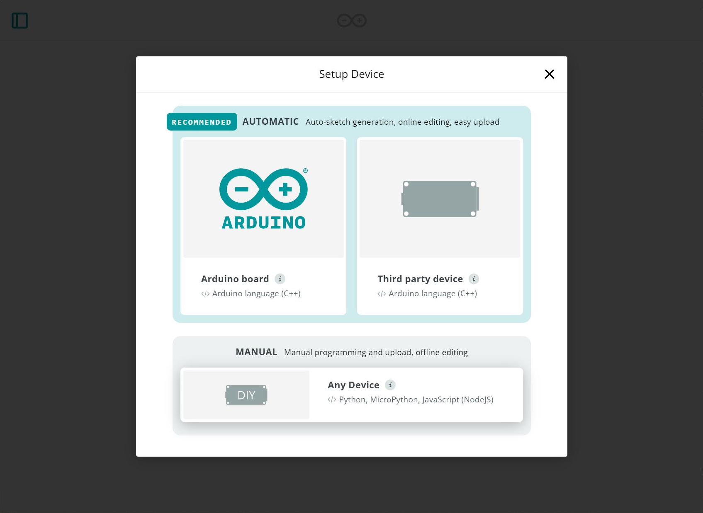

!!! arduino
    At the time of writing, Arduino's IoT service was referred to as the "Arduino IoT Cloud." [Arduino updated the service with a different UI and is now referring to the service as the "Arduino Cloud"](https://blog.arduino.cc/2023/11/15/announcing-a-better-arduino-cloud-together/)."  When referencing the Arduino IoT or Arduino IoT Cloud in this tutorial, we are referring to the Arduino Cloud.


# Creating and Connecting to an Arduino Cloud Device

One of the key features of the SparkFun DataLogger IoT is it's simplified access to IoT service providers. This document outlines how an Arduino Cloud Device is used by the DataLogger IoT.

The following is covered by this document:

* Structure of the Arduino Cloud Devices
* Device creation in the Arduino Cloud
* Setup of the Arduino Driver
* How data is posted from the DataLogger IoT to the Arduino Device

Currently, the Arduino Cloud device connection is a single direction - used to post data from the DataLogger IoT to an Arduino Cloud device.

<div style="text-align: center">
    <a href="../assets/Combined_Arduino_Logo_Cloud.png"></a>
    <br />
    <i>Image Courtesy of <a href="https://cloud.arduino.cc/">Arduino</a></i>
</div>


!!! note
    To take advantage of the API's in Arduino Cloud, you will also need to have a [service plan](https://cloud.arduino.cc/plans) with your account.


## General Operation

The Arduino Cloud enables connectivity between an IoT/Edge Arduino enabled device and the cloud. The edge device updates data in the Arduino Cloud by updating `variables` or parameters attached to a cloud device.

In the Arduino Cloud, the edge device is represented by a *Device* which has a virtual *Thing* attached/associated with it. The *Thing* acts as a container for a list of *parameters* or *variables* which represent the data values received from the edge device. As values on the edge device update, they are transmitted to the Arduino Cloud.

For a SparkFun DataLogger IoT connected to an Arduino Cloud device, the output parameters of a device connected to the DataLogger are mapped to variables within the Arduino Cloud Device's Thing using a simple pattern of *DeviceName_ParameterName* for the name of the variable in the Arduino Cloud.

<div style="text-align: center">
  <a href="../assets/aiot_overview.png"></a>
</div>


## Creating a Device in Arduino Cloud

The first step connecting to the Arduino Cloud is setting up a device within the cloud. A device is a logical element that represents a physical device.

Log into your Arduino Cloud account.

<div style="text-align: center"><a href="https://cloud.arduino.cc/home/" target="arduino_iot_cloud" class="md-button">Click Here to Log into Arduino Cloud</a></div>

Click on the expand menu icon on the upper left (e.g. the three lines stacked like a "hamburger"; &#9776;) and select  **Devices**. If your window is big enough, then it will show up on the navigation bar.

<div style="text-align: center">
  <a href="../assets/aiot_cloud_sel_devices.jpg"></a>
</div>

This page lists your currently defined devices. If there are no defined devices, select the ***Add Device*** button. This will probably be at the bottom of the page. The location of this button will change once the page has a device (or if there is an update to Arduino's user interface).

<div style="text-align: center">
  <a href="../assets/aiot_dev_add.jpg"></a>
</div>

A device type selection dialog is then shown. Since we are connecting a DataLogger IoT board to the system, and not connected a known device, select ***DIY*** - ***Any Device*** to manually include the DataLogger IoT.

<div style="text-align: center">
  <a href="../assets/aiot_dev_setup_sel.jpg"></a>
</div>

Once selected, another dialog is presented. Just select *Continue*. At this point you can provide a name for your device. In this case we named it as "_MyDataLoggerIoT_."

<div style="text-align: center">
  <a href="../assets/aiot_dev_name.jpg"></a>
</div>

The next screen is the critical step of the device creation process. This step is the one time the Device Secret Key is available. The provided ```Device ID``` and Device ```Secret Key``` values are needed to connect to the Arduino Cloud. Once this step is completed, the Secret Key is no longer available.

<div style="text-align: center">
  <a href="../assets/aiot_dev_secrets.jpg"></a>
</div>

The easiest way to capture these values is by downloading as a PDF file, which is offered on the setup page. Click on the **download the PDF** and save it to a safe location. When ready, click on the check box indicating that you have saved the values and select the ***Continue*** button.


## Arduino Cloud API Keys

In addition to creating a device, to access the Arduino Cloud, the driver requires an API Key. This allows the DataLogger IoT's Arduino Cloud driver to access the web API of the Arduino Cloud. This API is used to setup the connection to the Arduino Cloud.

To create an API key, click on the menu bar to expand and select your  **Arduino account profile** > **Personal Settings**.

<div style="text-align: center">
  <a href="../assets/aiot_cloud_api-k.jpg"></a>
</div>

This menu takes you to a list of existing API Keys. If you have not created one yet, the list will have nothing in it like the image below. From this page, select the ***CREATE API KEY*** button.

<div style="text-align: center">
  <a href="../assets/aiot_cloud_create_key.jpg"></a>
</div>

!!! note
    Users will need a service plan in order to take advantage of the API.


In the presented dialog, enter a name for the API key. In this case, we named it "*MyDataLoggerKey*".

<div style="text-align: center">
  <a href="../assets/aiot_cloud_key_name.jpg"></a>
</div>

Once the name is entered, click ***CONTINUE***. A page with the new API key is presented. Like in Device Creation, this page contains a secret that is only available on this page during this process.

<div style="text-align: center">
  <a href="../assets/aiot_cloud_key_secret.jpg"></a>
</div>

Make note of the *Client ID* and *Client Secret* values on this page. The best method to capture these values is to download the PDF file offered on this page. Click on the **download the PDF** and save it to a safe location. When ready, click on the check box indicating that you have saved the values and select the ***DONE*** button.

At this point, the Arduino Cloud is setup for connection by the driver.


## Arduino Cloud Configuration

To add an Arduino Cloud Device as a destination DataLogger IoT, the Arduino Cloud connection is enabled via the DataLogger menu system and the connection values, obtained from the Arduino Cloud (see above), are set in the connection properties.

The specifics for the Arduino Cloud must be configured. This includes the following:

* Thing Name
* Thing ID
* API Client ID
* API Secret
* Device Secret
* Device ID

!!! note
    The Thing Name does not necessarily need to be configured. However, there will be less confusion if you set this up before connecting the DataLogger IoT to the Cloud. The Thing ID will automatically be generated and saved once there is a connection available.


### Thing Name

The name of the Arduino Cloud ```Thing``` to use. If the Thing doesn't exist on startup, the driver will create a Thing and be named "Untitled" if you do not provide a name.

!!! note
    Note satisfied with the default "Untitled" as the Thing's name? You can rename the Thing Name after creating the Thing. Note that you will need to manually rename the Thing Name on the Arduino Cloud and DataLogger IoT.


### Thing ID

This is the ID of the Thing being used. This value is obtained by the following methods:

* If the driver creates a new Thing, the ID is obtained and used.
* If an existing Thing is connected to the DataLogger IoT, the driver retrieves it's ID.
!!! note
    In this case, the driver cannot create any new variables until the system is restarted.
* The user creates a new Thing using the web interface of Arduino Cloud, and provides the *Thing Name* and *Thing ID* .


### API Client ID and Secret

These values are used to provide API access by the driver. This access allows for the creation/use of a Thing and Variables within the Arduino Cloud. These are obtained via the steps outlined earlier in this document.


### Device Secret and ID

These values are used to identify the Arduino device that is connected to. These are obtained via the steps outlined earlier in this document.


## Setting Properties

The above property values must be set in the DataLogger's Arduino Cloud driver before use. They can be manually by using the menu system like the previous MQTT example.

For users that are interested in using the menu system, open a Serial Terminal, connect to the COM port that your DataLogger enumerated to, and set it to **115200** baud. In this case, we connected to **COM13**. Press any key to enter the Main Menu. Type <kbd>1</kbd> to enter the Settings menu. Then type <kbd>16</kbd> to enter the Arduino IoT Menu. When the menu system for the Arduino IoT is presented, you will need to configure the property values as listed in the JSON file. Saving the values through the menu system will save the credentials to the ESP32's persistent memory. The following options are displayed:

<div style="text-align: center">
  <a href="../assets/SparkFun_DataLogger_IoT_Arduino_IoT_Cloud_Menu.JPG"></a>
</div>

The alternative to using the menu system is a JSON file. These values can be set using a JSON file that is loaded by the system at startup. For the DataLogger Arduino Cloud example outlined in this document, the entries in the setting's JSON file are as follows:

```json
"Arduino IoT": {
    "Enabled": true,
    "Thing Name": "SparkFunThing1",
    "API Client ID": "MY_API_ID",
    "API Secret": "MY_API_SECRET",
    "Device Secret": "MY_DEVICE_SECRET",
    "Device ID": "MY_DEVICE_ID"            
  },
```

You will need to update the `API Client ID`, `API Secret`, `Device Secret`, and `Device ID` with the values that were obtained earlier. Don't forget to enable Arduino Cloud service by setting the value to `true`. If the JSON file is saved in the microSD card, you will need to load the credentials to the DataLogger IoT.

!!! tip
    To load the values by the system at startup using a JSON file and microSD card, you will need to [configure the Save Settings](../configuration#general-save-settings). This JSON file will be created with the "**Save to Fallback**" option. Make sure to enable the Arduino IoT as well.


## Operation

On startup, when the first values are written from the DataLogger IoT, the connection to the Arduino Cloud is made. During this connection, the system connects to the specified *Thing* and variables are mapped between the DataLogger Device values and Arduino Cloud Variables. If needed, variables can be created manually in the cloud.

While this initial setup takes seconds to complete, updates to the values on the Arduino Cloud are rapid as soon as there is a connection available.


### Viewing Values

Once the DataLogger IoT device is configured and running, updates in Arduino Cloud are listed in the ***Things*** tab of the Arduino Cloud page. Clicking the target Thing provides access to the current variable values that are connected to the DataLogger IoT. Your mileage may vary depending on the compatible device that is connected to the DataLogger IoT. In this case, we were able to see the built-in sensors that were connected on the DataLogger IoT - 9DoF.

<div style="text-align: center">
  <a href="../assets/aiot_cloud_vars.jpg"></a>
</div>

!!! note
    Not seeing certain variables on your list? Check your connections to make sure that the compatible device is connected to the DataLogger IoT. You may also have certain outputs disabled (like the connected [sensors](../configuration/#device-settings) or [timestamp](../example_timestamp)).

!!! note
    Having problems connecting new variables with the DataLogger IoT? When swapping out compatible Qwiic enabled devices, you may need to delete previous cloud variables so that the DataLogger IoT is able re-initialize them on the next power cycle.


### Create a Dashboard

With the data now available in the Arduino Cloud as variables, it is a simple step create a dashboard that plots the data values.

The general steps to create a simple dashboard include:

* Select the ***Dashboards*** section of the Arduino Cloud.
* Select the ***Build Dashboard*** button. If you have a dashboard already built, the location of the button will change and the button will be renamed: ***Create***.
* Click the edit button (i.e. the icon that looks like a paper and pencil, this is next to the eye).
* Add an element to the dashboard -- for this example select ***ADD ^*** > ***Advanced Chart***.
* On the Chart's Widget Settings select ***Link Variables*** to add readings.  
* The DataLogger IoT Variables are listed - select the variable to link.
* Continue this step until all the desired variables are linked to the chart. You can select up to 5x variables at a time. Click on the ***Link Variables*** button after selecting the variables.
* This will bring you back to the Chart's Widget Settings window. Configure any preferences that to display (i.e. variable colors, labels, etc.). When all variables are linked and the Chart Widget Settings is configured, select ***Done***.

<div style="text-align: center">
  <a href="../assets/aiot_dashboard_link.jpg"></a>
</div>

The created dashboard then displays the values posted from the SparkFun DataLogger IoT. You can continue adding additional readings on the dashboard that you were not able to fit on graph or even rename the Dashboard view. In this case, we displayed accelerometer values and temperature in degrees Celsius from the DataLogger IoT - 9DoF.

<div style="text-align: center">
  <a href="../assets/aiot_dashboard.jpg"></a>
</div>

!!! note
    Not seeing any values on the **LIVE** view? Try clicking on the other time periods to see the values posted.

Using compatible Qwiic enabled devices, you can also display additional readings that are not available with the built-in sensors. In this case, we were able to display humidity, temperature in degrees Fahrenheit, equivalent CO<sub>2</sub>, TVOC, and AQI with the DataLogger IoT and Environmental Combo Breakout (ENS160/BME280).

<div style="text-align: center">
  <a href="../assets/aiot_dashboard_qwiic_env.jpg"></a>
</div>
