# Creating and Connecting to an AWS IoT Device (Thing)

One of the key features of the DataLogger IoT is it's simplified access to IoT service providers. This document outlines how an AWS IoT device is used by the DataLogger IoT.

<div style="text-align: center">
    <a href="https://aws.amazon.com/iot-core/"></a>
    <br />
    <i>Image Courtesy of <a href="https://aws.amazon.com/iot-core/">Amazon Web Services (AWS)</a></i>
</div>

The following is covered by this document:

* Device (Thing) creation in AWS
* Securely connecting the device
* How data is posted from the DataLogger IoT to the AWS Device via it's Shadow

Currently, the AWS IoT device connection is a single direction - used to post data from the hardware to the IoT AWS Device via the AWS IoT devices **shadow**. Configuration information from AWS IoT to the DataLogger IoT is currently not implemented.


## General Operation

AWS IoT enables connectivity between an IoT / Edge device and the AWS Cloud Platform, implementing secure endpoints and device models within the AWs infrastructure. This infrastructure allows edge devices to post updates, status and state to the AWS infrastructure for analytics, monitoring and reporting.

In AWS IoT, an virtual representation of an actual device is created and referred to as a *Thing*. The virtual device/Thing is allocated a connection endpoint, security certificates and a device **shadow** - a JSON document used to persist, communicate and manage device state within AWS.

The actual IoT device communicates with it's AWS representation via a secure MQTT connection, posting JSON document payloads to a set of pre-defined topics. Updates are posted to the AWS IoT device **shadow**, which is then accessed within AWS for further process as defined by the users particular cloud implementation.


<div style="text-align: center">
  <a href="../assets/iot_aws_overview.png">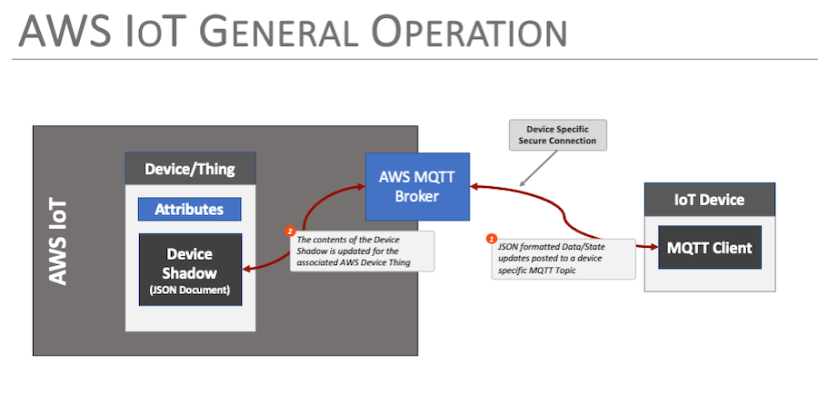</a>
</div>


## Creating a Device in AWS IoT

The following discussion outlines the basic steps taken to create a Thing in AWS IoT that the DataLogger IoT can connect to. First step is to log into your AWS account and create a thing.

<div style="text-align: center"><a href="https://aws.amazon.com/iot-core/" target="aws_iot_core" class="md-button">Click Here to Log into AWS</a></div>

Once logged into your AWS account, select **IoT Core** from the menu of services.

<div style="text-align: center">
  <a href="../assets/iot_aws_iot_core.png">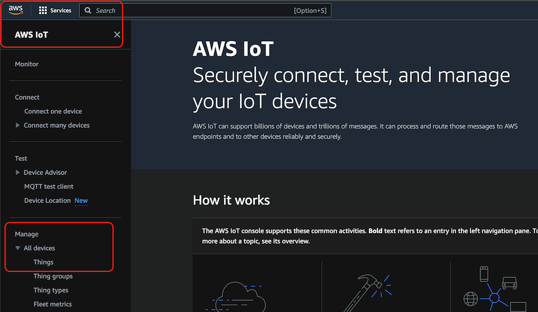</a>
</div>

From the IoT Core console page, under the **Manage** section, select **All Devices > Things**  

On the resultant Things Page, select the **Create Things** button.

<div style="text-align: center">
  <a href="../assets/iot_aws_thing_create.png">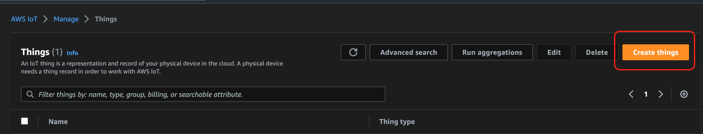</a>
</div>

AWS IoT will then take you through the steps to create a device. Selections made for a demo Thing are:

* Create single thing
* Thing Properties
  * Enter a name for your thing - for this example ***TestThing23***
  * Device Shadow - select ***Unnamed shadow (classic)***
* Auto-generate a new certificate
* Attach policies to certificate - This is discussed later in this document
* Select **Create thing**

Upon creation, AWS IoT presents you with a list of downloadable certificates and keys. Some of these are only available at this step. The best option is to download everything presented - three of these are used by the DataLogger IoT. The following should be downloaded:

* Device Certificate
* Public Key File
* Private Key File
* Root CA certificates - (for example:  Amazon Root CA 1 )

At this point, the new AWS IoT thing is created and listed on the AWS IoT Things Console

<div style="text-align: center">
  <a href="../assets/iot_aws_thing_list.png">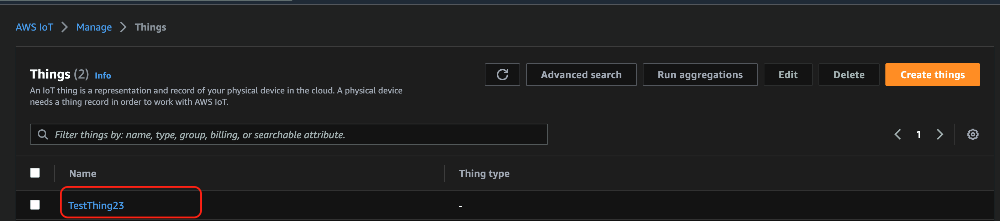</a>
</div>

### Security Policy

To write to the IoT device, a security policy that enables this is needed, and the policy needs to be assigned to the devices certificate.

To create a Policy, select the ***Manage > Security > Policies*** menu item from the left side menu of the AWS IoT panel. Once on this page, select the **Create policy** button to create a new policy.

<div style="text-align: center">
  <a href="../assets/iot_aws_thing_policy.png">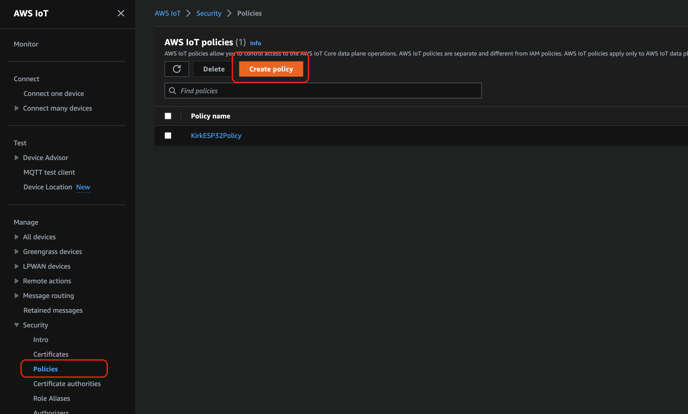</a>
</div>

When entering the policy, provide a name that fits your need. For this example, the name **NewThing23Policy** is used. For the Policy document, you can manually enter the security entires, or enter them as a JSON document. The JSON document used for this example is:

```json
{
  "Version": "2012-10-17",
  "Statement": [
    {
      "Effect": "Allow",
      "Action": "iot:Connect",
      "Resource": "*"
    },
    {
      "Effect": "Allow",
      "Action": "iot:Subscribe",
      "Resource": "*"
    },
    {
      "Effect": "Allow",
      "Action": "iot:Receive",
      "Resource": "*"
    },
    {
      "Effect": "Allow",
      "Action": "iot:Publish",
      "Resource": "*"
    },
    {
      "Effect": "Allow",
      "Action": "iot:GetThingShadow",
      "Resource": "*"
    },
    {
      "Effect": "Allow",
      "Action": "iot:UpdateThingShadow",
      "Resource": "*"
    }
  ]
}
```

<div style="text-align: center">
  <a href="../assets/iot_aws_thing_create_policy.png">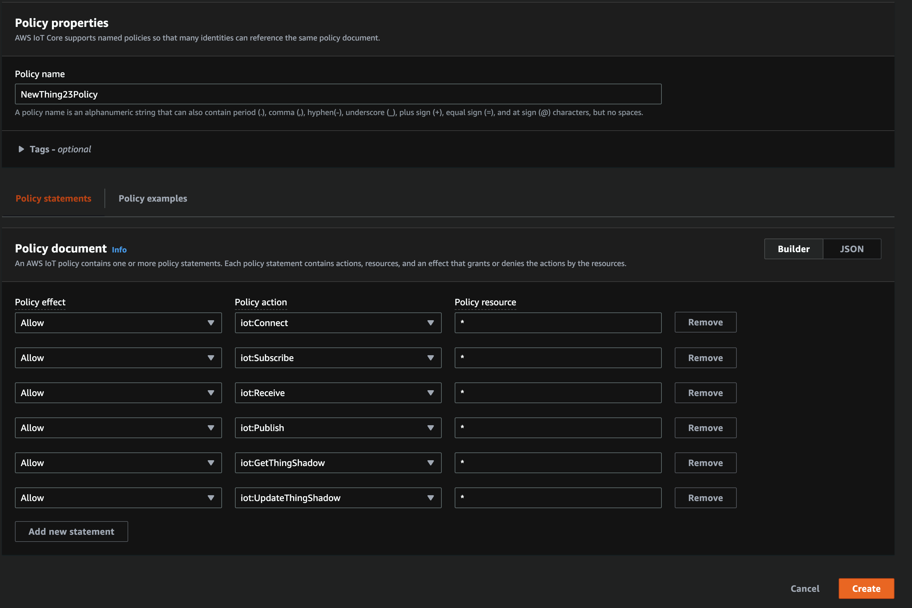</a>
</div>

Once the policy is created, go back to the IoT Device/Thing created above and associate this policy to the device Certificate.

* Go to your device ***Manage > All devices > Things***
* Select the device - ***TestThing23*** for this example
* Select the ***Certificates*** tab
* Select the listed Certificate (it's a very long hex number)
* At the bottom right of the page, select the ***Attach policies*** button and select the Policy created above.

<div style="text-align: center">
  <a href="../assets/iot_aws_iot_attach_policy.png">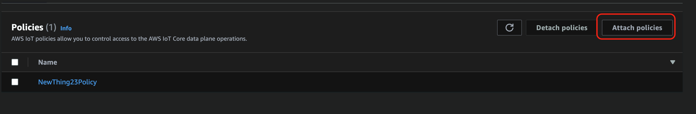</a>
</div>

At this point, AWS IoT is ready for a device to connect and receive data.


## AWS Configuration

The specifics for the AWS IoT Thing must be configured. This includes the following:

* Server name/host
* MQTT topic to update
* Client Name - The AWS IoT Thing Name
* CA Certificate Chain
* Client Certificate
* Client Key


### Server Name/Hostname

This value is obtained from the AWS IoT Device page for the created device. When on this page, select the ***Device Shadows*** tab, and then select the ***Classic Shadow*** shadow, which is listed. Note a secure connection is used, so the port for the connection is `8883`.

<div style="text-align: center">
  <a href="../assets/iot_aws_iot_dev_attr.png">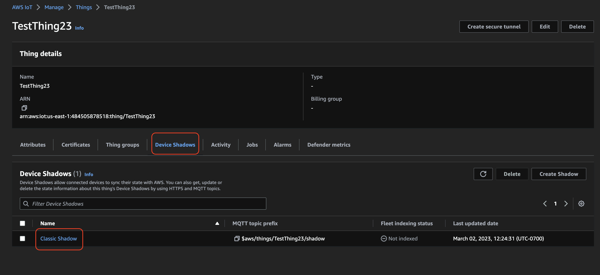</a>
</div>


Selecting the ***Classic Shadow*** entry provides the Server Name/Hostname for the device, as well as the MQTT topic for this device.

<div style="text-align: center">
  <a href="../assets/iot_aws_iot_shadow_details.png">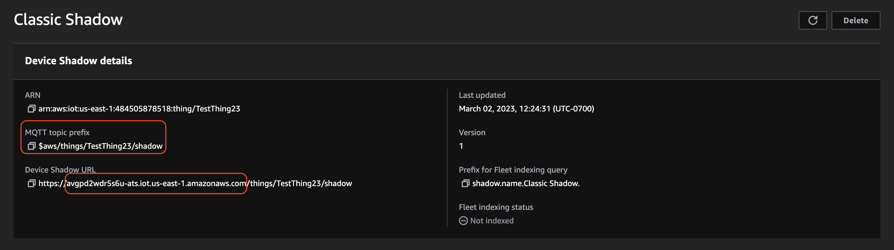</a>
</div>

Note: The server name is obtained from the Device Shadow URL entry


### MQTT Topic

The MQTT topic value is based uses the ***MQTT topic prefix*** from above, and has the value ***update*** added to it. So for this example, the MQTT topic is:

```$aws/things/TestThing23/shadow/update```


### Client Name

This is the AWS IoT name of the thing. For the provided example, the value is ***TestThing23***


### CA Certificate Chain

This value was downloaded as a file during the creation process. The contents of this file can be passed on to the DataLogger IoT by copying the file containing the data onto a devices SD Card and setting the filename property for the DataLogger IoT.


### Client Certificate

This value was downloaded as a file during the creation process. The contents of this file can be passed on to the DataLogger IoT by copying the file containing the data onto a devices SD Card and setting the filename property for the DataLogger IoT.


### Client Key

This value was downloaded as a file during the creation process. The contents of this file can be passed on to the DataLogger IoT by copying the file containing the data onto a devices SD Card and setting the filename property for the DataLogger IoT.


## Setting Properties

The above property values must be set on the DataLogger before use. They can be passed on via a JSON file that is loaded by the system at startup. Of course, you can also manually set the values using the menu system like the previous MQTT example.

For the DataLogger IoT example outlined in this document, the entries in the settings JSON file are as follows:

```json
"AWS IoT": {
    "Enabled": true,
    "Port": 8883,
    "Server": "avgpd2wdr5s6u-ats.iot.us-east-1.amazonaws.com",
    "MQTT Topic": "$aws/things/TestThing23/shadow/update",
    "Client Name": "TestThing23",
    "Buffer Size": 0,
    "Username": "",
    "Password": "",
    "CA Certificate": "",
    "Client Certificate": "",
    "Client Key": "",
    "CA Cert Filename": "AmazonRootCA1.pem",
    "Client Cert Filename": "TestThing23_DevCert.crt",
    "Client Key Filename": "TestThing23_Private.key"
  },
```

Besides updating the `Server`, `MQTT Topic`, `Client Name`, `CA Cert Filename`, `Client Cert Filename`, and `Client Key Filename`, you will need to also ensure that the `port` is set to `8883`. The default in previous firmware versions was `1883`. As of firmware v01.00.04, the default is `8883`. You will need to adjust the port value to properly connect to the [AWS IoT service](https://aws.amazon.com/about-aws/whats-new/2018/02/aws-iot-core-now-supports-mqtt-connections-with-certificate-based-client-authentication-on-port-443/). Don't forget to enable AWS IoT service by setting the value to `true`.

If the JSON file is saved in the microSD card, you will need to load the credentials to the DataLogger IoT. Of course, you can manually update the values through the command line as well to save the credentials to the ESP32's persistent memory.


## Operation

Once the device is configured and running, updates in AWS IoT are listed in the ***Activity*** tab of the devices page. For the test device in this document, this page looks like:

<div style="text-align: center">
  <a href="../assets/iot_aws_iot_shadow_updates.png">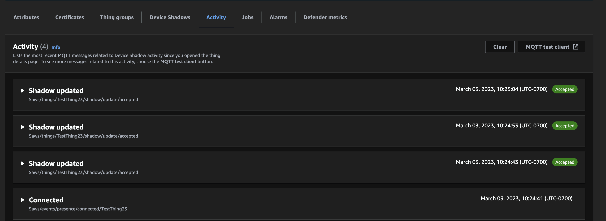</a>
</div>

Opening up an update, you can see the data being set to AWS IoT in a JSON format.

<div style="text-align: center">
  <a href="../assets/iot_aws_iot_shadow_data.png">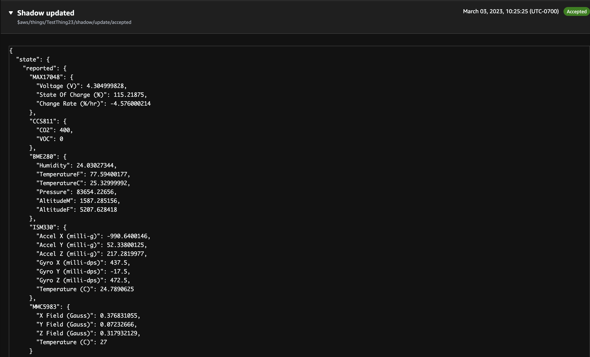</a>
</div>
