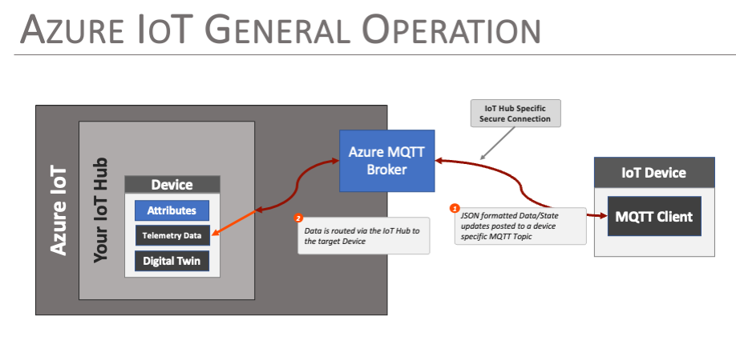
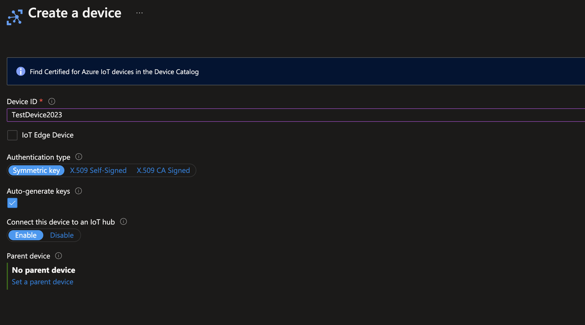
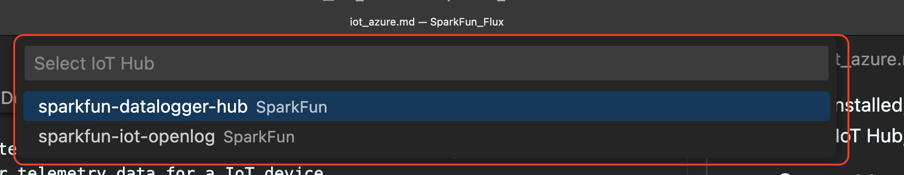

# Creating and Connecting to an Azure IoT Device

One of the key features of the DataLogger IoT is it's simplified access to IoT service providers. This document outlines how an Azure IoT device is used by the DataLogger IoT.

<div style="text-align: center">
    <a href="https://azure.microsoft.com/en-us/"></a>
    <br />
    <i>Image Courtesy of <a href="https://azure.microsoft.com/en-us/">Microsoft Azure</a></i>
</div>

The following is covered by this document:

* Device creation Azure
* Securely connecting the device
* How data is posted from the DataLogger IoT to the Azure Device

Currently, the Azure IoT device connection is is a single direction - it is used to post data from the hardware to the Azure IoT Device. Configuration information from Azure IoT to the DataLogger IoT is currently not implemented.


## General Operation

Azure IoT enables connectivity between an IoT / Edge device and the Azure Cloud Platform, implementing secure endpoints and device models within the Azure infrastructure. This infrastructure allows edge devices to post updates, status and state to the Azure infrastructure for analytics, monitoring and reporting.

In Azure IoT, an virtual representation of an actual device is created and referred to as a *Device*. The virtual device is allocated a connection endpoint, security certificates and a device **digital twin** - a JSON document used to persist, communicate and manage device state within Azure. Unlike AWS IoT, data from the device isn't posted to the devices digital twin (AWS Shadow), but to the device directly.

The actual IoT device communicates with it's Azure representation via a secure MQTT connection, posting JSON document payloads to a set of pre-defined topics. Updates are posted directly to the Azure device, which is then accessed within Azure for further process as defined by the users particular cloud implementation.

<div style="text-align: center">
  <a href="../assets/iot_az_iot_overview.png"></a>
</div>


## Creating a Device in Azure IoT

The following discussion outlines the basic steps taken to create a Device in Azure IoT that the DataLogger IoT can connect to. First step is to log into your Azure account and create an IoT Hub for your device.

<div style="text-align: center"><a href="https://azure.microsoft.com/en-us/" target="azure" class="md-button">Click Here to Log into Microsoft Azure</a></div>

Once logged into your Microsoft Azure account, select **Internet of Things > IoT Hub** from the menu of services.

<div style="text-align: center">
  <a href="../assets/iot_az_iot_hub.png"></a>
</div>


### Create an IoT Hub

This IoT Hub page lists all the IoT hubs available for your account. To add a device, you need to create a new IoT Hub.

Follow the Hub Creation workflow - key settings used for a DataLogger demo device:

* Used the "Free Tier" for testing and development.
* Networking
    * Connectivity - ***Public Access***
    * Minimum TLS Version - ***1.0***

The remaining settings were set at their default values.

## Create a Device

Once the IoT Hub is created, a Device needs to be created within the hub. The device represents the connection to the actual DataLogger IoT device.

To create a device, select the ***Device management > Devices*** from the IoT Hub menu and the select the ***+ Add Device*** menu item

<div style="text-align: center">
  <a href="../assets/iot_az_create_device.png"></a>
</div>

In the create device dialog:

* Enter a name for the device
* Select an Authentication type of ***Symmetric key***
* Auto-generate keys ***enabled***

<div style="text-align: center">
  <a href="../assets/iot_az_device_form.png"></a>
</div>

Once created, the device is listed in the ***Devices*** list of the IoT Hub. Selecting the device gives you the device ID and keys used to communicate with the device. Note, when connecting to the device with the DataLogger IoT, the ***Primary Key*** value is used.

<div style="text-align: center">
  <a href="../assets/iot_az_device_details.png"></a>
</div>


## Azure Configuration

Once the DataLogger IoT is integrated into the application, the specifics for the Azure IoT Thing must be configured. This includes the following:

* Server Name/Hostname
* Device Key
* Device ID
* CA Certificate Chain


### Server Name/Hostname

This value is hostname of the created IoT Hub and is obtained from the Overview page of the IoT Hub.

<div style="text-align: center">
  <a href="../assets/iot_az_iot_hub_details.png"></a>
</div>

### Device ID

The Device ID is obtained from the device detail page. This page is accessible via the Device listing page, which is accessed via the ***Device management > Devices*** menu item. The selected device of interest (**TestDevice2023** for this example) provides the device ID and Primary Key.

<div style="text-align: center">
  <a href="../assets/iot_az_device_details.png"></a>
</div>


### Device Primary Key

This is obtained via the Device details page, as outlined in the previous section.

!!! note
    You view and copy the key via the icons on the right of the key entry line.


### Root Certificate Authority - CA file

The Certificate Authority file for Azure is downloaded from this page:

<div style="text-align: center"><a href="https://learn.microsoft.com/en-us/azure/security/fundamentals/azure-ca-details" target="microsoft_azure_cert" class="md-button">Microsoft: Azure Certificate Authority details</a></div>

The file to download is the ***Baltimore CyberTrust Root*** entry in the **Root Certificate Authorities** section of the page.

<div style="text-align: center">
  <a href="../assets/iot_az_ca_file.png"></a>
</div>


## Setting Properties

The above property values must be set on the DataLogger IoT before use. They can be set via a JSON file that is loaded by the system at startup. For the example outlined in this document, the entries in the settings JSON file are as follows:

```json
"Azure IoT": {
    "Enabled": false,
    "Port": 8883,
    "Server": "sparkfun-datalogger-hub.azure-devices.net",
    "MQTT Topic": "",
    "Client Name": "",
    "Buffer Size": 0,
    "Username": "",
    "Password": "",
    "Device Key" : "My-Super-Secret-Device-Key",
    "Device ID"  : "TestDevice2023",
    "CA Cert Filename": "AzureRootCA.pem"
  },
```


## Operation and Monitoring

Once the DataLogger IoT device is configured and running, the Azure IoT capability in the DataLogger IoT posts messages via MQTT to the connected Azure Device via it's IoT Hub. Messages to the device are posted as ***Telemetry Data*** for the device.

The easiest method to view the Telemetry data being sent to an Azure Iot Device is via the Azure IoT Hub extension for the Visual Studio Code editor.

<div style="text-align: center">
  <a href="../assets/iot_az_iot_hub_ext.png"></a>
</div>

Once installed, and connected to Azure via the Azure Account extension, you can connect to the target IoT Hub, and monitor telemetry data for a IoT device.


### Connect to Your Azure IoT Hub

On the Explorer panel of Visual Studio Code, click on the **...** menu of the **AZURE IOT HUB** section. In the popup menu, select the **Select IoT Hub** menu entry.

<div style="text-align: center">
  <a href="../assets/iot_az_iot_hub_sel.png"></a>
</div>

The available IoT Hubs are displayed in the editors command prompt. Select the desired hub and press <kbd>Enter</kbd> (or click).

<div style="text-align: center">
  <a href="../assets/iot_az_iot_hub_sel_menu.png"></a>
</div>

The hub is then displayed in the **AZURE IOT HUB** section of the editor Explorer. Expanding the **Devices** section of the Hub will list the example device created above.

<div style="text-align: center">
  <a href="../assets/iot_az_iot_hub_exp.png"></a>
</div>


### Monitoring

To monitor the telemetry data send to a device, right click on the device, ***TestDevice2023*** in this example, select the menu entry **Start Monitoring Build-in Event Endpoint**.

<div style="text-align: center">
  <a href="../assets/iot_az_iot_start_mon.png"></a>
</div>

Once selected, the editor output console will start displaying output for the selected device. For the above example, with a device that has environmental sensors attached, the output appears as follows:

<div style="text-align: center">
  <a href="../assets/iot_az_iot_mon_output.png"></a>
</div>

To stop monitoring, click the **Stop Monitoring build-in event endpoint** item that is displayed in the status bar of the editor.

<div style="text-align: center">
  <a href="../assets/iot_az_iot_stop_mon.png"></a>
</div>

A menu option to stop monitoring is also available from the **...** menu of the **AZURE IOT HUB** section in the editor Explorer panel.
