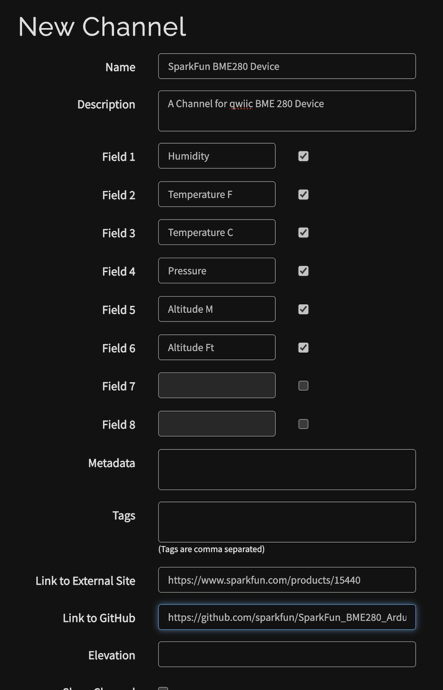
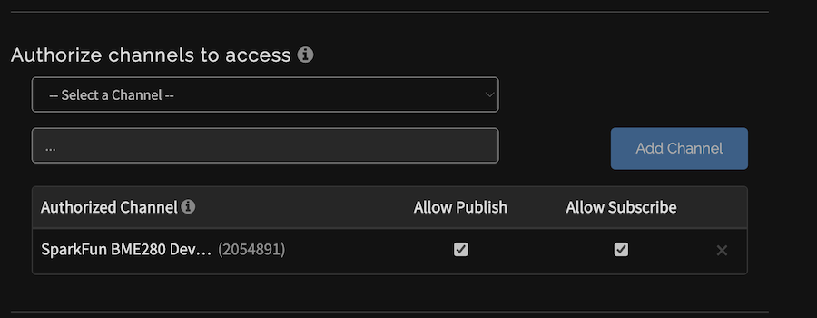
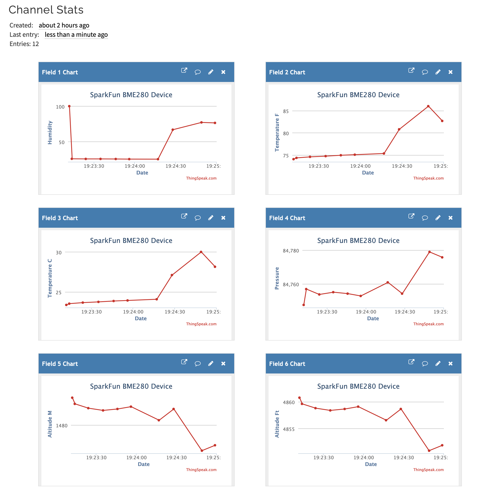
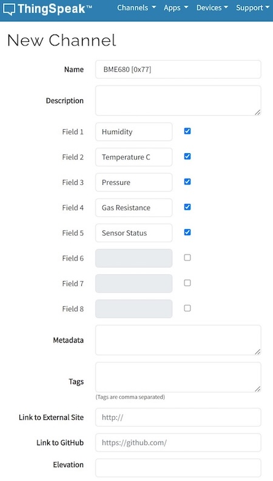
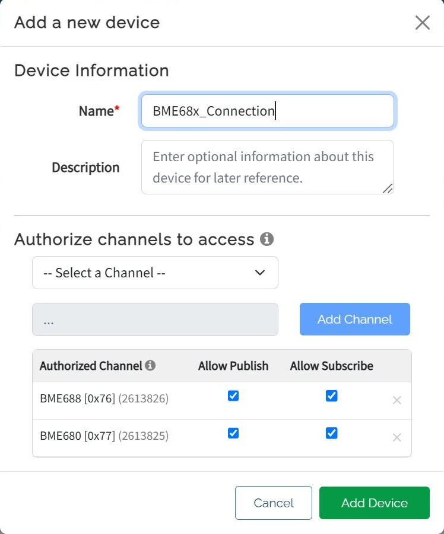
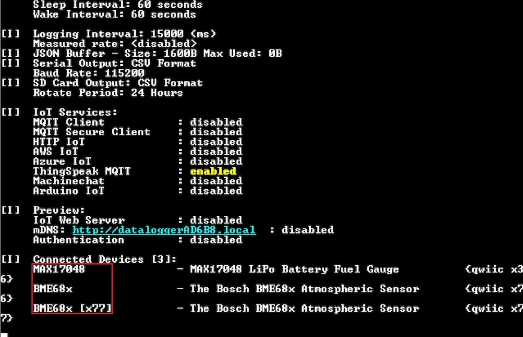
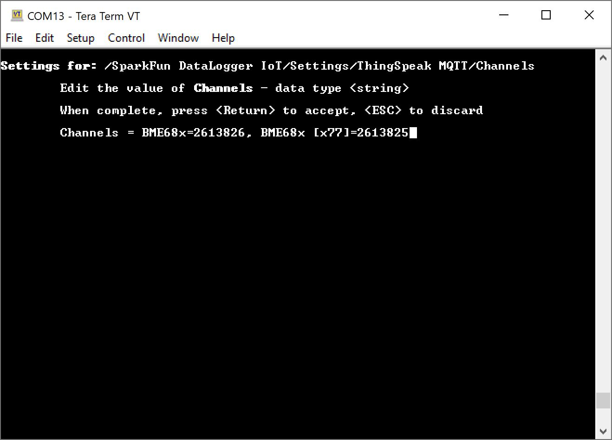
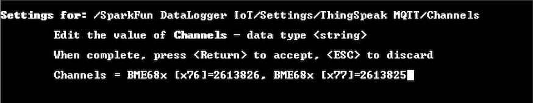

# Creating and Connecting to ThingSpeak

One of the key features of the DataLogger IoT is it's simplified access to IoT service providers. This document outlines how a ThinkSpeak output is used by the DataLogger IoT.

The following is covered by this document:

* Creating a ThingSpeak Channel and MQTT Connection
* Securely connecting the ThingSpeak
* How data is posted from the DataLogger IoT to ThingSpeak

## General Operation

### ThingSpeak Structure

The structure of ThingSpeak is based off of the concept of ***Channels***, with each channel supporting up to eight fields for data specific to the data source. Each channel is named, and has a unique ID associated with it.  One what to think of it is that a Channel is a grouping of associated data values or fields.

The fields of a channel are enumerated as ***Field1, Field2, ..., Field8***, but each field can be named to simplify data access and understanding.

As data is reported to a ThingSpeak channel, the field values are accessible for further processing or visualization output.

### Data Structure

The DataLogger IoT is constructed around the concept of ***Devices*** which are often a type of sensor that can output a set of data values per observation or sample.

### Mapping Data to ThingSpeak

The concept of Channels that contain Fields in ThingSpeak is similar to the Devices that contain Data within the DataLogger IoT, and this similarity is the mapping model used by the DataLogger IoT. Specifically:

* **Devices == Channels**
* **Data == Fields**


During configuration of the DataLogger IoT, the mapping between the Device and ThingSpeak channel is specified. The data to field mapping is automatically created by the DataLogger IoT following the data reporting order from the specific device driver.

## Creating a Device to a ThingSpeak Channel

The following discussion outlines the basic steps taken to create a Channel in ThingSpeak and then connect it to the DataLogger's Device. First step is to log into your [ThingSpeak](https://thingspeak.com/) and create a Channel.

Once logged into your ThingSpeak account, select ***Channels > My Channels*** menu item and on the **My Channel** page, select the **New Channel** button.


On the presented channel page, name the channel and fill in the specific channel fields. The fields should map to the data fields reported from the Device being linked to this channel. Order is important, and is determined by looking at output of a device to the serial device (or reviewing the device driver code).



Once the values are entered, select **Save Channel**. ThingSpeak will now show list of **Channel Stats**, made up of line plots for each field specified for the channel.

Key note - at the top of this page is listed the **Channel ID**. Note this number - it is used to map a Device to a ThingSpeak Channel.

## Setting Up ThingSpeak MQTT

The DataLogger IoT uses MQTT to post data to a channel. From the ThingSpeak menu, select ***Devices > MQTT***, which displays a list of your MQTT devices. From this page, select the **Add a new device** button.

On the presented dialog, enter a name for the MQTT connection and in the **Authorize channels to access**, select the channel created earlier. Once you select a channel, click the **Add Channel** button.

More channels can be added later.


When the MQTT device is created, a set of credentials (Client ID, Username, and Password) is provided. **Copy or download** these values, since the password in not accessible after this step.

The selected Channel is then listed in the **Authorized Channel** table. Ensure that the Allow Publish and Allow Subscribe attributes are enabled for the added channel.



At this point, the ThingSpeak Channel is setup for access by the DataLogger IoT.

## ThingSpeak Configuration

Once the device is integrated into the application, the specifics for the ThingSpeak Channel(s) must be configured. This includes the following:

* Server Name/Hostname
* Client Name
* User Name
* Password
* Device to Channel mapping
* CA Certificate Chain

### Server Name/Hostname

This value is hostname of the ThingSpeak mqtt connection, which is **mqtt3.thingspeak.com** as note at [ThingSpeakMQTT Basics](https://www.mathworks.com/help/thingspeak/mqtt-basics.html) page. Note a secure connection is used, so the port for the connection is `8883`.

### Client Name/ID

The Client Name/ID is found under MQTT connection details listed in the ***Devices > MQTT*** section of ThingSpeak.

### Username

The Username is found under MQTT connection details listed in the ***Devices > MQTT*** section of ThingSpeak.

### Password

The connection password was provided when the MQTT device was created. If you lost this value, you can regenerate a password on the MQTT Device information page.

### Certificate File

You can download the cert file for ThingSpeak.com page using a web-browser. Click on the security details of this page, and navigate the dialog (browser dependent) to download the certificate. The downloaded file is the made available for the DataLogger IoT to use as a file that is loaded at runtime)

## Setting Properties

The above property values must be set on the DataLogger IoT before use. They can be manually by using the menu system like the previous MQTT example.

For users that are interested in using the menu system, you will need to open a Serial Terminal, connect to the COM port that your DataLogger enumerated to, and set it to **115200** baud. In this case, we connected to **COM13**. Press any key to enter the Main Menu. Type ```1``` to enter the Settings menu. Then enter the ThingSpeak MQTT Menu. When the menu system for the ThingSpeak MQTT connection is presented, you will need to configure the property values as listed in the JSON file.  Saving the values through the menu system will save the credentials to the ESP32's persistent memory. The following options are displayed:


The alternative to using the menu system is a JSON file. These values can be set using a JSON file that is loaded by the system at startup. For the ThingSpeak example outlined in this document, the entries in the settings JSON file are as follows:

```json
"ThingSpeak MQTT": {
    "Enabled": true,
    "Port": 8883,
    "Server": "mqtt3.thingspeak.com",
    "MQTT Topic": "",
    "Client Name": "MQTT_Device_Client_ID",
    "Buffer Size": 0,
    "Username": "MQTT_Device_Username",
    "Password": "MQTT_Device_Password",
    "CA Cert Filename": "ThingspeakCA.cer",
    "Channels" : "BME280=2054891"
  }
```

The **Channels** value is a list of **[DEVICE NAME]=[Channel ID]** pairs. Each pair is separated by a comma. In this case, the device name `BME280` and the channel ID was `2054891`. Make sure to match the device name that was loaded on start up with the unique channel ID that was generated when creating a ThingSpeak Channel.

Besides updating the `Server`, `Client Name`, `Username`, `Password`, `CA Cert Filename`, and `Channels`, you will need to also ensure that the `port` is set to `8883`. The default in previous firmware versions was `1883`. As of firmware v01.00.04, the default is `8883`. You will need to adjust the port value to properly connect to the ThingSpeak service. Don't forget to enable ThingSpeak MQTT service by setting the value to `true`. If the JSON file is saved in the microSD card, you can load the credentials to the DataLogger IoT.

To load the values by the system at startup using a JSON file and microSD card, you will need to [configure the Save Settings](../configuration#general-save-settings). This JSON file will be created with the "**Save to Fallback**" option. Make sure to enable the ThingSpeak MQTT as well.

## Monitoring Output

Once the connector is configured and the DataLogger IoT is connected to ThingSpeak, as data is posted, the results are show on the Channel Stats page for your Channel. For the above example, the output of a SparkFun BME280 sensor produces the following output:



## Setting Up 2x or More Devices

For users that are setting up 2x or more devices on the DataLogger IoT, you will need to ensure that each device has their own ThingSpeak Channel. Unfortunately, you are not able to plot sensor readings from two devices in the same channel.

The following example demonstrates how to set up two devices for ThingSpeak on the DataLogger IoT. In this case, we will use the BME688 and BME680 and their respective default I<sup>2</sup>C address. This is also a good example of what to do when two devices use the same device driver. Head to ThingSpeak to create a channel for each device connected to the DataLogger IoT. Include a field for each device data that the DataLogger provides. The name of the channel does not need to match the device name or I<sup>2</sup>C address.

Creating a Channel for the BME688


Creating a Channel for the BME680



Once the channels are created, you will be provided with a unique channel ID for each channel. Make sure to take note of the number as explained earlier.

The alternative I<sup>2</sup>C address for the BME688 and BME680 uses the same address as the default of the other sensor:

* BME680: **0x77 (Default)** or 0x76
* BME688: **0x76 (Default)** or 0x77

Make sure to avoid using the same address when connecting the sensors to the same DataLogger IoT.

When setting up the connection, you will need to authorize both channels. In this example, we included the channels for the BME688 [x076] and BME680 [x077].

Authorizing 2x Channels through the Same Connection



Now that the ThingSpeak MQTT connection is setup, adjust the ThingSpeak configuration for the DataLogger IoT by including the credentials (i.e. Client Name, Username, and Password) and channels. We will assume that you have included the ThingSpeak CA certificate file in the root directory of the microSD card already. When including the device name with their respective channel, ensure that the device name matches the name that was loaded on startup. For example, the BME688 and BME680 were loaded on startup as `BME68x` and `BME68x [x77]`, respectively. Since we are only interested in plotting the BME688 and BME680, we will ignore the MAX17048 that was loaded on startup as well. Under **/Settings/ThingSpeak MQTT/Channels**, you will enter the string for the device names, each of their respective channel IDs, and a comma separating the two channels like so: ```BME68x=2613826, BME68x [x77]=2613825```.

DataLogger IoT Device Name Loaded during Startup



Device Name and Channel for Both Sensors



Whenever there are multiple devices using the same device driver (each with unique I<sup>2</sup>C addresses), the DataLogger IoT will display the device address for each additional device that is loading the same driver. As shown above, the first device name did not include the device's I<sup>2</sup>C address. The second device name using the same driver included its I<sup>2</sup>C address. Of course, there is an configuration that enables you to always include the address of all the device names.

The alternative to using the menu system is the JSON file. In this case, we updated channels for the BME688 and BME680. Not shown are the ThingSpeak Client Name, Username, and Password.

``` json
"ThingSpeak MQTT": {
    "Enabled": true,
    "Port": 8883,
    "Server": "mqtt3.thingspeak.com",
    "MQTT Topic": "",
    "Client Name": "MQTT_Device_Client_ID",
    "Buffer Size": 0,
    "Username": "MQTT_Device_Username",
    "Password": "MQTT_Device_Password",
    "CA Cert Filename": "ThingspeakCA.cer",
    "Channels" : "BME68x=2613826, BME68x [x77]=2613825"
  }
```

If users configure the DataLogger IoT to always include the device address with the device names (i.e. **/Settings/Application Settings** with Device Names=1), you will need to match the device names for BME688 and BME680 that were loaded on startup as `BME68x [x76]` and `BME68x [x77]`, respectively. Note the BME688 device name included a space and `[x76]` in this case. Remember, we are only interested in plotting hte BME688 and BME680 in this case so we will ignore the MAX17048 that was loaded on startup.

DataLogger IoT Device Names Loaded during Startup


Device Name and Channel for Both Sensors with Respective Addresses



Again, the alternative to using the menu system is the JSON file. In this case, we updated channels for the BME688 and BME680. We also included the address name for the BME688 like the configuration menu. Not shown are the ThingSpeak Client Name, Username, and Password.

``` json
"ThingSpeak MQTT": {
    "Enabled": true,
    "Port": 8883,
    "Server": "mqtt3.thingspeak.com",
    "MQTT Topic": "",
    "Client Name": "MQTT_Device_Client_ID",
    "Buffer Size": 0,
    "Username": "MQTT_Device_Username",
    "Password": "MQTT_Device_Password",
    "CA Cert Filename": "ThingspeakCA.cer",
    "Channels" : "BME68x [x76]=2613826, BME68x [x77]=2613825"
    }
```

Save the configuration to persistent memory and exit out of the configuration menu. Wait a few seconds for the DataLogger IoT to read the sensors and output the readings to the Serial Terminal. Open ThingSpeak channels in separate browser windows. In this case, we had the BME688 and the BME680 in private view. You should see sensor readings update and plot on the charts.

ThingSpeak Graphing the BME688 and BME680 in Seperate Channels on Two Browser Windows


