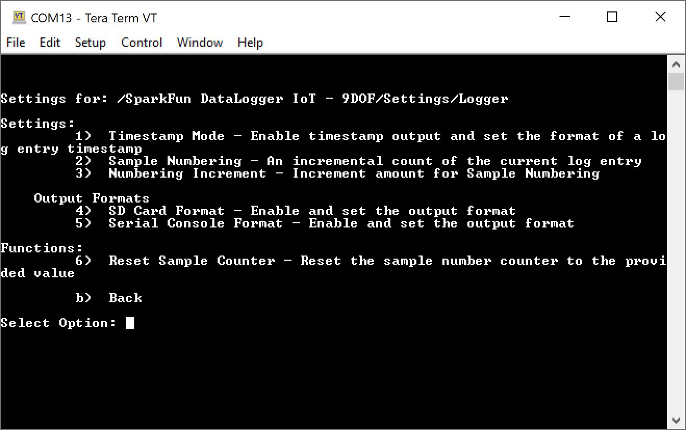

In the Settings Menu, send a <kbd>6</kbd> to adjust how data is logged.

  

Send a <kbd>1</kbd> to configure the timestamp for each log entry. The settings in this menu relate to the system clock and is dependent on the reference clock. You&apos;ll be prompted with different formats. In this example, we sent a a <kbd>4</kbd> to have a timestamp with the USA date format.

  

Follow the prompts to exit out of the menu properly so that the DataLogger IoT saves the settings. Once you see the message `[I] Saving System Settings`, the DataLogger IoT will add a timestamp with your preferred format to each log entry. Assuming that you have the output set to the serial terminal, you should see the timestamp attached to the output after the system settings are saved like the image below.  

  

