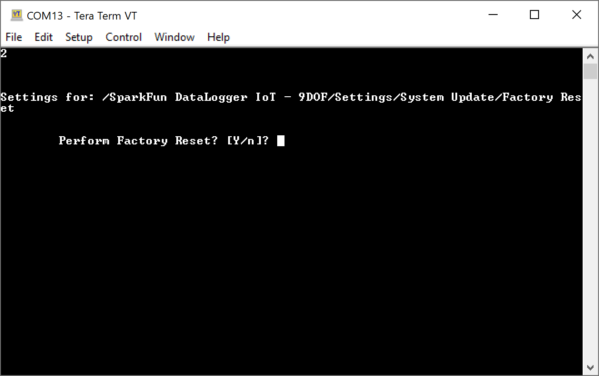

A factory reset will move the boot firmware of the device to the firmware imaged installed at the ***factory*** and erase any on-board stored settings on the device. This is helpful if an update fails, or an update has issues that prevent proper operations.

This option is available on ESP32 devices that contained a ***factory*** firmware partition that contains a bootable firmware image. Consult the specific product's production and build system for further details.

Open a Serial Terminal, connect to the COM port that your DataLogger enumerated to, and set it to  **115200** baud. In this case, we connected to **COM13**. Press any key to enter the Main Menu. Type <kbd>1</kbd> to enter the Settings menu. Then type <kbd>16</kbd> to enter the System Update Menu. Finally, type <kbd>2</kbd> to enter the Factory Reset option.

The user is presented a prompt to continue. To launch a factory reset, the value of <kbd>Y</kbd> should be entered. To abort the update, enter <kbd>n</kbd> or press the <kbd>Esc</kbd> key.

  

When a <kbd>Y</kbd> is entered, the system performs the following:

* Set the boot image to the Factory installed firmware
* Erase any settings stored in the on-board flash memory
* Reboot the device

  

