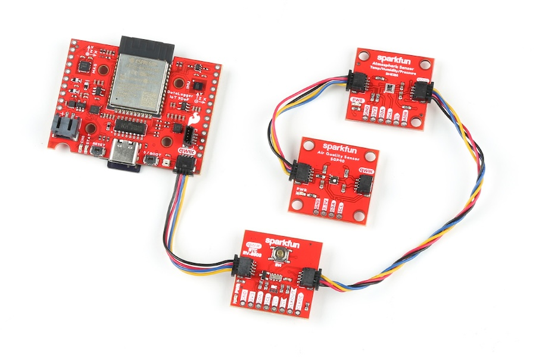
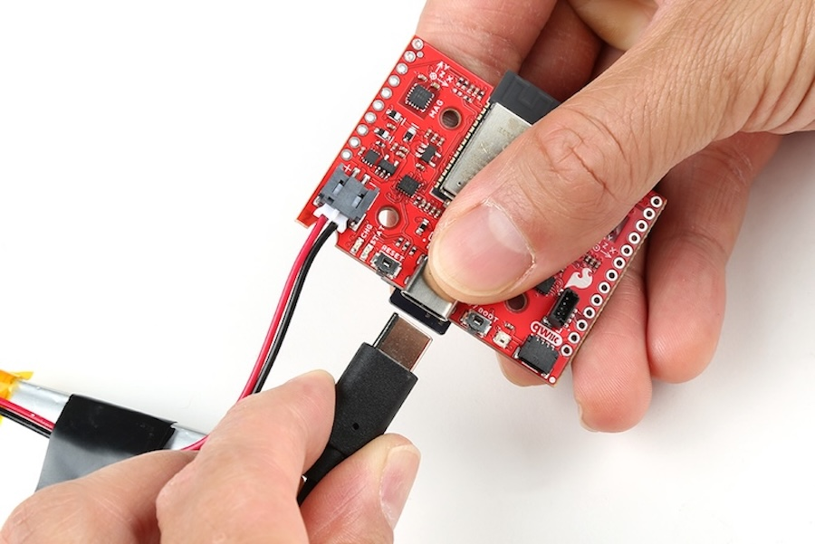
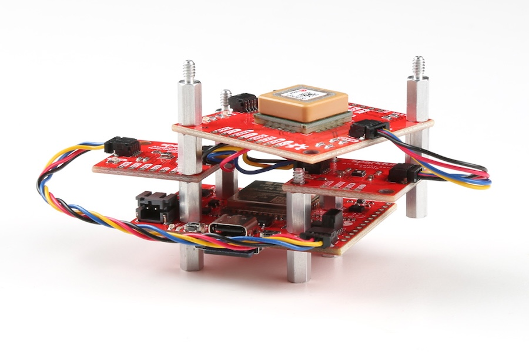

<!-- ---
icon: material/wrench
--- -->

# Hardware - Hookup

In this section, we will go over how to connect to the SparkFun DataLogger IoT. At the time of writing, we used the DataLogger IoT - 9DoF. This hardware hookup explained in this section also applies for the DataLogger IoT.

## Soldering to the PTHs

For users that are interested in soldering to the edge of the board, we recommend [soldering](https://learn.sparkfun.com/tutorials/how-to-solder-through-hole-soldering) headers to the PTHs on the breakout for a permanent connection and using jumper [wires](https://learn.sparkfun.com/tutorials/working-with-wire). Of course, you could also solder wires to the breakout board as well. For a temporary connection during prototyping, you can use [IC hooks like these](https://www.sparkfun.com/products/9741).

## MicroSD Card

If all you want to do is display your sensor readings in a serial terminal or monitor (connected via USB-C) then, strictly, you don’t need to add a microSD card. But of course the whole point of the DataLogger IoT is that it can log readings from whatever sensors you have attached to microSD card. The data is logged in easy-to-read Comma Separated Value (CSV) text format by default. You can also set the format as JSON.

You probably already have a microSD card laying around but if you need any additional units, we have plenty [in the store](https://www.sparkfun.com/products/15107). The DataLogger IoT can use any size microSD card as long as it is formatted correctly. Please ensure your SD card is formatted correctly. There are different software tools available. Some are built into your operating system. We recommend using the [Raspberry Pi Imager Tool](https://www.raspberrypi.com/software/) to easily format the memory card as FAT32 using the GUI. Flip over the DataLogger IoT and you’ll see the latching microSD card socket. Slide in your formatted SD card and it will click neatly into place. Part of the edge of the SD card will stick out when fully inserted in the microSD card socket.

!!! warning "SD Card Insertion and Removal"

    Only insert or remove the SD card while the **power is turned off or disconnected**. Removal while in use could result in data corruption. Insertion is not detected when the DataLogger is powered on and running.

After you’ve logged some data, you will find a new file on your SD card. There may also be additional files if you manually saved the firmware or preferences to the memory card.

- **sfe0001.txt**: This is the file that contains the CSV or JSON sensor data. The format will depend on how you configured the DataLogger's output. We use .TXT as the file type so that your computer can open it in a simple text editor. The contents are all human-readable. But, if you want to, you can rename it as .CSV or .JSON instead. The file number is incremented for the next logging session.
- **datalogger.json**: This file only appears when you save the settings as your fallback storage. The file will include all preferences saved for any connected device, WiFi credentials, certificates, and keys.
- **SparkFun_DataLoggerIoT*.bin**: This file only appears when you save the firmware to the microSD card. Note that the asterisk (**&ast;**) is the firmware version number (i.e. **SparkFunDataLoggerIoT_01.00.01.bin**).

To remove the microSD card, make sure power is disconnected from the DataLogger IoT. Then press the microSD card into the microSD socket. The memory card will be ejected and you will hear a click again. Once the card is ejected, you can insert it into a microSD card adapter or USB reader to be read on a computer.

## Qwiic Sensors

If you are going to attach extra sensors or any Qwiic-enabled device to the DataLogger IoT, then those need to be connected first before attaching a USB cable. It is a good idea to only attach or disconnect Qwiic sensors when the power is turned off or disconnected. The Qwiic bus is pretty tolerant to “hot swapping”, but: disconnecting a sensor while it is in use will confuse the DataLogger IoT software (most likely each value associated with the device will remain constant); and a new sensor won’t be detected until the firmware restarts.

Plug one end of your Qwiic cable into the DataLogger IoT and plug the other end into your sensor. If you want to add extra sensors, you can simply connect them to each other in a daisy chain. You will need a Qwiic cable for each sensor. Our [Qwiic Cable Kit](https://www.sparkfun.com/products/15081) covers all the options.

DataLogger IoT and a Qwiic-Enabled Device

DataLogger IoT and several Qwiic-Enabled Devices Daisy Chained

Our Qwiic sensors usually all have power indicator LEDs and I2C pull-up resistors. Depending on your application, you may want or need to disable these by cutting the jumper links on the sensor circuit boards. We have a [tutorial](https://learn.sparkfun.com/tutorials/how-to-work-with-jumper-pads-and-pcb-traces) that will show you how to do that safely.

Sometimes you might want to connect more than one of the same type of sensor to the DataLogger IoT. On the I2C bus, each device needs to have a unique address. On many of our boards, there are jumpers links which you can use to change the address and some have addresses that can be configured in software. But there are some where you cannot change the address - the [NAU7802 Qwiic Scale](https://www.sparkfun.com/products/15242) being one example.

Typically one would use a multiplexor. However, we currently do not have the DataLogger IoT configured to work with any multiplexors (i.e. Qwiic Mux Breakout).

## LiPo Battery

Please make sure that you use one of our recommended Lithium Ion batteries. Some batteries use the same JST connector as ours but have the opposite polarity. Connecting one of these to your DataLogger IoT will destroy it. If you are going to use your own battery, it is up to you to ensure it has the correct polarity.
Now is a good time to attach a LiPo battery, if you want the DataLogger IoT to keep logging when you disconnect USB-C.

You can connect one of our standard single cell LiPo batteries to the DataLogger IoT and power it for hours, days or weeks depending on what sensors you have attached and how often you log data. The DataLogger IoT has a built-in charger too which will charge your battery at **500mA** when USB-C is connected. Please make sure your battery capacity is at least 500mAh (0.5Ah); bad things will happen if you try to charge our smallest batteries at 500mA. The yellow CHG charging LED will light up while the battery is charging and will go out once charging is complete.

The MCP73831 charge IC on the board is used on a few SparkFun products. For more information about the CHG status LED, we recommend taking look at the Hardware Overview. We also recommend taking a look at this tutorial for [Single Cell LiPo Battery Care](https://learn.sparkfun.com/tutorials/single-cell-lipo-battery-care).

## USB Cable

The USB-C connector provides power to the DataLogger IoT and acts as a serial interface for configuration and data display.

If you are going to use a microSD card to store your data, and why wouldn’t you, then insert that first before attaching your USB cable. You should only insert or remove the SD card while the power is turned off or disconnected. Removing the card while the DataLogger IoT is logging will almost certainly corrupt your data.

Likewise, it is a good idea to only attach or disconnect Qwiic sensors when the power is turned off or disconnected. The Qwiic bus is pretty tolerant to “hot swapping”, but: disconnecting a sensor while it is in use will confuse the DataLogger IoT software; and a new sensor won’t be detected until the firmware restarts.

Depending on what ports your computer has available, you will need one of the following cables:

- [USB 2.0 A to C Cable](https://www.sparkfun.com/products/15092)
- [USB 3.1 A to C Cable](https://www.sparkfun.com/products/14743)
- [USB 2.0 C to C Cable](https://www.sparkfun.com/products/16395)

Use the cable to connect your DataLogger IoT to your computer and you will see the LEDs light as the DataLogger IoT starts up. The addressable RGB RGB LED will light up green for a second or two while the DataLogger IoT configures itself. It will flash blue while data is being logged to the microSD card. If you have jumped the gun and have a LiPo battery already connected, the yellow CHG charging LED may light up too.

If the addressable RGB LED does not light up, your DataLogger IoT is probably in deep sleep following a previous logging session. Pressing the RST reset button will wake it.

You’ll find full instructions on how to configure the DataLogger IoT later in this tutorial.

## Standoffs

For users interested in stacking the Qwiic-enabled device on the DataLogger IoT or mounting in an enclosure, you will need some [standoffs](https://www.sparkfun.com/categories/257) to mount the boards. When mounting, note that all four mounting holes are not positioned exactly for a 1.0"x1.0" sized Qwiic board. Only two of the four mounting holes are compatible for a 1.0"x1.0" sized Qwiic board. For example the image below shows the boards stacked on each side of the DataLogger IoT. On top, the Qwiic GPS (SAM-M10Q) breakout was also able to stack by rotating the board slightly and aligning the mounting holes on the 1.6"x1.6" sized board to the other mounting holes

