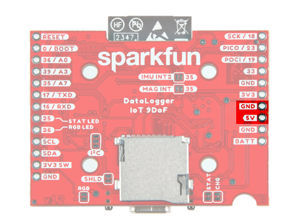
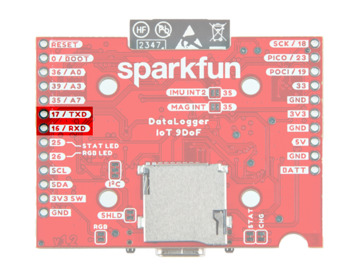
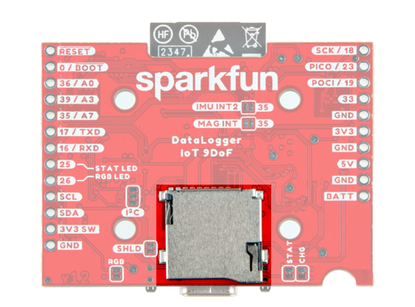
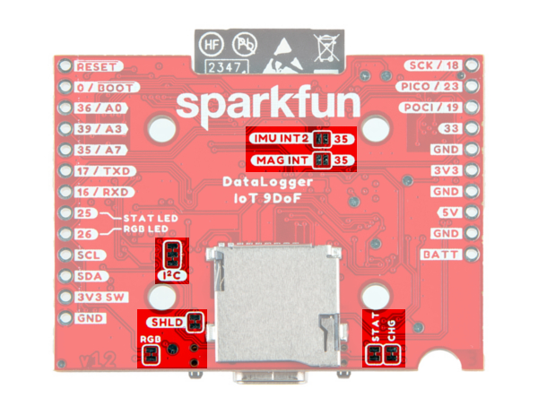

In this section, we will highlight the hardware and pins that are broken out on the SparkFun DataLogger IoT.

  <table>
    <tr align="center">
     <td></td>
     <td></td>
    </tr>
  </table>

## ESP32-WROOM Module

The DataLogger IoT is populated with [Espressif's ESP32-WROOM-32E module](https://www.sparkfun.com/products/17830). Espressif's ESP32 WROOM ubiquitous IoT microcontroller is a powerful WiFi, BT, and BLE MCU module that targets a wide variety of applications. For the DataLogger IoT, the firmware currently utilizes the WiFi feature.

  

!!! note
    Currently the DataLogger IoT does not have BT or BLE. However, BT or BLE is being considered on a future firmware build to include this as a feature.

## Power

There are a variety of power and power-related nets broken out to connectors and through hole pads. Below list a few methods of powering the board up. There are protection diodes for the USB-C, 5V pin, and single cell LiPo battery. Power is regulated down to [3.3V for the system voltage](https://learn.sparkfun.com/tutorials/logic-levels/all).  Depending on the settings and what is connected to the DataLogger IoT, the board can pull a minimum of 200&micro;A in low power mode by itself.

* USB-C
* 5V Pin
* Single Cell LiPo Battery
* 3V3 Pin

### USB-C and 5V

The DataLogger IoT comes equipped with a USB type C socket which you can use to connect it to your computer for configuration through the serial terminal; upload new firmware; or plug in a USB-C power supply. The DataLogger IoT includes the configuration channel resistors needed to tell the power supply to deliver **5V**. You can use your USB-C laptop charger as the power source should you need to, even though it normally delivers a much higher voltage. There is also a **5V** pin. However, this is not connected to the same USB bus.

  <table>
    <tr align="center">
     <td></td>
     <td></td>
    </tr>
  </table>

Voltage from the USB is regulated down to the XC6222 **3.3V**/700mA voltage regulators for the system voltage and Qwiic-enabled devices. USB power is also connected to the MCP73831 to charge a single cell LiPo battery at a default rate of **500mA**.

For customers in North America, our [NEMA Raspberry Pi Wall Adapter](https://www.sparkfun.com/products/15448) is a perfect choice. You can power the DataLogger IoT from our [USB Battery Pack / Power Bank - TOL-15204](https://www.sparkfun.com/products/15204) but you will need a USB-C cable too:

* Our [USB 2.0 A to C Cable - CAB-15092](https://www.sparkfun.com/products/15092) will do nicely
* Our [USB 3.1 A to C Cable - CAB-14743](https://www.sparkfun.com/products/14743) is a good choice too

### LiPo Battery Input, Charger, and Fuel Gauge

!!! warning
    <b>Battery Polarity:</b> Please make sure that you use one of our recommended Lithium Ion batteries. Some batteries use the same JST connector as ours but have the <a href="https://learn.sparkfun.com/tutorials/polarity/all#other-polarized-components">opposite polarity</a>. Connecting one of these to your DataLogger IoT will destroy it. If you are going to use your own battery, it is up to you to ensure it has the correct polarity.

But of course you’re going to want to use the DataLogger IoT to log sensor data while on the move too. You can connect one of our [standard single cell LiPo batteries](https://www.sparkfun.com/products/13855) to the DataLogger IoT and power it for hours, days or weeks depending on what sensors you have attached and how often you log data. The DataLogger IoT uses the built-in MCP73831 charger too which will charge your battery at 500mA when USB-C is connected. Please make sure your battery capacity is at least **500mAh** (0.5Ah); bad things will happen if you try to charge our smallest batteries at 500mA. The board also includes the MAX17048 LiPo Fuel Gauge which allows you to determine how much power your LiPo battery has available. The 2-pin JST connector pins are broken out to PTHs on the edge of the board if you decide to solder a single cell LiPo battery directly to the board or power another device.

  <table>
    <tr align="center">
     <td></td>
     <td></td>
    </tr>
  </table>

### 3V3 Pins

For those going the old school route, you can also bypass the voltage regulators by [soldering](https://learn.sparkfun.com/tutorials/how-to-solder-through-hole-soldering) directly to the 3V3 and GND pin to provide power if your application has a regulated 3.3V. Note that this is only connected to the system voltage. You will also need to provide power to the 3V3 SWCH or Qwiic-enabled devices should you decide to bypass the voltage regulator.

  <table>
    <tr align="center">
     <td></td>
     <td></td>
    </tr>
  </table>

## CH340 USB-to-Serial Converter

The top side of the board includes a CH340 USB-to-Serial Converter. The chip can be used to send serial data between the device and computer. You can view the output or configure the device through a serial terminal.

  

The driver should automatically install on most operating systems. However, there is a wide range of operating systems out there. You may need to install drivers the first time you connect the chip to your computer's USB port or when there are operating system updates. For more information, check out our [How to Install CH340 Drivers Tutorial](https://learn.sparkfun.com/tutorials/how-to-install-ch340-drivers).

  <table>
    <tr>
      <td>
        <a href="https://learn.sparkfun.com/tutorials/how-to-install-ch340-drivers">
          

          

          <h3 style="text-align: left">
            <b>How to Install CH340 Drivers</b>
          </h3>
        </a>
      </td>
    </tr>
  </table>

## UART

The hardware serial UART pins are broken out on the edge of the board. For more information about Serial UART, check out the tutorial about [Serial Communication](https://learn.sparkfun.com/tutorials/serial-communication/all#wiring-and-hardware) for more information.

* **TXD**: UART transmit pin. This is connected to pin `16`.
* **RXD**: UART receive pin. This is connected to pin `17`.

!!! note
    The UART pins are not currently supported in the firmware for data logging.

  <table>
    <tr align="center">
     <td></td>
     <td></td>
    </tr>
  </table>

## Qwiic and I2C

!!! note
    You may notice a thin film over the vertial Qwiic connector. This is used by a pick-and-place machine when populating the component on the board before it goes through the reflow oven. This can be removed if you decide to use the vertical Qwiic connector with Qwiic-enabled devices.

[SparkFun's Qwiic Connect System](https://www.sparkfun.com/qwiic) uses 4-pin JST style connectors to quickly interface development boards with I2C sensors and more. No soldering required and there's no need to worry about accidentally swapping the SDA and SCL wires. The Qwiic connector is polarized so you know you’ll have it wired correctly every time, right from the start. Qwiic boards are daisy chain-able too so you can connect multiple sensors to the DataLogger IoT and log readings from all of them.

The board is populated with vertical and horizontal Qwiic connectors. These are also broken out to PTHs on the edge of the board.

  <table>
    <tr align="center">
     <td></td>
     <td></td>
    </tr>
  </table>

* **SCL**: I2C clock pin. This is connected to pin `22` and a 2.2k&ohm; pull-up resistor.
* **SDA**: I2C data pin. This is connected to pin `21` and a 2.2k&ohm; pull-up resistor.
* **3V3 SW**: The 3.3v pin is connected to the XC6222 voltage regulator's output to power the Qwiic devices.
* **GND**: Common, ground voltage (0V reference) for the system

Connected to the line I2C line is the MAX17048 LiPo fuel gauge (7-bit unshifted address = 0x36).

Sometimes you might want to connect more than one of the same type of sensor to the DataLogger IoT. On the I2C bus, each device needs to have a unique address. On many of our boards, there are jumpers links which you can use to change the address and some have addresses that can be configured in software. But there are some where you cannot change the address. Typically, one would use a multiplexor. However, we currently do not have the DataLogger IoT configured to work with any multiplexors (i.e. Qwiic Mux Breakout).

!!! note
    Currently the Qwiic Mux does not compatible with the DataLogger IoT.

The DataLogger IoT includes a dedicated 3.3V regulator for the Qwiic connector. This has several advantages including:

* the DataLogger IoT can completely power-down the I2C sensors during sleep to prolong your battery life
* there’s no risk of the Qwiic bus gulping too much current and causing problems for the ESP32

## SPI

!!! note
    Besides the built-in ISM330DHCX and MMC5983MA, the SPI pins are not currently supported in the firmware for data logging.

The SPI pins are broken out on the edge of the board. For those that are unfamiliar to PICO and POCI, check out the [SPI tutorial](https://learn.sparkfun.com/tutorials/serial-peripheral-interface-spi/all#receiving-data) for more information.

* **SCK**: SPI clock pin. This is connect to pin `18`.
* **PICO**: SPI Peripheral In Controller Out. This is connected to pin `23`.
* **POCI**: SPI Peripheral Out Controller In. This is connected to pin `19`.

  <table>
    <tr align="center">
     <td></td>
     <td></td>
    </tr>
  </table>

Not shown in the image are the chip select (CS) pins. The 6DoF IMU's CS pin is connected to pin `5`. The magnetometer's CS pin is connected to pin `27` which is not broken out.

## MicroSD Card Socket

The DataLogger IoT supports full 4-bit SDIO for fast logging and uses common microSD cards to record clear text, comma separated files. Flip over the DataLogger IoT and you'll see the latching microSD card socket. You probably already have a microSD card laying around. However, if you need any additional units, we have plenty [in the SparkFun catalog](https://www.sparkfun.com/categories/351). The DataLogger can use any size microSD card and supports FAT32 cards in addition to FAT16. Please ensure that your SD card is formatted correctly; we recommend the [Raspberry Pi Imager Tool](https://www.raspberrypi.com/software/).

  

Slide in your formatted SD card and it will click neatly into place. The edge of the SD card will stick out on the edge of the circuit board when it is inserted correctly.

!!! Warning

    You should only insert or remove the SD card while the power is turned off or disconnected. Removing the card while the DataLogger IoT is logging will almost certainly corrupt your data.

## 9 Degrees of Freedom (9DOF)

As stated earlier, included on every DataLogger IoT - 9DoF is a 6DoF Inertial Measurement Unit (IMU) for built-in logging of triple-axis accelerometer and gyro. There is also a built-in triple-axis magnetometer. Both are connected to the ESP32 via the SPI port. Combined, you have 9 degrees of inertial measurement! Whereas the [original 9DOF Razor](https://www.sparkfun.com/products/14001) used the old MPU-9250, this uses the ISM330DHCX and MMC5983MA. Oh, and if that wasn’t enough, it comes with a built-in temperature sensor on each IC too. So if you want to use the DataLogger IoT as a transportation logger, it will do that straight out of the anti-static bag!  

  

## Analog Pins

!!! note
    The analog pins are not currently supported in the firmware for data logging.

There are three 12-bit analog pins available and broken out on edge of the board.

* **36 / A0**: Analog A0. This is connected to pin `36`.
* **39 / A3**: Analog A3. This is connected to pin `39`.
* **35 / A7**: Analog A7. This is connected to pin `35`.

  <table>
    <tr align="center">
     <td></td>   
     <td></td>
    </tr>
  </table>

## Reset and Boot Buttons

!!! note
    You may notice a thin film over buttons. This is used by a pick-and-place machine when populating the component on the board before it goes through the reflow oven. This can be removed.

There are two buttons available on the board for reset and boot. These are also broken out on the edge of the board as PTHs. If you have your DataLogger IoT mounted in an enclosure, you can also attach an external boot or reset switch too. Any Single Pole Normally-Open Push-To-Close momentary switch will do. Solder pin headers or wires to the RST and GND breakout pins and connect your external switch to those.

* **RESET**: Pressing this button will pull the pin LOW and reset the program running on the ESP32 without unplugging the board.
* **BOOT**: The boot button allows users to force the ESP32 into bootloader mode to manually flash new firmware to the ESP32.The ESP32 will remain in this mode until there is a power cycle, code is uploaded, or the reset button is pressed. This is connected to pin `0` on the ESP32.

  <table>
    <tr align="center">
     <td></td>
     <td></td>
    </tr>
  </table>

Like other ESP32 development boards, these buttons are populated so that users can place the ESP32 module in bootloader mode. For users that need to place the board in booltoader mode when powered, you will need to:

* Press the BOOT button.
* While holding on the BOOT button, press the RESET button momentarily.
* Finally, release the BOOT button.

Most of the time, users will simply have the board executing the firmware that is loaded on the ESP32 module and updating through the configuration menu either through the microSD card or OTA.

## LEDs

There are three LEDs populated on the board. These can be disabled with their respective jumpers on the back of the board.

* **STAT**: The status LED is connected to pin `25`.
* **RGB**: The WS2812-2020 RGB addressable LED is connected to pin `26`. In addition to being disabled through the jumper on the back, you can also disable the LED through software. The following colors represent different states that the board is in.
    * Green: The board is initializing.
    * Blue: The board is reading sensor data and logging the values.
    * White: The board is currently being configured through the configuration menu.
    * Yellow: A firmware update is in progress.
* **CHG**: The on-board yellow CHG LED can be used to get an indication of the **charge status** of your battery. Below is a table of other status indicators depending on the state of the charge IC.

  <table>
      <tr align="center">
          <td><b>Charge State</b></td>
          <td><b>LED status</b></td>
      </tr>
      <tr align="center">
          <td>No Battery</td>
          <td>Floating (should be OFF, but may flicker)</td>
      </tr>
      <tr align="center">
          <td>Shutdown</td>
          <td>Floating (should be OFF, but may flicker)</td>
      </tr>
      <tr align="center">
          <td>Charging</td>
          <td>ON</td>
      </tr>
      <tr align="center">
          <td>Charge Complete</td>
          <td>OFF</td>
      </tr>
  </table>

  

## Jumpers

There are seven jumpers on the back of the board. For more information, check out our [tutorial on working with jumper pads and PCB traces](https://learn.sparkfun.com/tutorials/how-to-work-with-jumper-pads-and-pcb-traces/all) should you decide to cut the traces with a hobby knife.

* **SHLD**: This jumper connects the USB Type C connector's shield pin to GND. Cut this to isolate the USB Type C connector's shield pin.
* **I2C**: This three way jumper labeled as I2C are closed by default. By cutting the jumpers, it will disconnect the 2.2k&ohm; pull-up resistors for the I2C bus. Most of the time you can leave these alone unless your project requires you to [disconnect the pull-up resistors](https://learn.sparkfun.com/tutorials/i2c/all#i2c-at-the-hardware-level).
* **STAT**: This jumper connects the status LED to pin `25` and it is closed by default. Open the jumper to disable the LED.
* **RGB**: This jumper connects the WS2812-2020 RGB addressable LED to pin `26` and it is closed by default. Open the jumper to disable the LED.
* **CHG**:  This jumper connects the charge LED on the MCP73831 charge IC and it is closed by default. Open the jumper to disable the LED.
* **IMU INT2**: This jumper connects the ISM330DHCX IMU's interrupt pin to pin `35` and it is open by default. Add a solder jumper to connect.
* **MAG INT**: This jumper connects the MMC5983MA  magnetometer's interrupt pin to pin `35` and it is open by default. Add a solder jumper to connect.

  

## Board Dimensions

The overall length and width with the antenna connector is about 1.66" x 2.00". There are four mounting holes in the center of the board. Due to the size of the board and the ESP32 module, the mounting holes are positioned in a way for users to add two Qwiic enabled boards with a width of 1.0" instead of one Qwiic board.

  

