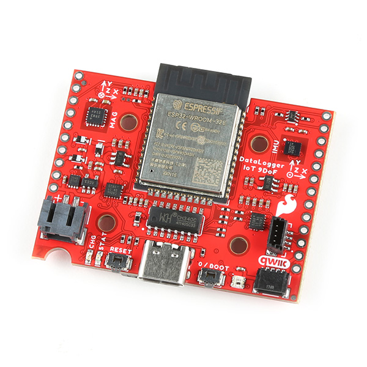
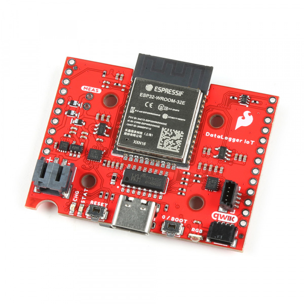

<!--    TODO
    ____ Low Power Considerations?

    ____ WiFi Example with NFC Tag???
    ____ Comma Separated Values Exporting with Google Spreadsheets
    ____ go back include Alex's enclosure in tutorial

-->

The SparkFun DataLogger IoT is a data logger that comes preprogrammed to automatically log IMU, GPS, and various pressure, humidity, and distance sensors.  All without writing a single line of code! They come in two flavors: The [SparkFun DataLogger IoT - 9DoF](https://www.sparkfun.com/products/20594) and the [SparkFun DataLogger IoT](https://www.sparkfun.com/products/22462). Both versions of the DataLogger IoT automatically detects, configures, and logs Qwiic sensors. It was specifically designed for users who just need to capture a lot of data to a CSV or JSON file, and get back to their larger project. Save the data to a microSD card or send it wirelessly to your preferred Internet of Things (IoT) service!

-   <a href="https://www.sparkfun.com/products/20594">
      <figure markdown>
        
      </figure>
    </a>

    ---

    <a href="https://www.sparkfun.com/products/20594">
      <b>SparkFun DataLogger IoT - 9DoF</b>
       
      DEV-20594
       
      
[Purchase from SparkFun :fontawesome-solid-cart-plus:](https://www.sparkfun.com/products/20594){ .md-button .md-button--primary }

    </a>

-   <a href="https://www.sparkfun.com/products/22462">
      <figure markdown>
        
      </figure>
    </a>

    ---

    <a href="https://www.sparkfun.com/products/22462">
      <b>SparkFun DataLogger IoT</b>
       
      DEV-22462
       
      
[Purchase from SparkFun :fontawesome-solid-cart-plus:](https://www.sparkfun.com/products/22462){ .md-button .md-button--primary }

    </a>

  <iframe width="560" height="315" src="https://www.youtube.com/embed/RwCu-60sQOI" title="YouTube video player" frameborder="0" allow="accelerometer; autoplay; clipboard-write; encrypted-media; gyroscope; picture-in-picture; web-share" allowfullscreen></iframe>

### Required Materials

!!! warning "Battery Polarity"

    Please make sure that you use one of our recommended Lithium Ion batteries. Some batteries use the same JST connector as ours but have the [opposite polarity](https://learn.sparkfun.com/tutorials/polarity/all#other-polarized-components). Connecting one of these to your DataLogger IoT will destroy it. If you are going to use your own battery, it is up to you to ensure it has the correct polarity.

To follow along with this tutorial, you will need the following materials. You may not need everything though depending on what you have. Add it to your cart, read through the guide, and adjust the cart as necessary.

* 1x SparkFun DataLogger IoT
    * [SparkFun DataLogger IoT - 9DoF [DEV-20594]](https://www.sparkfun.com/products/20594)
    * [SparkFun DataLogger IoT [DEV-22462]](https://www.sparkfun.com/products/22462)
* 1x [microSD card formatted with FAT32 [COM-15107]](https://www.sparkfun.com/products/15107)
* 1x A USB-C cable for configuring and LiPo charging
    * Our [USB 2.0 A to C Cable [CAB-15092]](https://www.sparkfun.com/products/15092) will do nicely
    * Our [USB 3.1 A to C Cable [CAB-14743]](https://www.sparkfun.com/products/14743) is a good choice too
* 1x [Lithium Ion Battery](https://www.sparkfun.com/products/18286)
* At least one Qwiic cable
    * A single [50mm Cable](https://www.sparkfun.com/products/14426) is all you need to get going
    * Our [Qwiic Cable Kit](https://www.sparkfun.com/products/15081) covers all the options
* At least one [Qwiic enabled devices that is compatible](../supported_devices) that you may need

-   <a href="https://www.sparkfun.com/products/20594">
      <figure markdown>
        
      </figure>
    </a>

    ---

    <a href="https://www.sparkfun.com/products/20594">
      <b>SparkFun DataLogger IoT - 9DoF</b>
       
      DEV-20594
    </a>

-   <a href="https://www.sparkfun.com/products/14743">
      <figure markdown>
        
      </figure>
    </a>

    ---

    <a href="https://www.sparkfun.com/products/14743">
      <b>USB 3.1 Cable A to C - 3 Foot</b>
       
      CAB-14743
    </a>

-   <a href="https://www.sparkfun.com/products/15107">
      <figure markdown>
        
      </figure>
    </a>

    ---

    <a href="https://www.sparkfun.com/products/15107">
      <b>microSD Card - 1GB (Class 4)</b>
       
      COM-15107
    </a>

-   <a href="https://www.sparkfun.com/products/14426">
      <figure markdown>
        
      </figure>
    </a>

    ---

    <a href="https://www.sparkfun.com/products/14426">
      <b>Qwiic Cable - 50mm</b>
       
      PRT-14426
    </a>

-   <a href="https://www.sparkfun.com/products/18286">
      <figure markdown>
        
    </figure>
    </a>

    ---

    <a href="https://www.sparkfun.com/products/18286">
    <b>Lithium Ion Battery - 1250mAh (IEC62133 Certified)</b>
     
    PRT-18286
   </a>

### The Sensors

Straight out of the ~~box~~ anti-static bag, the DataLogger IoT is ready to log data from its built-in ISM330DHCX Inertial Measurement Unit (IMU) and MMC5983MA magnetometer. Only want to log magnetometer, accelerometer, gyro or temperature data? You’re good to go! But the fun is only just beginning…

The DataLogger IoT is preprogrammed to automatically log data from all of the following sensors, so you may wish to add one or more of these to your shopping cart too. (More sensors are being added all the time and it is really easy to upgrade the DataLogger IoT to support them. But we'll get to that in a moment!). Currently, auto-detection is supported on the following Qwiic-enabled products:

!!! note
    For a list of supported devices based on the firmware, you can check out the [list of supported Qwiic Devices in the appendix](../supported_devices). We simply categorized the supported devices below based on the type.

* **Any u-Blox GNSS Modules (Lat/Long, Altitude, Velocity, SIV, Time, Date) such as:**
    * [ZED-F9P](https://www.sparkfun.com/products/15136) 1cm High Precision GPS
    * [NEO-M8P](https://www.sparkfun.com/products/15005) 2.5cm High Precision GPS
    * [SAM-M10Q](https://www.sparkfun.com/products/21834) 1.5m GPS
    * [SAM-M8Q](https://www.sparkfun.com/products/15210) 1.5m 72 Channel GPS
    * [ZOE-M8Q](https://www.sparkfun.com/products/15193) 1.5m Compact GPS
    * [NEO-M9N](https://www.sparkfun.com/products/15712) 1.5m GPS
    * [MAX-M10S](https://www.sparkfun.com/products/18037) 1.5m Ultra-Low Power GPS
* **Inertial Measurement Unit (Accelerometer and Gyro):**
    * [ISM330DHCX](https://www.sparkfun.com/products/19764) IMU (Built-in for the 9DoF versio via SPI)
* **Magnetometer:**
    * [MMC5983](https://www.sparkfun.com/products/19921) (Built-in for the 9DoF version via SPI)
* **Distance:**
    * [TMF8820](https://www.sparkfun.com/products/19036) dToF Imager
    * [TMF8821](https://www.sparkfun.com/products/19037) dToF Imager
    * [VCNL4040](https://www.sparkfun.com/products/15177) Proximity and Lux
    * [VL53L1X](https://www.sparkfun.com/products/14722) Distance - 4 Meter
    * [VL53L4](https://www.sparkfun.com/products/18993) Distance - 1.3 Meter
    * [VL53L5](https://www.sparkfun.com/products/18642) ToF Imager
* **Pressure, Altitude, Humidity and Temperature Data:**
    * [BME280](https://www.sparkfun.com/products/15440) Atmospheric
    * [LPS25HB](https://www.sparkfun.com/products/14767) Absolute Pressure
    * [MPR Series - MPRLS0025PA00001A](https://www.sparkfun.com/products/16476) MicroPressure  
    * [MS8607](https://www.sparkfun.com/products/16298) Pressure, Humidity, and Temperature
    * [MS5637](https://www.sparkfun.com/products/14688) Barometric Pressure and Temperature
    * [AHT20](https://www.sparkfun.com/products/16618) Humidity and Temperature
    * [SHTC3](https://www.sparkfun.com/products/16467) Humidity and Temperature
    * [SDP31](https://www.sparkfun.com/products/17874) Differential Pressure
    * [BMP384](https://www.sparkfun.com/products/19662) Pressure and Temperature
    * [BMP581](https://www.sparkfun.com/products/20170) Pressure and Temperature
* **Air Quality and Environmental Sensors:**
    * [CCS811](https://www.sparkfun.com/products/14193) Air Quality (CO2 and VOC)
    * [SGP30](https://www.sparkfun.com/products/16531) Air Quality (TVOC, CO2, H2, Ethanol)
    * [SGP40](https://www.sparkfun.com/products/18345) Air Quality (VOC, Humidity, Temperature)
    * [SCD30](https://www.sparkfun.com/products/15112) CO2, Humidity, and Temperature
    * [SCD40](https://www.sparkfun.com/products/18365) CO2, Humidity, and Temperature
    * [BME680](https://www.sparkfun.com/products/16466) Air Quality (Pressure, Humidity, Temperature, Gas, VOCs)
    * [BME688](https://www.sparkfun.com/products/19096) Air Quality (Pressure, Humidity, Temperature, Gas, VOCs, VSC, CO, Gas)
    * [FS3000](https://www.sparkfun.com/products/18377) Air Velocity
    * [SEN54](https://www.sparkfun.com/products/19325) Environmental Sensor Node (Particle, VOC, Humidity, and Temperature)
    * [STC31](https://www.sparkfun.com/products/18385) CO2 and Temperature sensor
    * [VEML6075](https://www.sparkfun.com/products/15089) UV  
    * [VEML7700](https://www.sparkfun.com/products/18981) Ambient Light and Lux
* **Temperature:**
    * [AMG8833](https://www.sparkfun.com/products/14607) Grid-EYE Infrared Array
    * [MCP9600](https://www.sparkfun.com/products/16294) Thermocouple Amplifier
    * [PT100 ADS122C04](https://www.sparkfun.com/products/16770) PR Temperature
    * [TMP117](https://www.sparkfun.com/products/15805) High Precision Temperature
* **Power:**
      * [ACS37800](https://www.sparkfun.com/products/17873) Power Meter
      * [MAX17048](https://www.sparkfun.com/products/17715) Li-Po Battery Fuel Gauge (Built-in)
* **Real Time Clock:**
      * [RV8803](https://www.sparkfun.com/products/16281) RTC Module
* **NFC/RFID:**
      * [ST25DVxxKC](https://www.sparkfun.com/products/19035) Dynamic NFC/RFID Tag
* **Weight:**
      * [NAU7802](https://www.sparkfun.com/products/15242)	Qwiic Scale Load Cell Amplifier
* **Miscellaneous:**
      * [Qwiic Button](https://www.sparkfun.com/products/15932)
      * [Qwiic Twist](https://www.sparkfun.com/products/15083) RGB Rotary Encoder
* **Analog Voltage:**
      * [ADS1015](https://www.sparkfun.com/products/15334) 12-bit 4-channel Differential ADC
      * [ADS122C04](https://www.sparkfun.com/products/16770) 24-bit Differential ADC found on the PT100

### Suggested Reading

If you aren't familiar with the Qwiic system, we recommend reading [here for an overview](https://www.sparkfun.com/qwiic).

  <table style="border-style:none">
    <tr>
     <td style="text-align: center; vertical-align: middle;">
     

     

    </td>
    </tr>
    <tr>
      <td style="text-align: center; vertical-align: middle;">
<i><a href="https://www.sparkfun.com/qwiic">Qwiic Connect System</a></i>
</td>
    </tr>
  </table>

If you aren’t familiar with the following concepts, we also recommend checking out a few of these tutorials before continuing.

-   <a href="https://learn.sparkfun.com/tutorials/accelerometer-basics">
      <figure markdown>
        
      </figure>
    </a>

    ---

    <a href="https://learn.sparkfun.com/tutorials/accelerometer-basics">
      <b>Accelerometer Basics</b>
    </a>

-   <a href="https://learn.sparkfun.com/tutorials/gyroscope">
      <figure markdown>
        
      </figure>
    </a>

    ---

    <a href="https://learn.sparkfun.com/tutorials/gyroscope">
      <b>Gyroscope</b>
    </a>

-   <a href="https://learn.sparkfun.com/tutorials/qwiic-9dof---ism330dhcx-mmc5983ma-hookup-guide">
      <figure markdown>
        
      </figure>
    </a>

    ---

    <a href="https://learn.sparkfun.com/tutorials/qwiic-9dof---ism330dhcx-mmc5983ma-hookup-guide">
      <b>Qwiic 9DoF - ISM330DHCX, MMC5983MA Hookup Guide</b>
    </a>

-   <a href="https://learn.sparkfun.com/tutorials/terminal-basics">
      <figure markdown>
        
      </figure>
    </a>

    ---

    <a href="https://learn.sparkfun.com/tutorials/terminal-basics">
      <b>Serial Terminal Basics</b>
    </a>

-   <a href="https://learn.sparkfun.com/tutorials/how-to-work-with-jumper-pads-and-pcb-traces">
      <figure markdown>
        
      </figure>
    </a>

    ---

    <a href="https://learn.sparkfun.com/tutorials/how-to-work-with-jumper-pads-and-pcb-traces">
      <b>How to Work with Jumper Pads and PCB Traces</b>
    </a>

-   <a href="https://learn.sparkfun.com/tutorials/i2c">
      <figure markdown>
        
      </figure>
    </a>

    ---

    <a href="https://learn.sparkfun.com/tutorials/i2c">
      <b>I2C</b>
    </a>

-   <a href="https://learn.sparkfun.com/tutorials/battery-technologies">
      <figure markdown>
        
      </figure>
    </a>

    ---

    <a href="https://learn.sparkfun.com/tutorials/battery-technologies">
    <b>Battery Technologies</b>
    </a>

-   <a href="https://learn.sparkfun.com/tutorials/single-cell-lipo-battery-care">
      <figure markdown>
        
      </figure>
    </a>

    ---

    <a href="https://learn.sparkfun.com/tutorials/single-cell-lipo-battery-care">
      <b>Single Cell LiPo Battery Care</b>
    </a>

