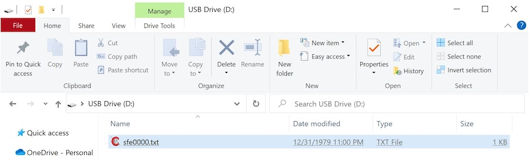

# Logging - Data File

A key feature of the DataLoggerIoT is logging data to an IoT web service, but it still performs core data logging functionality, including logging data to a file on an SD card.

The logging to a file includes `file rotation` - after a specific period of time, a new file is created using a numbering scheme and prefix.

## Options

In the Settings menu, select the Data File Menu Item to adjust the Logging Data File.


/// caption
Data File Menu Options
///

Adjusting these parameters allows you to change the filename prefix, the number the files starts at, and how often the DataLogger will create a new file on the microSD card.

The file naming scheming used is:  ```[prefix string][number].txt```

For example, the default file will be saved as **sfe0001.txt**. After 1 day, the DataLogger will rotate files by creating a new file named **sfe0002.txt**. The DataLogger will begin logging data in this new file. The purpose of this log rotation is to limit the size of each file prevent issues when opening large files.

## Settings

### Rotate Period

This value is the time between file rotation.

Options for this setting are:

* 6 Hours
* 12 Hours
* 1 Day
* 2 Days
* 1 Week

### File Start Number

The number to start the file name numbering.

## Details

The contents of the file will depend on how the data was saved (either CSV or JSON). Make sure that the SD Card format is enabled to either CSV or JSON with your desired device outputs turned on so that the DataLogger can save the readings.

When removing the microSD card, make sure to remove your power source. Then insert into it into microSD card adapter or USB reader. When connecting the memory card to your computer, you can use a text editor to view the saved readings. In this case, a Windows operating system was viewing the file **sfe0000.txt** and it was only file available in the microSD card.


/// caption
Reading data value from Text File
///
