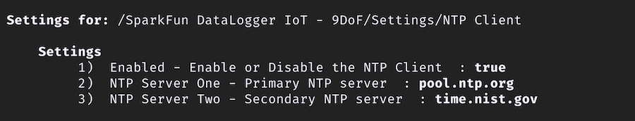

# NTP Client Setup

NTP - **Network Time Protocol** -  It is a networking protocol used to synchronize the clocks of computers over a network. NTP ensures that all devices on a network maintain the same accurate time, which is crucial for various applications such as logging events, security protocols, and time-sensitive transactions.

When connected to the network ([via WiFi](net-wifi-setup.md)), the DataLoggerIoT can use NTP as a time refernce. To do this, NTP must be enabled and NTP services to use specified. The configuration of NTP for the DataLoggerIoT is enabled in this secton of the *Settings* menu.

## NTP Configuration

In the Settings menu, under the **Network** heading,  select the NTP Client settings.

/// caption
NTP Client
///

The NTP configuration has the following settings:

|Setting|Description|
|--|--|
|**Enabled**|Used to Enable or Disable the use of NTP by the DataLoggerIoT|
|**NTP Server One**|The primary NTP Server to use. Default value is: **pool.ntp.org***|
|**NTP Server Two**|The secondary NTP Server to use. Default value is: **time.nist.gov**|

!!! note
    Only one NTP service is required to use this option, but it's common to provice two for redundancy.

Once changes are made to the NTP settings, the should take effect immediatly.
