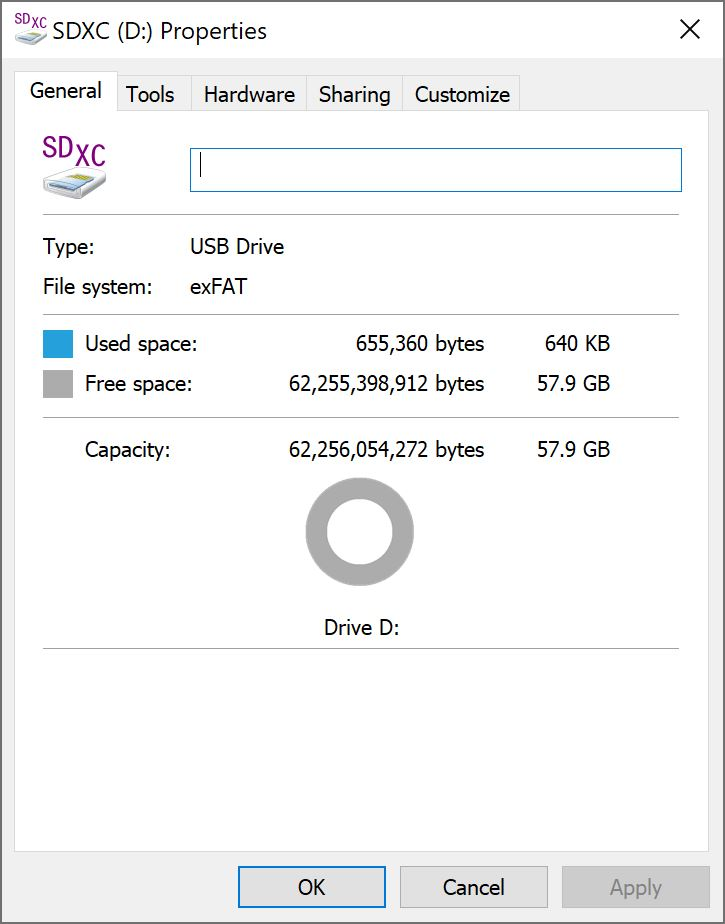
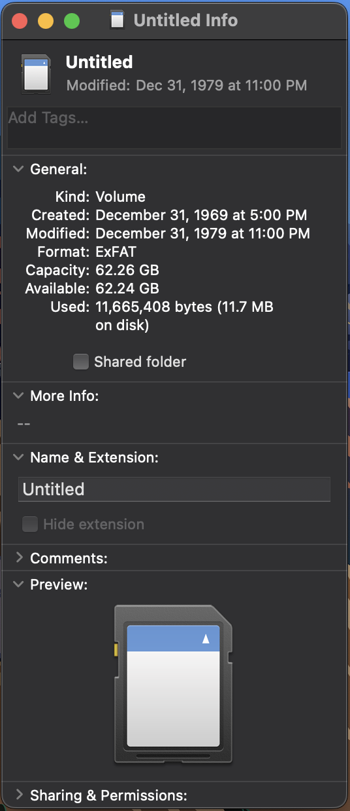
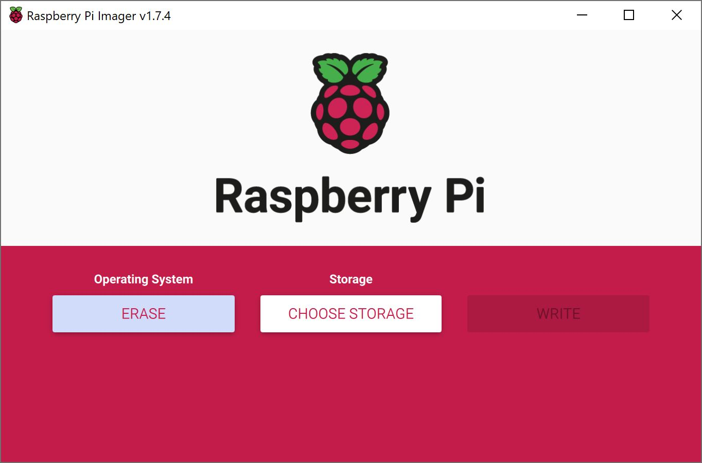
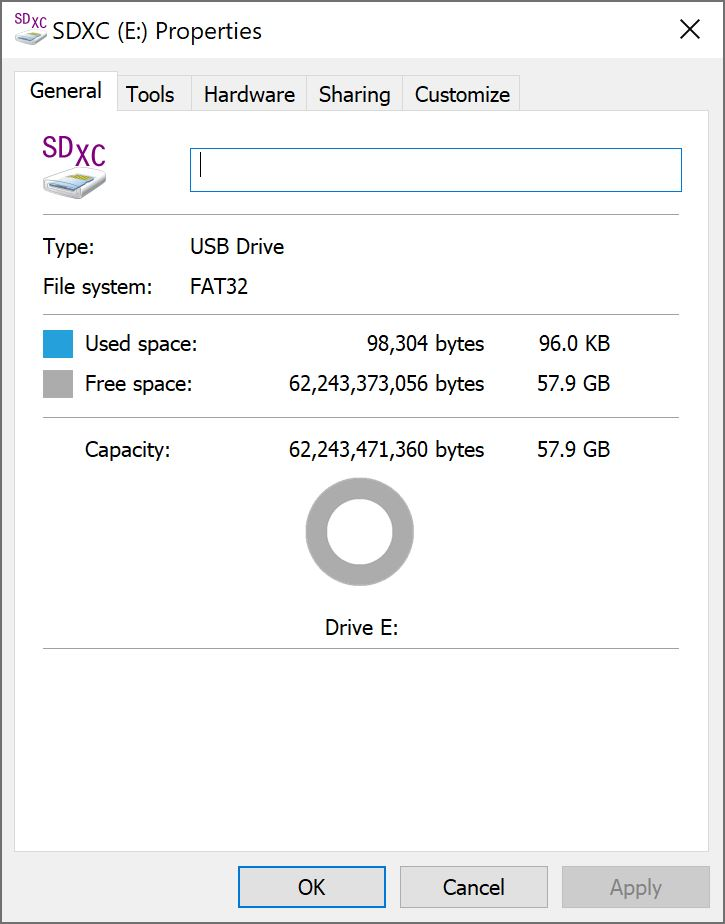
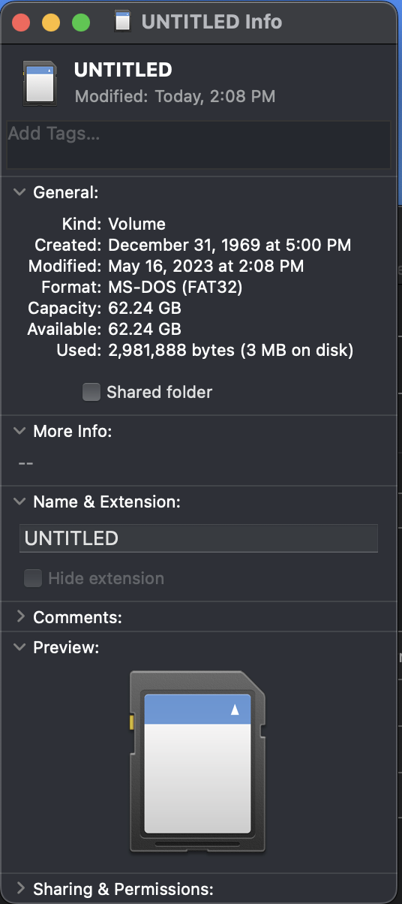

Not all microSD cards are created equal. The [capacity, read/write speed, and format](https://learn.sparkfun.com/tutorials/sd-cards-and-writing-images) vary depending on the manufacturer. In order to log data to the microSD card, you will need to ensure that your memory card is formatted as **FAT32**. You can also use FAT16. If the memory card is formatted as a different memory card, the DataLogger IoT will not be able to recognize the microSD card.

## Checking MicroSD Card Format

While you can simply insert the microSD card into your DataLogger IoT and start logging, there may be a chance that the it will not recognize the memory card due to the format.

### Checking MicroSD Card Format - Windows

To check to see if it is the correct format on a Windows you could head to the drive, right click, and select **Properties**.

  

Once the properties are open, you should be able to tell what file system that the memory card uses. In this case, it was exFAT which is not compatible with the DataLogger IoT. You will need to reformat the memory card since it is not formatted as FAT32.

  

### Checking MicroSD Card Format - macOS

To check to see if it is the correct format on a macOS, you could head to the drive on your desktop. Then right click, and select **Get Info**.

  

A window will pop up indicating the microSD card properties. Under **General:** > **Format:**, you should be able to tell what file system that the memory card uses. In this case, it was exFAT which is not compatible with the DataLogger IoT. You will need to reformat the memory card since it is not formatted as FAT32.

  

## Download Raspberry Pi Imager

There are a few methods and programs available to reformat your microSD card as a FAT32. We found it easier to use the [Raspberry Pi Imager Tool](https://www.raspberrypi.com/software/). Of course, you will only be using the tool to erase the contents of the microSD card and formatting it as a FAT32 system. You will not actually flash any image to the memory card. Click on the button below to download the tool from the Raspberry Pi Foundation. It is supported on *Windows*, *macOS*, and *Ubuntu for x86*.

<a href="https://www.raspberrypi.com/software/" target="rpi_imager_tool" class="md-button">Raspberry Pi Imager Tool</a>

## Formatting as FAT32 using the Raspberry Pi Imager

After downloading and installing the software, open the Raspberry Pi Imager.

  

Under "**Operating System**", select "**Erase**" to "format card as FAT32."

  <a href="../assets/Raspberry_Pi_Imager_Erase_Format.JPG">
   Erase : Format as FAT32"></a>

Under "**Storage**", select the drive that the microSD card appeared as on your computer.

  <a href="../assets/Raspberry_Pi_Imager_Select_Drive.JPG">
   Select Storage Drive"></a>

When ready, select "**Write**". After a few minutes, the microSD card should be formatted with FAT32.

  <a href="../assets/Raspberry_Pi_Imager_Write.JPG">
   Write"></a>

Once the memory card has finished formatting, eject the microSD from your computer. To check to see if the microSD card is formatted as FAT32, you can check its properties as explained earlier with your operating system. Below shows a screenshot from a Windows and macOS showing that the microSD card reformatted as a FAT32 file system.

  <table>
    <tr style="vertical-align:middle;">
     <td style="vertical-align:middle;"></td>
     <td style="vertical-align:middle;"></td>
    </tr>
  </table>

