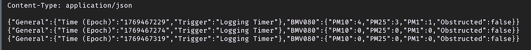
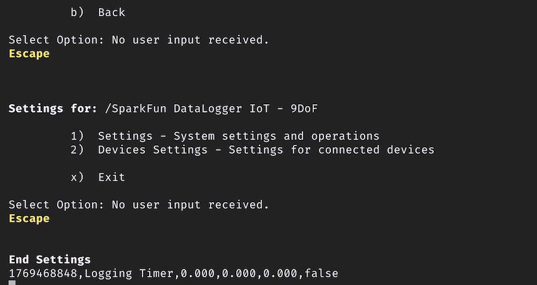

# Operation Overview

The main interface for the DataLogger IoT is a menuing system accessed via a serial terminal. You can use any interactive serial terminal emulator to quickly and easily change and store the DataLoggerIoT settings via its USB-C interface.

Before proceeding - ensure you are using an appropriate [Serial Terminal application](ref-serial-terms.md) to communicate with the DataLoggerIoT.

## General Operation

When connected to a Serial Terminal, the displayed output has the following sequence of events when the DataLoggerIoT is stared:

1) Startup Menu - A startup menu is displayed to change operation of the datalogger.
2) System Startup - messages are output as the system initialized and begings operation
3) Logging Output - sent to the Serial Monitor
4) Settings Menu - displayed with the touch of any key
5) Quick Commands - simple commands entered at the console - they start with a `!`

## Startup Menu

Connect the DataLogger IoT to a USB cable and connect to your computer. The addressable RGB LED will light up green as it initializes. In the Serial Terminal,  a *Startup Menu* is presented, which allows you to change the behavior of the DataLogger at start-up. This change only affects the current system session.


/// caption
Startup Menu Options
///

* 'n' - Normal startup
* 'a' - Disable I2C device auto load on startup
* 'l' - List the I2C devices supported. This device table is discarded after auto-load
* 'w' - Disable WiFi
* 's' - Disable preference restore during startup

The amount of time the start-up menu is displayed is adjustable. This settings can be configured in the **Settings/Application Settings** page, under the Advanced section.

## System Startup

As the system starts up you will see the following output when the board initializes:


/// caption
Startup Output Information
///

The messages in the serial terminal provide us with the DataLogger's configuration and will vary depending on the firmware version that is loaded on the board and the boards configuration settings.

In general, the output will include the following:

* The DataLogger IoT software version
* As the DataLogger IoT is initializing, the system settings are being restored from the last saved preference.
* There no WiFi credentials and the board has failed to connect. This output will change once you provide the WiFi credentials and are able to connect to the network.
* There are 3x devices currently detected and they are connected through I<sup>2</sup>C through the Qwiic port and SPI. These are the on-board sensors for the DataLogger IoT. There may be more devices that are detected depending on the firmware and what is connected to the ports. Since these were recognized, they were loaded onto the DataLogger IoT.
* The current date and time is shown (by default), the date and time is set to **1-1-1970** and **00:00:00**). This value will change depending on the clock source through NTP, RTC, or a u-blox GNSS module.
* The time the board has been running will be shown in the uptime.
* The primary external time source that the board syncs is currently through the **NTP client**. This can be configured depending on your clock source.
* The board name
* The board ID
* The microSD card has been found, the type of memory card it is, the size of the memory card, how much memory is used, and how much is available.
* If there is a WiFi network name saved, the SSID will be shown along with information indicating whether the board was able to connect to the WiFi network. By default there is no SSID saved in memory.
* If there is a battery connected, the LiPo Battery Fuel Guage will indicate if there is one attached to the board.
* Parameters for low power mode will be provided indicating if deep sleep is enabled, sleep interval, and wake interval.
* Parameters for logging are also provided for the logging interval, the format for the serial output, format for the microSD card, current saved filename, and file rotation period.
* The board will also show the available IoT services that are enabled for the DataLogger IoT.
* Current settings to download log files via a web interface (included in firmware v01.02.00)
* Supported devices through Qwiic or SPI will be listed if they are connected.
* The output will finish by telling you what devices are connected to the DataLogger IoT again.

As of firmware v01.02.00, there is also a compact mode! By adjusting the setting, the datalogger will output less at startup. This settings can be configured in the **Settings/Application Settings** page, under the Advanced section.


/// caption
Compact Startup Mode Output
///

## Logging Output

Once the DataLogger IoT has initialized, the DataLogger IoT will begin outputting comma separated values (CSV). This is the default output that is set for the DataLogger IoT - 9DoF. Of course, you will not have as many readings on the DataLogger IoT since the 6DoF IMU and magnetometer are not populated on that version of the board.


/// caption
CSV Output to the Serial Console
///

Depending on your DataLogger IoT preferences, your device may output as a JSON format like the image shown below.


/// caption
JSON Output to the Serial Console
///

The data scrolling up the screen show what each device's output is along with their associated unit if it is available. Your mileage will vary depending on the board version that you have and what device is connected:

* `MAX17048.Voltage (V)`
* `MAX17048.State of Charge (%)`
* `MAX17048.Charge Rate (%/hr)`
* `ISM330.Accel X (milli-g)`
* `ISM330.Accel Y (milli-g)`
* `ISM330.Accel Z (milli-g)`
* `ISM330.Gyro X (milli-dps)`
* `ISM330.Gyro Y (milli-dps)`
* `ISM330.Gyro Z (milli-dps)`
* `ISM330.Temperature (C)`
* `MMC5983.X Field (Gauss)`
* `MMC5983.Y Field (Gauss)`
* `MMC5983.Z Field (Gauss)`
* `MMC5983.Temperature (C)`

The output will vary depending on what is connected so you may get additional readings in the output and it may not be in the following order listed above. The logging rate defaults to about 0.067Hz (or 15000ms), so as the data scrolls past, you will see the last value settle at about 0.067Hz.

## Settings Menu

Right! Let's open the main menu by pressing on any key in the serial terminal program.


///
Main Menu
///

You will be prompted with a few options. Once in the configuration menu, all three colors of the addressable RGB LED will turn on to produce the color white indicating that you are navigating through the menu.

### Selecting a Menu Item

Menus items are entered by pressing the number next to the menu item desired. For example, at the main menu, pressing `1` will bring up the overall Settings Menu. You will have the option to adjust various settings ranging from the your preferences, time source to synchronize the date and time, WiFi network, how the device logs data, which IoT service to use, and firmware updates.


/// caption
The Settings Menu
///

!!! note
    You may notice after entering a ```1``` with long menus there is a slight delay before the system responds. The delay was added to allow some time for an additional digit for any option greater than 9. If you want to head to option 1 immediately without the slight delay, you can hit the ```Enter``` key.

Hitting the `ESC` returns to the previous menu. From here you can enter a `2` which brings up the Device menu - which lists all devices currently connected to the datalogger

### Exiting and Saving

When exiting the menus, you will be prompted with either an ```x``` or ```b```. You can use either character when exiting the menus as well as ```X``` or ```B```. Note that you will need to use either of these keys when making a change in order for the DataLogger IoT to save any changes in memory. Make sure that you receive the following message indicating that the settings were saved: ```[I] Saving System Settings```. The DataLogger IoT will the continue reading the devices and outputting the readings through the serial terminal.


/// caption
Save Settings When Exiting the Menu
///

### Cancelling Changes

You can also use any of your ```Esc``` to exit. However, using the escape will not save any changes in memory once the reset button is hit or whenever power is cycled.


/// caption
Escape to Exit a Menu
///

### Timeout from Inactivity

The menus will slowly exit out after 2 minutes of inactivity, so if you do not press a key the DataLogger IoT will return to its previous menu. It will continue to move back until it reaches the main menu. After another additional 2 minutes of inactivity, the board will exit begin logging data again. When the menu exits from inactivity, any changes will not be saved in memory as well.


/// caption
Timeout in the Menu
///

## Quick Commands

As of firmware v01.02.00, when not in the menu system, commands can be executed directly from the serial console - these are called *quick commands*. When you enter a `!`, you will see a prompt appear for quick command entry.

The following commands are available:

|Command|Description|
|--|--|
|!about|Display the system about page|
|!clear-settings|Clear the on board system preferences with a yes/no prompt|
|!clear-settings-forced|Clear the on board system preferences with no prompt|
|!devices|List the currently connected devices|
|!factory-reset|Perform a factory reset - presents a Y/N prompt|
|!heap|Display the current system heap memory usage|
|!json-settings|For setting the device settings via a serial connection. When this command is sent, the system expects to receive a JSON settings file|
|!log-now|Perform a log observation event|
|!log-rate|If log rate measurement is enabled, the current log rate is printed|
|!reset-device|Reset the device - erasing any saved settings and restarting the device|
|!reset-device-forced|Reset the device, but without a Y/N prompt|
|!restart|Restart the device|
|!restart-forced|Restart the device without a Y/N prompt|
|!save-settings|Save the current settings to on-board flash|
|!sdcard|Output the current SD card usage statistics|
|!systime|Output current system time|
|!uptime|The uptime of the device|
|!device-id|The ID for the device|
|!version|The version of the firmware|
|!wifi|Output current system WiFi state|

Typing a quick command and hitting the ```Enter``` button will result in the DataLogger IoT executing the command without the need to go through the menu system. Below is an example showing the `!about` quick command being sent and then executing the command as the DataLogger IoT is outputting CSV values to the serial terminal.


/// caption
Enter a quick command
///
