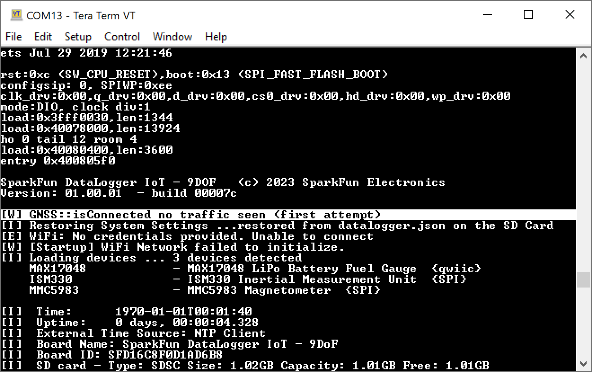

!!! note
    <span class="glyphicon glyphicon-question-sign" aria-hidden="true"></span>
        <strong> Not working as expected and need help? </strong> <br /><br />

    If you need technical assistance and more information on a product that is not working as you expected, we recommend heading on over to the <a href="https://www.sparkfun.com/technical_assistance">SparkFun Technical Assistance</a> page for some initial troubleshooting. <br /><br />

    <div style="text-align: center"><a href="https://www.sparkfun.com/technical_assistance" target="sfe_technical_assistance" class="md-button">SparkFun Technical Assistance Page</a></div>

    If you don't find what you need there, the <a href="https://forum.sparkfun.com/index.php">SparkFun Forums</a> are a great place to find and ask for help. If this is your first visit, you'll need to <a href="https://forum.sparkfun.com/ucp.php?mode=register">create a Forum Account</a> to search product forums and post questions.<br /><br />

    <div style="text-align: center"><a href="https://forum.sparkfun.com/ucp.php?mode=register" class="md-button">Create New Forum Account</a>&nbsp;&nbsp;&nbsp;<a href="https://forum.sparkfun.com/index.php" class="md-button md-button--primary">Log Into SparkFun Forums</a></div>


### U-Blox I<sup>2</sup>C Device Disappears when IoT DataLogger Initializes

If you have issues where a u-blox device that is connected to the I<sup>2</sup>C port fails to connect a second time when the IoT DataLogger initializes, this is due to a bug in the firmware from an initial release. You may see an output similar to the following line and image shown below.

``` bash
[W] GNSS::isConnected no traffic seen (first attempt)
```

<div style="text-align: center">
  <a href="../assets/No_GNSS_Satellite_Lock.PNG">
  </a>
</div>

If you see the following output and the IoT DataLogger not loading your u-blox device, you will need to [update the firmware to v01.00.03 and above](https://github.com/sparkfun/SparkFun_DataLogger/releases). For more information, make sure to check out the [tutorial on updating your IoT DataLogger's firmware](https://docs.sparkfun.com/SparkFun_DataLogger/updating_firmware/).
