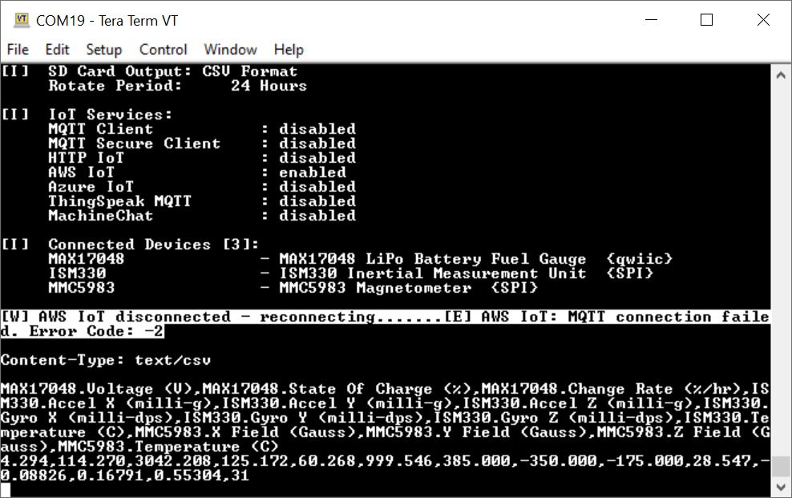
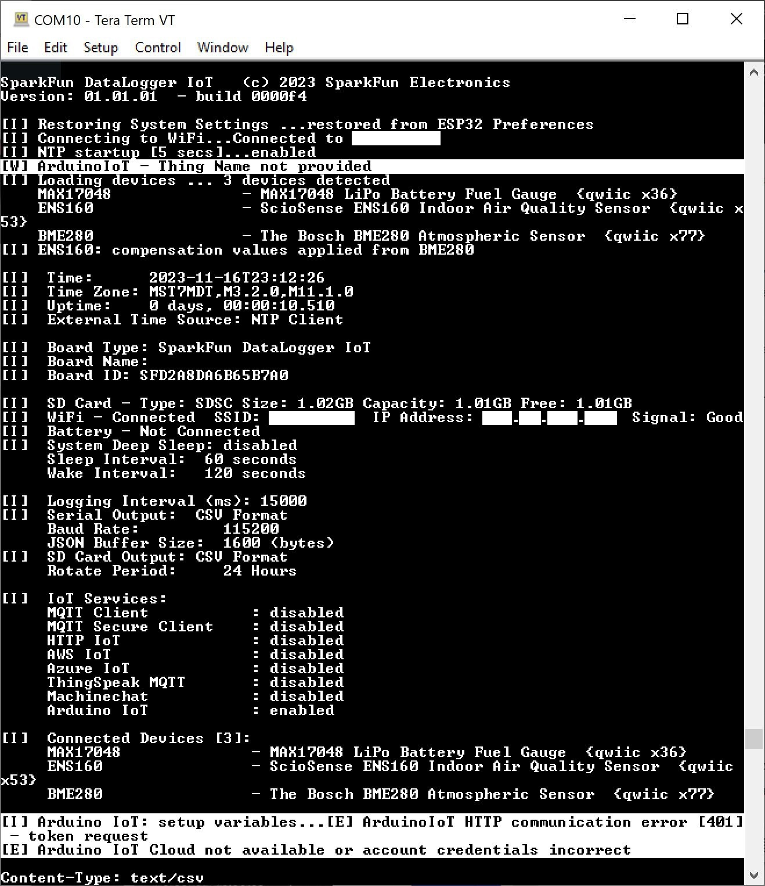

!!! note
    <span class="glyphicon glyphicon-question-sign" aria-hidden="true"></span>
        <strong> Not working as expected and need help? </strong> <br /><br />

    If you need technical assistance and more information on a product that is not working as you expected, we recommend heading on over to the <a href="https://www.sparkfun.com/technical_assistance">SparkFun Technical Assistance</a> page for some initial troubleshooting. <br /><br />

    <div style="text-align: center"><a href="https://www.sparkfun.com/technical_assistance" target="sfe_technical_assistance" class="md-button">SparkFun Technical Assistance Page</a></div>

    If you don't find what you need there, the <a href="https://forum.sparkfun.com/index.php">SparkFun Forums</a> are a great place to find and ask for help. If this is your first visit, you'll need to <a href="https://forum.sparkfun.com/ucp.php?mode=register">create a Forum Account</a> to search product forums and post questions.<br /><br />

    <div style="text-align: center"><a href="https://forum.sparkfun.com/ucp.php?mode=register" class="md-button">Create New Forum Account</a>&nbsp;&nbsp;&nbsp;<a href="https://forum.sparkfun.com/index.php" class="md-button md-button--primary">Log Into SparkFun Forums</a></div>


### Issues Connecting to IoT Service

Having trouble connecting your DataLogger IoT to an IoT service? Make sure to check your credentials and ensure that the configuration matches the IoT Service (such as your WiFi network, port, server, topic, certificates, keys, etc. to name a few). Make sure to also include the associated certificates and keys in the microSD card as well. You may see an output similar to the following errors below.


#### AWS IoT Error

The following error occurred when the DataLogger IoT was initializing with AWS.

``` bash
[W] AWS IoT disconnected - reconnecting.......[E] AWS IoT: MQTT connection failed. Error Code: -2
```

<div style="text-align: center">
  <a href="../assets/Incorrect_Configuration_Connection_Failed_IoT_Service_AWS.JPG">
  </a>
</div>

In this case, the DataLogger IoT failed to connect to AWS IoT service because the port was using the default value that was saved: `1883`. Ensure that the port is set to `8883` for your IoT service (e.g. AWS IoT, Azure, and ThingSpeak) and saved in persistent memory in order for the DataLogger IoT to successfully connect. As of firmware v01.00.04, the default is `8883`.


#### Arduino Cloud Error 1

The following error was occurred when the DataLogger IoT was initializing with Arduino Cloud.

``` bash
[W] ArduinoIoT - Thing Name not provided
.
.
.
[I] Arduino IoT: setup variables...[E] ArduinoIoT HTTP communication error [401] - token request
[E] Arduino IoT Cloud not available or account credentials incorrect
```

<div style="text-align: center">
  <a href="../assets/Arduion_IoT_Error_Connecting_Incorrect_Configuration.JPG">
  </a>
</div>

In this case, the DataLogger IoT failed to connect to the Arduino Cloud service because the credentials were incorrect. Ensure that the credentials (i.e. API client ID, API secret, device secret, device ID) are entered correctly and saved in persistent memory in order for the DataLogger IoT to successfully connect.


#### Arduino Cloud Error 2

The following error was occurred when the DataLogger IoT was initializing with Arduino Cloud.

``` bash
[I] Arduino IoT: setup variables...[E] Arduino IoT: return code=400, failed to decode request body with content type "application/json": uuid: incorrect UUID length 37 in string "a111aaa1-1111-1111-1a1a-1a11111a1111\r"
```

In this case, the DataLogger IoT failed to connect to the Arduino Cloud service because the credentials were incorrect. The string was supposed to be the device ID. When copying and pasting the device ID from a PDF that was generated with the Arduino Cloud, a carriage return (`\r`) was also copied and entered in the serial terminal. By pasting the device ID into a text editor and then re-copying/pasting it into the serial terminal helped to ensure that the credentials were entered correctly.


!!! note
    The device ID in this example was a randomly generated string. You will need to check to make sure that your device matches the one that the Arduino Cloud generated specifically for your account.


#### Arduino Cloud Error 3

The following error was occurred when the DataLogger IoT was initializing with Arduino Cloud.

``` bash
[I] Arduino IoT: setup variables...ArduinoIoTCloudTCP::handle_ConnectMqttBroker could not connect to mqtts-up.iot.arduino.cc:8884
ArduinoIoTCloudTCP::handle_ConnectMqttBroker 1 connection attempt at tick time 301939
ArduinoIoTCloudTCP::handle_ConnectMqttBroker could not connect to mqtts-up.iot.arduino.cc:8884
ArduinoIoTCloudTCP::handle_ConnectMqttBroker 2 connection attempt at tick time 307420
[E] Arduino IoT: No Arduino Thing ID provided. Enter ID, delete Thing (SparkFunThing1) on Cloud, or enter new Thing Name.
```

In this case, the DataLogger IoT failed to connect to the Arduino Cloud service because there was already a Thing that was created. By deleting the Thing in the Arduino Cloud, the DataLogger IoT was able to automatically create another Thing and setup the variables.


### U-Blox I<sup>2</sup>C Device Disappears when IoT DataLogger Initializes

If you have issues where a u-blox device that is connected to the I<sup>2</sup>C port fails to connect a second time when the IoT DataLogger initializes, this is due to a bug in the firmware from an initial release. You may see an output similar to the following message and image shown below.

``` bash
[W] GNSS::isConnected no traffic seen (first attempt)
```

<div style="text-align: center">
  <a href="../assets/No_GNSS_Satellite_Lock.PNG">
  </a>
</div>

If you see the following output and the IoT DataLogger not loading your u-blox device, you will need to [update the firmware to v01.00.03 and above](https://github.com/sparkfun/SparkFun_DataLogger/releases). For more information, make sure to check out the [tutorial on updating your IoT DataLogger's firmware](https://docs.sparkfun.com/SparkFun_DataLogger/updating_firmware/).
