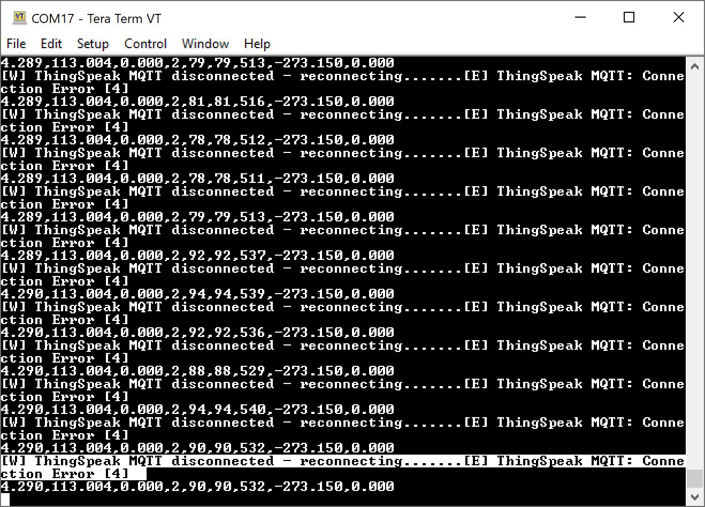
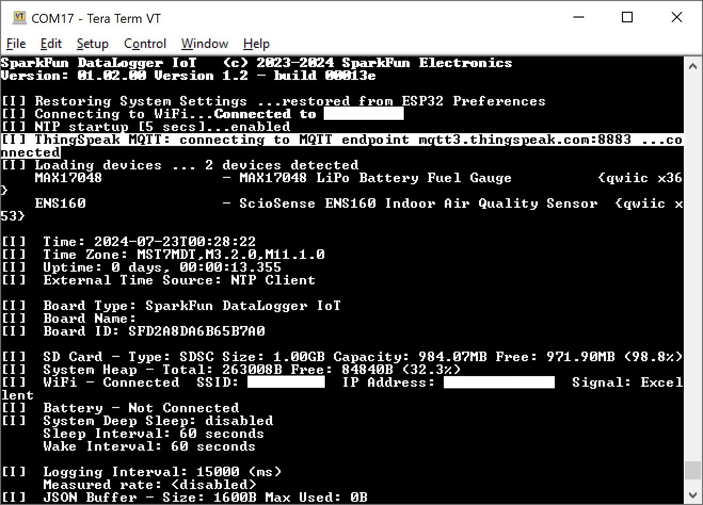
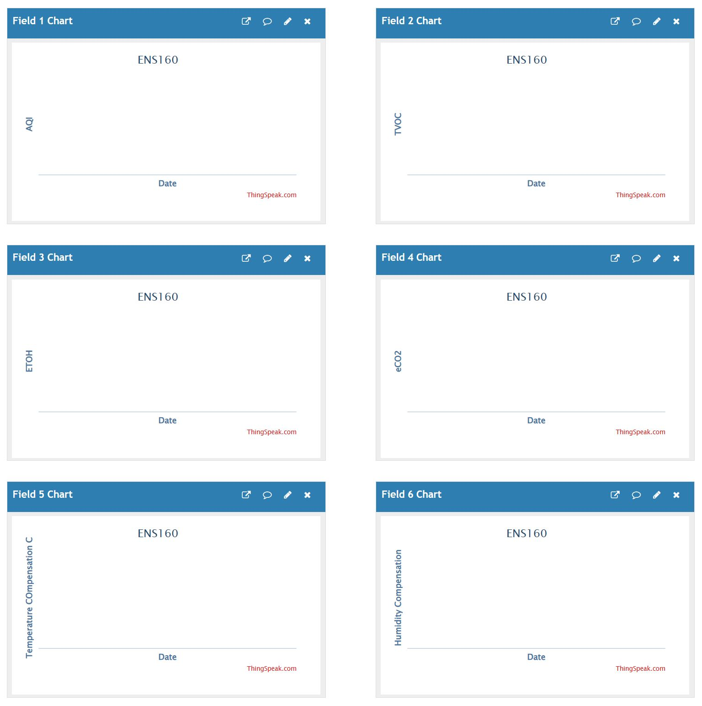

# Troubleshooting and Support

## Support

If you need technical assistance and more information on a product that is not working as you expected, visit the [SparkFun Community](https://community.sparkfun.com). The community forums are monitored by the SparkFun Technical Support Team and the SparkFun community as a whole.

### Issues Connecting to IoT Service

Having trouble connecting your DataLogger IoT to an IoT service? Make sure to check your credentials and ensure that the configuration matches the IoT Service (such as your WiFi network, port, server, topic, certificates, keys, etc. to name a few). Make sure to also include the associated certificates and keys in the microSD card as well. You may see an output similar to the following errors below.

#### AWS IoT Error

The following error occurred when the DataLogger IoT was initializing with AWS.

``` bash
[W] AWS IoT disconnected - reconnecting.......[E] AWS IoT: MQTT connection failed. Error Code: -2
```


In this case, the DataLogger IoT failed to connect to AWS IoT service because the port was using the default value that was saved: `1883`. Ensure that the port is set to `8883` for your IoT service (e.g. AWS IoT, Azure, and ThingSpeak) and saved in persistent memory in order for the DataLogger IoT to successfully connect. As of firmware v01.00.04, the default is `8883`.

#### ThinkSpeak IoT Error

The following error occurred when the DataLogger IoT was initializing with ThingSpeak.

``` bash
[I] ThingSpeak MQTT: connecting to MQTT endpoint mqtt3.thingspeak.com:8883 .......[E] ThingSpeak MQTT: Connection Error [4]
```



In this case, the DataLogger IoT failed to connect to ThingSpeak service because the credentials were entered incorrectly. Ensure that the  and saved in persistent memory in order for the DataLogger IoT to successfully connect.

#### Arduino Cloud Error 1

The following error was occurred when the DataLogger IoT was initializing with Arduino Cloud.

``` bash
[W] ArduinoIoT - Thing Name not provided
.
.
.
[I] Arduino IoT: setup variables...[E] ArduinoIoT HTTP communication error [401] - token request
[E] Arduino IoT Cloud not available or account credentials incorrect
```


In this case, the DataLogger IoT failed to connect to the Arduino Cloud service because the credentials were incorrect. Ensure that the credentials (i.e. API client ID, API secret, device secret, device ID) are entered correctly and saved in persistent memory in order for the DataLogger IoT to successfully connect.

#### Arduino Cloud Error 2

The following error was occurred when the DataLogger IoT was initializing with Arduino Cloud.

``` bash
[I] Arduino IoT: setup variables...[E] Arduino IoT: return code=400, failed to decode request body with content type "application/json": uuid: incorrect UUID length 37 in string "a111aaa1-1111-1111-1a1a-1a11111a1111\r"
```

In this case, the DataLogger IoT failed to connect to the Arduino Cloud service because the credentials were incorrect. The string was supposed to be the device ID. When copying and pasting the device ID from a PDF that was generated with the Arduino Cloud, a carriage return (`\r`) was also copied and entered in the serial terminal. By pasting the device ID into a text editor and then re-copying/pasting it into the serial terminal helped to ensure that the credentials were entered correctly.

> **NOTE** The device ID in this example was a randomly generated string. You will need to check to make sure that your device matches the one that the Arduino Cloud generated specifically for your account.

#### Arduino Cloud Error 3

The following error was occurred when the DataLogger IoT was initializing with Arduino Cloud.

``` bash
[I] Arduino IoT: setup variables...ArduinoIoTCloudTCP::handle_ConnectMqttBroker could not connect to mqtts-up.iot.arduino.cc:8884
ArduinoIoTCloudTCP::handle_ConnectMqttBroker 1 connection attempt at tick time 301939
ArduinoIoTCloudTCP::handle_ConnectMqttBroker could not connect to mqtts-up.iot.arduino.cc:8884
ArduinoIoTCloudTCP::handle_ConnectMqttBroker 2 connection attempt at tick time 307420
[E] Arduino IoT: No Arduino Thing ID provided. Enter ID, delete Thing (SparkFunThing1) on Cloud, or enter new Thing Name.
```

In this case, the DataLogger IoT failed to connect to the Arduino Cloud service because there was already a Thing that was created. By deleting the Thing in the Arduino Cloud, the DataLogger IoT was able to automatically create another Thing and setup the variables.

### ThingSpeak Data Points Not Updating

If your DataLogger IoT is connected to ThingSpeak but you do not see any data, ensure that the device name matches the Qwiic device that is connect to the DataLogger IoT. For example, the DataLogger IoT and Qwiic-enabled ENS160 was able to connect to ThingSpeak as shown in the following image:



However, there were no data points in any of the graphs as shown on ThingSpeak:



If you head back into the configuration menu for the DataLogger's ThingSpeak channel, make sure that the ```<device name>``` matches the connected Qwiic device's name that was shown during initialization.  In this case, the device that was loaded and detected was **ENS160**. Then add the channel ID before saving the system settings.


> **NOTE** Only one device can be loaded per channel! ThingSpeak is not able graph two different devices in the same channel.

Head back to your ThingSpeak Channel to verify that data is being plotted on the graphs.


### U-Blox Device Disappears when IoT DataLogger Initializes

If you have issues where a u-blox device that is connected via qwiic fails to connect a second time when the IoT DataLogger initializes, this is due to a bug in the firmware from an initial release. You may see an output similar to the following message and image shown below.

``` bash
[W] GNSS::isConnected no traffic seen (first attempt)
```


If you see the following output and the IoT DataLogger not loading your u-blox device, you will need to [update the firmware to v01.00.03 and above](https://github.com/sparkfun/SparkFun_DataLogger/releases). For more information, make sure to check out the [tutorial on updating your IoT DataLogger's firmware](https://docs.sparkfun.com/SparkFun_DataLogger/updating_firmware/).
