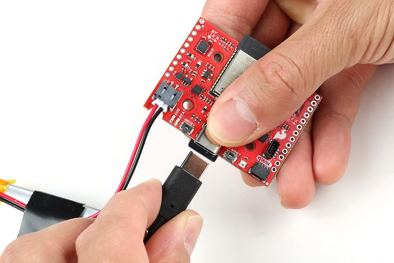
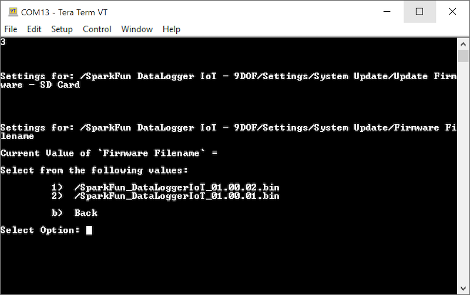
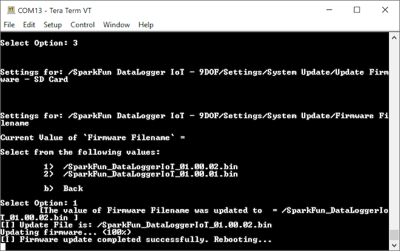
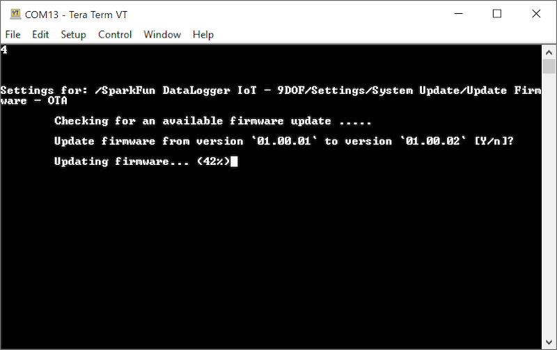
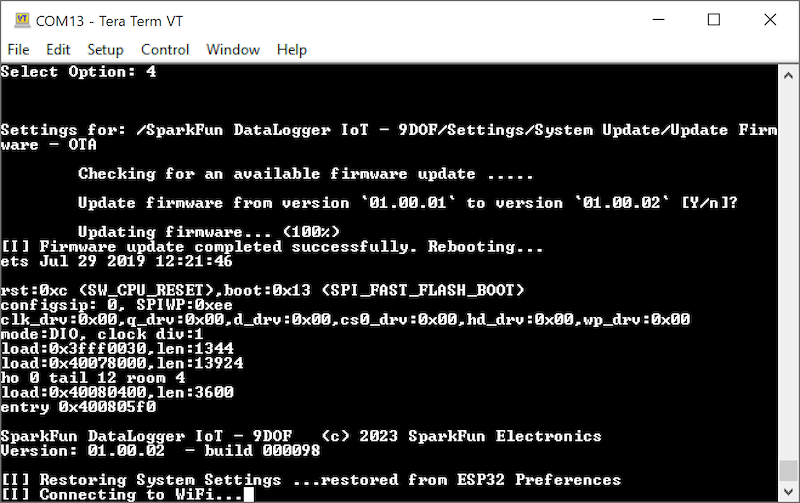

## Firmware Update - SD Card

This action enables the ability to update the onboard firmware to an image file contained an SD card. This user is presented a list of available firmware images files contained in root directory of the on-board SD card, and updates the board to the selected file.

This option is available on ESP32 devices that contained two update firmware (OTA type) partitions within the on-board device flash memory. Consult the specific products production and build system for further details.

To download the latest firmware and update through the microSD card, you will need to head to the [GitHub repository containing the firmware](https://github.com/sparkfun/SparkFun_DataLogger/releases). Select the firmware version and download.

Once downloaded, insert the microSD card into a card reader or USB adapter. Then move the files into the memory card's root directory. Below shows an image of v01.00.01 and v01.00.02 on a Windows OS.


Once the files are copied to the memory card, eject the microSD card from your computer. Insert the card back into the DataLogger IoT's microSD card socket. Connect the DataLogger IoT to your computer using a USB cable.




Open a Serial Terminal, connect to the COM port that your DataLogger enumerated to, and set it to  **115200** baud. In this case, we connected to **COM13**. Press any key to enter the Main Menu. Type ```1``` to enter the Settings menu. Then select the System Update Menu. Finally, type ```3``` to update the firmware from the microSD card. You should see an image similar to the output below.



The system will search the root directory of the on-board SD card for available firmware files. The firmware files are selected using the following criteria:

* The file is contained in the root "**/**" folder of the SD card.
* The filename has a "**.bin**" extension.
* The filename starts with a specified name ***prefix***. The prefix is optional and is set by the developers at SparkFun using this action.
  * For example, the DataLogger IoT boards use a prefix value of "**SparkFun_DataLoggerIoT_**".

Once a file is selected, the system new firmware is read off the SD card and written to the device.


And once updated, the system is rebooted and starts using the new firmware image!



## Firmware Update - Over-the-Air (OTA)

This action enables the ability to update the onboard firmware to an image file contained on an update server, which is accessed via the WiFi network the system is connected to. This Over-The-Air (OTA) capability contacts the systems update server and searches for newer firmware (later version) for the specific board.

This option is available on ESP32 devices that contained two update firmware (OTA type) partitions within the on-board device flash memory. Consult the specific products production and build system for further details.

If you have not already, connect the DataLogger IoT to your computer using a USB cable.


Open a Serial Terminal, connect to the COM port that your DataLogger enumerated to, and set it to  **115200** baud. In this case, we connected to **COM13**. Press any key to enter the Main Menu. Type ```1``` to enter the Settings menu. Then enter the System Update Menu. Finally, type ```4``` to update the firmware over-the-air.


When this option is selected, the system will contact the update server and search for available upgrade firmware, selecting the latest version available. If a newer version is found, a prompt is presented to confirm the upgrade.


**NOTE** For the upgrade option to occur, a the system must be connected to a network and have access to the firmware OTA server.

Typing ```Y``` (or hitting enter) starts the update operation. As the firmware is downloaded, the percent complete status is updated. If connectivity fails during the download, the operation is halted and the update aborted.



Once the update file is downloaded, it is verified as being the correct file. Once verified, the system is rebooted and starts using the new firmware image! You will notice the firmware version change as the DataLogger IoT initializes.



## If the Firmware is overwritten by an Arduino Sketch

Flashing an Arduino sketch to a DataLogger IoT board removes the ability for easy firmware updates and will require a full low-level flash of the latest software, which includes the bootloader and partition map for the device. These files are now provided as part of the DataLogger IoT firmware updates.

To perform this level of update, please view the [Build and Update Instructions](https://github.com/sparkfun/sfe-datalogger/blob/main/docs/build_update.md#firmware-upload)
