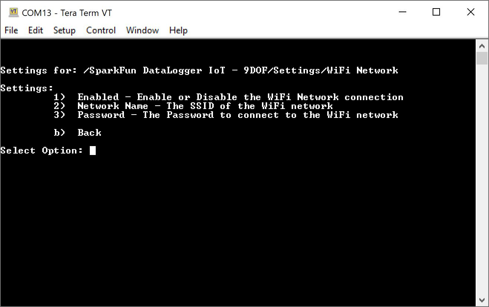
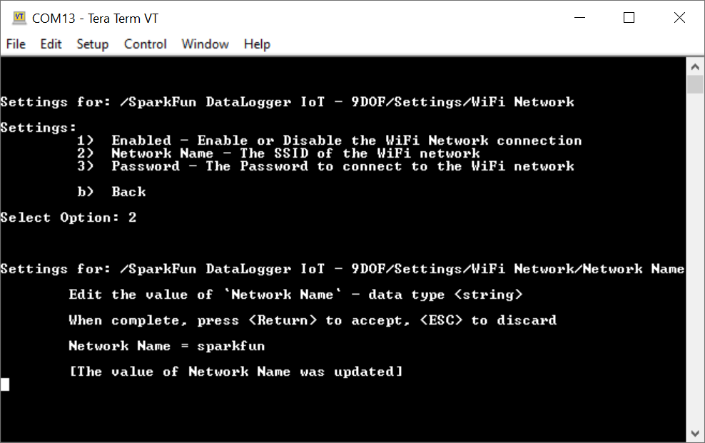
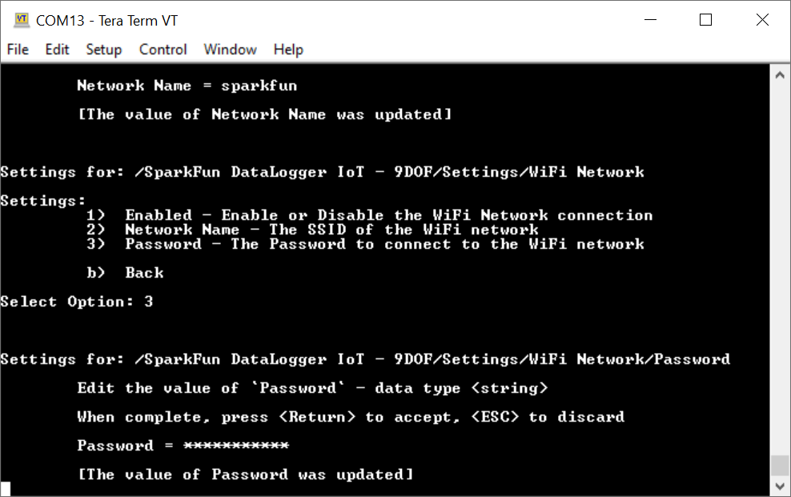
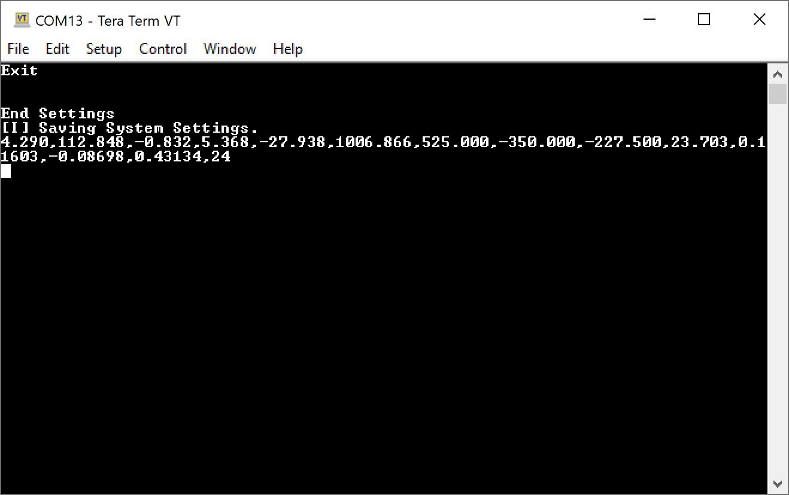
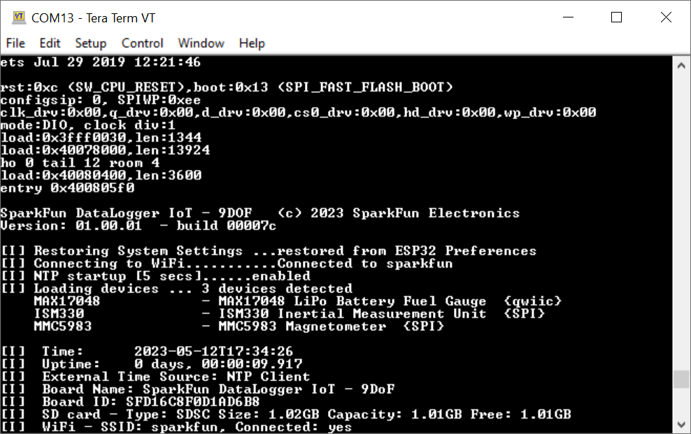

!!! note
    The ESP32-WROOM can only connect to a 2.4GHz WiFi network. Unfortunately, 5GHz is not supported on the ESP32-WROOM module.

To take advantage of syncing DataLogger to the Network Time Protocol (NTP), logging data to an IoT service, or updating firmware OTA, you will need to connect to a 2.4GHz WiFi network.

In the Settings Menu, send a <kbd>4</kbd> to configure the WiFi settings.

  

Send a <kbd>2</kbd> to set the WiFi Network Name. You'll be prompted to set the network name. In this case, the network name is `sparkfun`. Once you enter the name, hit the <kbd>enter</kbd> key.

  

Send a <kbd>2</kbd> to set the WiFi  password. You'll be prompted to set the password. As you send the password, each character will be masked by a asterisk (i.e. &ast;) Once you enter the name, hit the <kbd>enter</kbd> key.

  

Follow the prompts to exit out of the menu properly so that the DataLogger IoT saves the settings.

  

Once you see the message `[I] Saving System Settings` and data on the output, hit the reset button on the board. You can also use the menu to perform a device restart, however you will need to ensure that you receive the message indicating that the settings were saved before restarting the device.

Once the device has restarted, the DataLogger will provide an output as it is initializing. If the WiFi credentials are saved properly, you will receive a message indicating that your chosen network is connected to your WiFi network. If the time source is set to the default NTP client, you will also notice that the time will be synced to the latest date and time!

  

